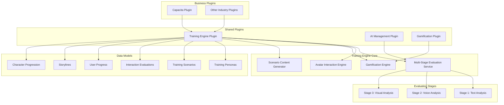

# Capacita Phase 1: Core Training Engine - Technical Specification

## Overview

Phase 1 focuses on building the universal training engine as a shared plugin that can be used across multiple industries. This creates the foundation for the Avatar Arena and RPG-style gamification system.

## Architecture Diagram



## Phase 1 Implementation Details

### 1. Plugin Structure Setup

#### Directory Structure
```
src/plugins/shared/training-engine/
├── index.ts                           # Main plugin export
├── collections/                       # Core data models
│   ├── AvatarPersonas.ts             # Character personas with psychological profiles
│   ├── TrainingScenarios.ts          # Universal scenario framework
│   ├── InteractionSessions.ts        # Session tracking and recording
│   ├── EvaluationResults.ts          # Multi-stage evaluation results
│   ├── UserProgress.ts               # Gamification and progress tracking
│   ├── Storylines.ts                 # RPG-style narrative contexts
│   └── CharacterProgression.ts       # User character development
├── services/                          # Core business logic
│   ├── MultiStageEvaluationService.ts # Universal evaluation engine
│   ├── AvatarInteractionEngine.ts    # Persona behavior simulation
│   ├── PersonaBehaviorEngine.ts      # Complex character AI
│   ├── GamificationEngine.ts         # Achievement and progression
│   └── ScenarioGenerator.ts          # Dynamic content creation
├── components/                        # React components
│   ├── EvaluationDashboard.tsx       # Real-time evaluation display
│   ├── AvatarInteractionPanel.tsx    # Avatar conversation interface
│   ├── ProgressTracker.tsx           # User progress visualization
│   └── ScenarioPlayer.tsx            # Scenario execution interface
├── hooks/                            # React hooks
│   ├── useEvaluation.ts              # Evaluation state management
│   ├── useAvatarInteraction.ts       # Avatar conversation hooks
│   └── useProgress.ts                # Progress tracking hooks
├── utils/                            # Utility functions
│   ├── evaluationUtils.ts            # Evaluation calculations
│   ├── personaUtils.ts               # Persona behavior utilities
│   └── gamificationUtils.ts          # Points and achievement calculations
└── types/                            # TypeScript definitions
    ├── personas.ts                   # Avatar persona interfaces
    ├── evaluation.ts                 # Evaluation result types
    └── gamification.ts               # Progress and achievement types
```

### 2. Core Data Models Implementation

#### AvatarPersonas Collection
```typescript
// src/plugins/shared/training-engine/collections/AvatarPersonas.ts
import { CollectionConfig } from 'payload'

export const AvatarPersonas: CollectionConfig = {
  slug: 'avatar-personas',
  labels: {
    singular: 'Avatar Persona',
    plural: 'Avatar Personas',
  },
  admin: {
    group: 'Training Engine',
    useAsTitle: 'name',
    description: 'Complex character personas for training scenarios',
  },
  fields: [
    {
      type: 'tabs',
      tabs: [
        {
          label: 'Basic Identity',
          fields: [
            {
              name: 'name',
              type: 'text',
              required: true,
              admin: {
                description: 'Character name (e.g., "Derek the Explosive Executive")',
              },
            },
            {
              name: 'title',
              type: 'text',
              admin: {
                description: 'Character title or role',
              },
            },
            {
              name: 'backstory',
              type: 'textarea',
              required: true,
              admin: {
                description: 'Character background and motivation',
              },
            },
            {
              name: 'appearance',
              type: 'json',
              admin: {
                description: 'Physical appearance details for avatar generation',
              },
            },
            {
              name: 'voiceProfile',
              type: 'json',
              admin: {
                description: 'Voice characteristics for TTS generation',
              },
            },
          ],
        },
        {
          label: 'Psychological Profile',
          fields: [
            {
              name: 'personalityTraits',
              type: 'group',
              fields: [
                {
                  name: 'agreeableness',
                  type: 'number',
                  min: -100,
                  max: 100,
                  defaultValue: 0,
                  admin: {
                    description: 'How cooperative and pleasant (-100 to 100)',
                  },
                },
                {
                  name: 'patience',
                  type: 'number',
                  min: 0,
                  max: 100,
                  defaultValue: 50,
                  admin: {
                    description: 'Tolerance for delays and problems (0 to 100)',
                  },
                },
                {
                  name: 'hostility',
                  type: 'number',
                  min: 0,
                  max: 100,
                  defaultValue: 0,
                  admin: {
                    description: 'Tendency toward aggressive behavior (0 to 100)',
                  },
                },
                {
                  name: 'intelligence',
                  type: 'number',
                  min: 0,
                  max: 100,
                  defaultValue: 70,
                  admin: {
                    description: 'Cognitive ability and problem-solving (0 to 100)',
                  },
                },
                {
                  name: 'emotionalStability',
                  type: 'number',
                  min: 0,
                  max: 100,
                  defaultValue: 50,
                  admin: {
                    description: 'Emotional consistency and control (0 to 100)',
                  },
                },
                {
                  name: 'trustworthiness',
                  type: 'number',
                  min: -100,
                  max: 100,
                  defaultValue: 50,
                  admin: {
                    description: 'Honesty and reliability (-100 treacherous to 100 trustworthy)',
                  },
                },
              ],
            },
          ],
        },
        {
          label: 'Behavioral Patterns',
          fields: [
            {
              name: 'behaviorPatterns',
              type: 'group',
              fields: [
                {
                  name: 'initialMood',
                  type: 'select',
                  options: [
                    { label: 'Calm', value: 'calm' },
                    { label: 'Frustrated', value: 'frustrated' },
                    { label: 'Angry', value: 'angry' },
                    { label: 'Hostile', value: 'hostile' },
                    { label: 'Suspicious', value: 'suspicious' },
                    { label: 'Friendly', value: 'friendly' },
                  ],
                  defaultValue: 'calm',
                },
                {
                  name: 'escalationTriggers',
                  type: 'array',
                  fields: [
                    {
                      name: 'trigger',
                      type: 'text',
                    },
                  ],
                  admin: {
                    description: 'Words/phrases that make the character worse',
                  },
                },
                {
                  name: 'deEscalationResponses',
                  type: 'array',
                  fields: [
                    {
                      name: 'response',
                      type: 'text',
                    },
                  ],
                  admin: {
                    description: 'What calms the character down',
                  },
                },
                {
                  name: 'manipulativeTactics',
                  type: 'array',
                  fields: [
                    {
                      name: 'tactic',
                      type: 'text',
                    },
                  ],
                  admin: {
                    description: 'For treacherous characters - manipulation methods',
                    condition: (data) => data.personalityTraits?.trustworthiness < 0,
                  },
                },
                {
                  name: 'emotionalVolatility',
                  type: 'number',
                  min: 0,
                  max: 100,
                  defaultValue: 30,
                  admin: {
                    description: 'How quickly mood changes (0 stable to 100 volatile)',
                  },
                },
                {
                  name: 'hiddenAgenda',
                  type: 'textarea',
                  admin: {
                    description: 'Secret motivations (for treacherous characters)',
                    condition: (data) => data.personalityTraits?.trustworthiness < 0,
                  },
                },
              ],
            },
          ],
        },
        {
          label: 'Difficulty & Progression',
          fields: [
            {
              name: 'difficultyLevel',
              type: 'select',
              options: [
                { label: 'Beginner (1)', value: 1 },
                { label: 'Intermediate (2)', value: 2 },
                { label: 'Advanced (3)', value: 3 },
                { label: 'Expert (4)', value: 4 },
                { label: 'Master (5)', value: 5 },
              ],
              defaultValue: 1,
            },
            {
              name: 'unlockRequirements',
              type: 'group',
              fields: [
                {
                  name: 'level',
                  type: 'number',
                  defaultValue: 1,
                  admin: {
                    description: 'Minimum user level required',
                  },
                },
                {
                  name: 'previousPersonasCompleted',
                  type: 'relationship',
                  relationTo: 'avatar-personas',
                  hasMany: true,
                  admin: {
                    description: 'Personas that must be completed first',
                  },
                },
                {
                  name: 'skillsRequired',
                  type: 'array',
                  fields: [
                    {
                      name: 'skill',
                      type: 'text',
                    },
                  ],
                  admin: {
                    description: 'Skills that must be developed first',
                  },
                },
              ],
            },
            {
              name: 'isActive',
              type: 'checkbox',
              defaultValue: true,
            },
          ],
        },
      ],
    },
  ],
  access: {
    read: ({ req }) => !!req.user,
    create: ({ req }) => !!req.user,
    update: ({ req }) => !!req.user,
    delete: ({ req }) => !!req.user,
  },
}
```

#### TrainingScenarios Collection
```typescript
// src/plugins/shared/training-engine/collections/TrainingScenarios.ts
export const TrainingScenarios: CollectionConfig = {
  slug: 'training-scenarios',
  labels: {
    singular: 'Training Scenario',
    plural: 'Training Scenarios',
  },
  admin: {
    group: 'Training Engine',
    useAsTitle: 'title',
  },
  fields: [
    {
      name: 'title',
      type: 'text',
      required: true,
    },
    {
      name: 'description',
      type: 'textarea',
      required: true,
    },
    {
      name: 'genre',
      type: 'select',
      options: [
        { label: 'Corporate', value: 'corporate' },
        { label: 'Fantasy RPG', value: 'fantasy' },
        { label: 'Sci-Fi', value: 'sci-fi' },
        { label: 'Historical', value: 'historical' },
        { label: 'Modern', value: 'modern' },
      ],
      defaultValue: 'corporate',
    },
    {
      name: 'difficulty',
      type: 'select',
      options: [
        { label: 'Beginner', value: 'beginner' },
        { label: 'Intermediate', value: 'intermediate' },
        { label: 'Advanced', value: 'advanced' },
        { label: 'Expert', value: 'expert' },
      ],
      defaultValue: 'beginner',
    },
    {
      name: 'category',
      type: 'text',
      admin: {
        description: 'Industry-specific category (e.g., sales, support, negotiation)',
      },
    },
    {
      name: 'context',
      type: 'richText',
      required: true,
      admin: {
        description: 'Detailed scenario context and background',
      },
    },
    {
      name: 'avatarPersona',
      type: 'relationship',
      relationTo: 'avatar-personas',
      required: true,
    },
    {
      name: 'expectedOutcomes',
      type: 'array',
      fields: [
        {
          name: 'outcome',
          type: 'text',
        },
      ],
      admin: {
        description: 'Learning objectives and expected results',
      },
    },
    {
      name: 'evaluationCriteria',
      type: 'json',
      admin: {
        description: 'Scoring rubric and evaluation parameters',
      },
    },
    {
      name: 'aiPrompts',
      type: 'json',
      admin: {
        description: 'AI prompts for avatar behavior and responses',
      },
    },
    {
      name: 'metadata',
      type: 'json',
      admin: {
        description: 'Additional scenario-specific data',
      },
    },
    {
      name: 'isActive',
      type: 'checkbox',
      defaultValue: true,
    },
  ],
}
```

### 3. Multi-Stage Evaluation Service

#### Core Evaluation Engine
```typescript
// src/plugins/shared/training-engine/services/MultiStageEvaluationService.ts
export interface EvaluationStage {
  stage: 'text' | 'voice' | 'visual';
  score: number; // 0-100
  kpis: Record<string, number>;
  highlights: string[];
  conclusions: string;
  recommendations: string[];
  processingTime: number;
  confidence: number; // 0-1
}

export interface ComprehensiveEvaluation {
  sessionId: string;
  overallScore: number;
  stages: EvaluationStage[];
  generatedAt: Date;
  aiProvider: string;
}

export class MultiStageEvaluationService {
  constructor(
    private textEvaluator: TextEvaluationService,
    private voiceEvaluator: VoiceEvaluationService,
    private visualEvaluator: VisualEvaluationService,
    private aiProvider: AIProvider
  ) {}

  async evaluateSession(sessionData: InteractionSessionData): Promise<ComprehensiveEvaluation> {
    const stages: EvaluationStage[] = [];
    
    // Stage 1: Text Analysis
    if (sessionData.transcript) {
      const textResult = await this.textEvaluator.evaluate(
        sessionData.transcript,
        sessionData.scenario.evaluationCriteria
      );
      stages.push({
        stage: 'text',
        ...textResult,
      });
    }
    
    // Stage 2: Voice Analysis
    if (sessionData.audioUrl) {
      const voiceResult = await this.voiceEvaluator.evaluate(
        sessionData.audioUrl,
        sessionData.scenario.evaluationCriteria
      );
      stages.push({
        stage: 'voice',
        ...voiceResult,
      });
    }
    
    // Stage 3: Visual Analysis
    if (sessionData.videoUrl) {
      const visualResult = await this.visualEvaluator.evaluate(
        sessionData.videoUrl,
        sessionData.scenario.evaluationCriteria
      );
      stages.push({
        stage: 'visual',
        ...visualResult,
      });
    }
    
    // Calculate overall score
    const overallScore = this.calculateOverallScore(stages);
    
    return {
      sessionId: sessionData.id,
      overallScore,
      stages,
      generatedAt: new Date(),
      aiProvider: this.aiProvider.name,
    };
  }

  private calculateOverallScore(stages: EvaluationStage[]): number {
    if (stages.length === 0) return 0;
    
    // Weighted average based on stage importance
    const weights = { text: 0.4, voice: 0.3, visual: 0.3 };
    let totalScore = 0;
    let totalWeight = 0;
    
    stages.forEach(stage => {
      const weight = weights[stage.stage] || 0.33;
      totalScore += stage.score * weight;
      totalWeight += weight;
    });
    
    return Math.round(totalScore / totalWeight);
  }
}
```

### 4. Avatar Interaction Engine

#### Persona Behavior Engine
```typescript
// src/plugins/shared/training-engine/services/PersonaBehaviorEngine.ts
export interface EmotionalState {
  currentMood: 'calm' | 'frustrated' | 'angry' | 'hostile' | 'suspicious' | 'friendly';
  patienceLevel: number; // 0-100
  trustLevel: number; // -100 to 100
  stressLevel: number; // 0-100
  engagementLevel: number; // 0-100
}

export interface PersonaResponse {
  spokenText: string;
  voiceModifiers: {
    tone: string;
    pace: string;
    volume: string;
    pitch: string;
  };
  facialExpression: string;
  bodyLanguage: string;
  eyeContact: string;
  interruptionLikelihood: number;
  patienceLevel: number;
  trustLevel: number;
  hiddenThoughts: string;
  manipulationAttempt?: string;
  testingBehavior?: string;
}

export class PersonaBehaviorEngine {
  constructor(private aiProvider: AIProvider) {}

  async updateEmotionalState(
    persona: AvatarPersona,
    userInput: string,
    currentState: EmotionalState,
    context: InteractionContext
  ): Promise<EmotionalState> {
    // Analyze user input for triggers
    const triggers = this.detectTriggers(userInput, persona.behaviorPatterns.escalationTriggers);
    const deEscalators = this.detectDeEscalators(userInput, persona.behaviorPatterns.deEscalationResponses);
    
    let newState = { ...currentState };
    
    // Apply trigger effects
    triggers.forEach(trigger => {
      newState.patienceLevel = Math.max(0, newState.patienceLevel - 20);
      newState.stressLevel = Math.min(100, newState.stressLevel + 15);
      
      if (newState.patienceLevel < 30) {
        newState.currentMood = 'frustrated';
      }
      if (newState.patienceLevel < 10) {
        newState.currentMood = 'angry';
      }
    });
    
    // Apply de-escalation effects
    deEscalators.forEach(deEscalator => {
      newState.patienceLevel = Math.min(100, newState.patienceLevel + 10);
      newState.stressLevel = Math.max(0, newState.stressLevel - 10);
      newState.trustLevel = Math.min(100, newState.trustLevel + 5);
    });
    
    // Apply personality modifiers
    newState = this.applyPersonalityModifiers(persona, newState);
    
    return newState;
  }

  async generateResponse(
    persona: AvatarPersona,
    userInput: string,
    emotionalState: EmotionalState,
    context: InteractionContext
  ): Promise<PersonaResponse> {
    // Build AI prompt based on persona and emotional state
    const prompt = this.buildResponsePrompt(persona, userInput, emotionalState, context);
    
    // Generate response using AI
    const aiResponse = await this.aiProvider.generateResponse(prompt);
    
    // Apply persona filters and modifiers
    const response = this.applyPersonaFilters(persona, aiResponse, emotionalState);
    
    return response;
  }

  private detectTriggers(input: string, triggers: string[]): string[] {
    return triggers.filter(trigger => 
      input.toLowerCase().includes(trigger.toLowerCase())
    );
  }

  private detectDeEscalators(input: string, deEscalators: string[]): string[] {
    return deEscalators.filter(deEscalator => 
      input.toLowerCase().includes(deEscalator.toLowerCase())
    );
  }

  private applyPersonalityModifiers(persona: AvatarPersona, state: EmotionalState): EmotionalState {
    // Apply personality trait modifiers
    const traits = persona.personalityTraits;
    
    // Low emotional stability = more volatile reactions
    if (traits.emotionalStability < 50) {
      state.stressLevel *= 1.5;
      state.patienceLevel *= 0.8;
    }
    
    // High hostility = quicker to anger
    if (traits.hostility > 70) {
      if (state.stressLevel > 50) {
        state.currentMood = 'hostile';
      }
    }
    
    // Low agreeableness = less cooperative
    if (traits.agreeableness < 0) {
      state.trustLevel = Math.min(state.trustLevel, 30);
    }
    
    return state;
  }

  private buildResponsePrompt(
    persona: AvatarPersona,
    userInput: string,
    emotionalState: EmotionalState,
    context: InteractionContext
  ): string {
    return `
You are ${persona.name}: ${persona.backstory}

Current emotional state:
- Mood: ${emotionalState.currentMood}
- Patience: ${emotionalState.patienceLevel}/100
- Trust: ${emotionalState.trustLevel}/100
- Stress: ${emotionalState.stressLevel}/100

Personality traits:
- Agreeableness: ${persona.personalityTraits.agreeableness}/100
- Patience: ${persona.personalityTraits.patience}/100
- Hostility: ${persona.personalityTraits.hostility}/100
- Intelligence: ${persona.personalityTraits.intelligence}/100
- Trustworthiness: ${persona.personalityTraits.trustworthiness}/100

${persona.personalityTraits.trustworthiness < 0 ? `Hidden agenda: ${persona.behaviorPatterns.hiddenAgenda}` : ''}

Context: ${context.scenarioDescription}

User said: "${userInput}"

Respond as this character would, staying true to their personality and current emotional state. Include:
1. What you say out loud
2. Your hidden thoughts (what you're really thinking)
3. Any manipulation attempts (if applicable)
4. Your current emotional state after this interaction
`;
  }

  private applyPersonaFilters(
    persona: AvatarPersona,
    aiResponse: any,
    emotionalState: EmotionalState
  ): PersonaResponse {
    // Parse AI response and apply persona-specific modifications
    // This would include voice modifiers, body language, etc.
    // Implementation details would depend on AI response format
    
    return {
      spokenText: aiResponse.spokenText,
      voiceModifiers: this.calculateVoiceModifiers(persona, emotionalState),
      facialExpression: this.calculateFacialExpression(persona, emotionalState),
      bodyLanguage: this.calculateBodyLanguage(persona, emotionalState),
      eyeContact: this.calculateEyeContact(persona, emotionalState),
      interruptionLikelihood: this.calculateInterruptionLikelihood(persona, emotionalState),
      patienceLevel: emotionalState.patienceLevel,
      trustLevel: emotionalState.trustLevel,
      hiddenThoughts: aiResponse.hiddenThoughts,
      manipulationAttempt: aiResponse.manipulationAttempt,
      testingBehavior: aiResponse.testingBehavior,
    };
  }

  private calculateVoiceModifiers(persona: AvatarPersona, state: EmotionalState) {
    let tone = 'normal';
    let pace = 'normal';
    let volume = 'normal';
    let pitch = 'normal';

    // Adjust based on emotional state
    if (state.currentMood === 'angry') {
      tone = 'angry';
      volume = 'loud';
      pace = 'fast';
    } else if (state.currentMood === 'frustrated') {
      tone = 'frustrated';
      pitch = 'strained';
    } else if (state.currentMood === 'hostile') {
      tone = 'hostile';
      volume = 'quiet';
      pace = 'slow';
    }

    // Apply personality modifiers
    if (persona.personalityTraits.hostility > 80) {
      volume = volume === 'normal' ? 'loud' : volume;
    }

    return { tone, pace, volume, pitch };
  }

  private calculateFacialExpression(persona: AvatarPersona, state: EmotionalState): string {
    if (persona.personalityTraits.trustworthiness < 0 && state.trustLevel > 50) {
      return 'smiling'; // Fake smile for manipulation
    }
    
    switch (state.currentMood) {
      case 'angry': return 'scowling';
      case 'frustrated': return 'frowning';
      case 'hostile': return 'glaring';
      case 'friendly': return 'smiling';
      default: return 'neutral';
    }
  }

  private calculateBodyLanguage(persona: AvatarPersona, state: EmotionalState): string {
    if (state.stressLevel > 70) return 'tense';
    if (state.currentMood === 'hostile') return 'aggressive';
    if (state.trustLevel < 30) return 'defensive';
    if (persona.personalityTraits.trustworthiness < 0) return 'manipulative';
    return 'neutral';
  }

  private calculateEyeContact(persona: AvatarPersona, state: EmotionalState): string {
    if (persona.personalityTraits.trustworthiness < 0) return 'calculating';
    if (state.currentMood === 'hostile') return 'intense';
    if (state.stressLevel > 80) return 'avoiding';
    return 'direct';
  }

  private calculateInterruptionLikelihood(persona: AvatarPersona, state: EmotionalState): number {
    let likelihood = 20; // Base likelihood
    
    // Personality factors
    likelihood += (100 - persona.personalityTraits.patience) * 0.5;
    likelihood += persona.personalityTraits.hostility * 0.3;
    
    // Emotional state factors
    likelihood += (100 - state.patienceLevel) * 0.4;
    likelihood += state.stressLevel * 0.2;
    
    return Math.min(100, Math.max(0, likelihood));
  }
}
```

## Implementation Timeline

### Week 1: Foundation (Days 1-7)
- [ ] **Day 1-2**: Set up training-engine plugin structure
- [ ] **Day 3-4**: Implement AvatarPersonas collection with full psychological profile system
- [ ] **Day 5-6**: Implement TrainingScenarios collection with genre support
- [ ] **Day 7**: Create basic plugin registration and integration tests

### Week 2: Evaluation Engine (Days 8-14)
- [ ] **Day 8-9**: Implement MultiStageEvaluationService foundation
- [ ] **Day 10-11**: Build TextEvaluationService with sentiment analysis
- [ ] **Day 12-13**: Create evaluation result storage and retrieval
- [ ] **Day 14**: Integration testing with AI Management Plugin

### Week 3: Avatar Behavior Engine (Days 15-21)
- [ ] **Day 15-16**: Implement PersonaBehaviorEngine core logic
- [ ] **Day 17-18**: Build emotional state management system
- [ ] **Day 19-20**: Create response generation with personality filters
- [ ] **Day 21**: Test complex persona interactions and consistency

### Week 4: Integration & Testing (Days 22-28)
- [ ] **Day 22-23**: Build React components for evaluation dashboard
- [ ] **Day 24-25**: Create avatar interaction interface
- [ ] **Day 26-27**: Comprehensive integration testing
- [ ] **Day 28**: Performance optimization and documentation

## Success Criteria for Phase 1

### Technical Milestones
- [ ] Training engine plugin successfully loads and integrates with existing system
- [ ] Avatar personas demonstrate consistent personality traits across interactions
- [ ] Multi-stage evaluation produces meaningful scores and recommendations
- [ ] System handles 100+ concurrent persona interactions without performance degradation

### Quality Metrics
- [ ] Persona consistency: >95% personality trait adherence across 50+ interactions
- [ ] Evaluation accuracy: >80% correlation with human expert assessments
- [ ] Response time: <2 seconds for persona response generation
- [ ] System stability: >99% uptime during testing period

### User Experience Goals
- [ ] Personas feel authentic and engaging to users
- [ ] Evaluation feedback is actionable and helpful
- [ ] Interface is intuitive and responsive
- [ ] System provides clear progression and achievement feedback

This technical specification provides a solid foundation for implementing the core training engine that will power the Avatar Arena and RPG-style gamification system in subsequent phases.