# AFFiNE Integration Layer (Phase 2) - Technical Specification

## Executive Summary

This specification defines the AFFiNE Integration Layer for our Universal Block System, enabling collaborative document editing and workspace planning capabilities. The integration builds upon the existing Universal Block Foundation to provide real-time collaboration, visual workspace design, and seamless synchronization across multi-tenant environments.

## Architecture Overview

```mermaid
graph TB
    subgraph "AFFiNE Integration Layer (Phase 2)"
        subgraph "Document Context Enhancement"
            DC[Document Context<br/>• AFFiNE Editor Integration<br/>• Real-time Collaboration<br/>• Version Control<br/>• Conflict Resolution]
            YJS[Yjs Document Store<br/>• CRDT Operations<br/>• Real-time Sync<br/>• Offline Support<br/>• Change History]
            WS[WebSocket Provider<br/>• Real-time Updates<br/>• User Presence<br/>• Connection Management<br/>• Reconnection Logic]
        end
        
        subgraph "Workspace Context Enhancement"
            WC[Workspace Context<br/>• Canvas Interface<br/>• Visual Planning<br/>• Drag & Drop<br/>• Layout Designer]
            BS[BlockSuite Integration<br/>• Custom Block Types<br/>• Visual Editor<br/>• Component Library<br/>• Theme System]
            CP[Canvas Provider<br/>• Infinite Canvas<br/>• Zoom & Pan<br/>• Grid System<br/>• Snap to Grid]
        end
        
        subgraph "Synchronization System"
            SS[Sync Service<br/>• Multi-tenant Isolation<br/>• Conflict Resolution<br/>• Change Broadcasting<br/>• Persistence Layer]
            PS[Presence System<br/>• User Awareness<br/>• Cursor Tracking<br/>• Selection Sync<br/>• Activity Indicators]
            CS[Connection Manager<br/>• WebSocket Management<br/>• Retry Logic<br/>• Health Monitoring<br/>• Fallback Strategies]
        end
    end
    
    subgraph "Universal Block Foundation (Phase 1)"
        UBE[Universal Block Engine]
        COM[Communication System]
        TM[Tenant Manager]
    end
    
    subgraph "Data Layer"
        AWC[AFFiNE Workspaces Collection]
        WDC[Workflow Documents Collection]
        UPC[User Permissions Collection]
    end
    
    DC --> YJS
    DC --> WS
    WC --> BS
    WC --> CP
    SS --> PS
    SS --> CS
    
    DC --> UBE
    WC --> UBE
    SS --> COM
    SS --> TM
    
    SS --> AWC
    SS --> WDC
    SS --> UPC
    
    %% Styling
    classDef affine fill:#e3f2fd
    classDef foundation fill:#e8f5e8
    classDef data fill:#fff3e0
    
    class DC,WC,YJS,WS,BS,CP,SS,PS,CS affine
    class UBE,COM,TM foundation
    class AWC,WDC,UPC data
```



## 1. Data Model Specification

### 1.1 AFFiNE Workspaces Collection

```typescript
// src/collections/AFFiNEWorkspaces/index.ts
export const AFFiNEWorkspaces: CollectionConfig = {
  slug: 'affine-workspaces',
  admin: {
    group: 'AFFiNE Integration',
    useAsTitle: 'name',
    defaultColumns: ['name', 'tenant', 'collaborators', 'status', 'updatedAt'],
  },
  access: {
    read: ({ req }) => tenantBasedAccess(req, 'affine-workspaces', 'read'),
    create: ({ req }) => tenantBasedAccess(req, 'affine-workspaces', 'create'),
    update: ({ req }) => tenantBasedAccess(req, 'affine-workspaces', 'update'),
    delete: ({ req }) => tenantBasedAccess(req, 'affine-workspaces', 'delete'),
  },
  fields: [
    {
      name: 'name',
      type: 'text',
      required: true,
      admin: {
        description: 'Workspace display name',
      },
    },
    {
      name: 'workspaceId',
      type: 'text',
      unique: true,
      required: true,
      admin: {
        description: 'Unique AFFiNE workspace identifier',
        readOnly: true,
      },
      hooks: {
        beforeChange: [
          ({ operation, value }) => {
            if (operation === 'create' && !value) {
              return `ws_${Date.now()}_${Math.random().toString(36).substr(2, 9)}`
            }
            return value
          },
        ],
      },
    },
    {
      name: 'tenant',
      type: 'relationship',
      relationTo: 'users',
      required: true,
      admin: {
        description: 'Workspace owner/tenant',
      },
    },
    {
      name: 'businessUnit',
      type: 'select',
      options: [
        { label: 'IntelliTrade', value: 'intellitrade' },
        { label: 'Salarium', value: 'salarium' },
        { label: 'Latinos', value: 'latinos' },
        { label: 'Shared', value: 'shared' },
      ],
      required: true,
      admin: {
        description: 'Business unit for tenant isolation',
      },
    },
    {
      name: 'collaborators',
      type: 'relationship',
      relationTo: 'users',
      hasMany: true,
      admin: {
        description: 'Users with access to this workspace',
      },
    },
    {
      name: 'permissions',
      type: 'group',
      fields: [
        {
          name: 'defaultRole',
          type: 'select',
          options: [
            { label: 'Viewer', value: 'viewer' },
            { label: 'Editor', value: 'editor' },
            { label: 'Admin', value: 'admin' },
          ],
          defaultValue: 'viewer',
        },
        {
          name: 'allowPublicAccess',
          type: 'checkbox',
          defaultValue: false,
        },
        {
          name: 'allowGuestEditing',
          type: 'checkbox',
          defaultValue: false,
        },
        {
          name: 'customPermissions',
          type: 'array',
          fields: [
            {
              name: 'user',
              type: 'relationship',
              relationTo: 'users',
              required: true,
            },
            {
              name: 'role',
              type: 'select',
              options: [
                { label: 'Viewer', value: 'viewer' },
                { label: 'Editor', value: 'editor' },
                { label: 'Admin', value: 'admin' },
              ],
              required: true,
            },
          ],
        },
      ],
    },
    {
      name: 'settings',
      type: 'group',
      fields: [
        {
          name: 'theme',
          type: 'select',
          options: [
            { label: 'Light', value: 'light' },
            { label: 'Dark', value: 'dark' },
            { label: 'Auto', value: 'auto' },
          ],
          defaultValue: 'auto',
        },
        {
          name: 'canvasSettings',
          type: 'group',
          fields: [
            {
              name: 'gridEnabled',
              type: 'checkbox',
              defaultValue: true,
            },
            {
              name: 'snapToGrid',
              type: 'checkbox',
              defaultValue: true,
            },
            {
              name: 'gridSize',
              type: 'number',
              defaultValue: 20,
              min: 10,
              max: 50,
            },
            {
              name: 'zoomLimits',
              type: 'group',
              fields: [
                {
                  name: 'min',
                  type: 'number',
                  defaultValue: 0.1,
                  min: 0.05,
                  max: 1,
                },
                {
                  name: 'max',
                  type: 'number',
                  defaultValue: 5,
                  min: 2,
                  max: 10,
                },
              ],
            },
          ],
        },
        {
          name: 'collaborationSettings',
          type: 'group',
          fields: [
            {
              name: 'showCursors',
              type: 'checkbox',
              defaultValue: true,
            },
            {
              name: 'showSelections',
              type: 'checkbox',
              defaultValue: true,
            },
            {
              name: 'enableVoiceChat',
              type: 'checkbox',
              defaultValue: false,
            },
            {
              name: 'enableComments',
              type: 'checkbox',
              defaultValue: true,
            },
          ],
        },
      ],
    },
    {
      name: 'status',
      type: 'select',
      options: [
        { label: 'Active', value: 'active' },
        { label: 'Archived', value: 'archived' },
        { label: 'Deleted', value: 'deleted' },
      ],
      defaultValue: 'active',
      admin: {
        position: 'sidebar',
      },
    },
    {
      name: 'metadata',
      type: 'group',
      fields: [
        {
          name: 'documentCount',
          type: 'number',
          defaultValue: 0,
          admin: {
            readOnly: true,
          },
        },
        {
          name: 'lastActivity',
          type: 'date',
          admin: {
            readOnly: true,
          },
        },
        {
          name: 'storageUsed',
          type: 'number',
          defaultValue: 0,
          admin: {
            readOnly: true,
            description: 'Storage used in bytes',
          },
        },
      ],
    },
  ],
  hooks: {
    beforeChange: [
      async ({ data, operation, req }) => {
        if (operation === 'create') {
          // Set tenant from current user
          if (!data.tenant && req.user) {
            data.tenant = req.user.id
          }
          
          // Initialize metadata
          data.metadata = {
            documentCount: 0,
            lastActivity: new Date(),
            storageUsed: 0,
          }
        }
        
        if (operation === 'update') {
          // Update last activity
          data.metadata = {
            ...data.metadata,
            lastActivity: new Date(),
          }
        }
      },
    ],
    afterChange: [
      async ({ doc, operation }) => {
        if (operation === 'create') {
          // Initialize AFFiNE workspace
          await initializeAFFiNEWorkspace(doc)
        }
      },
    ],
  },
}
```

### 1.2 Workflow Documents Collection

```typescript
// src/collections/WorkflowDocuments/index.ts
export const WorkflowDocuments: CollectionConfig = {
  slug: 'workflow-documents',
  admin: {
    group: 'AFFiNE Integration',
    useAsTitle: 'title',
    defaultColumns: ['title', 'workspace', 'status', 'collaborators', 'updatedAt'],
  },
  access: {
    read: ({ req }) => tenantBasedAccess(req, 'workflow-documents', 'read'),
    create: ({ req }) => tenantBasedAccess(req, 'workflow-documents', 'create'),
    update: ({ req }) => tenantBasedAccess(req, 'workflow-documents', 'update'),
    delete: ({ req }) => tenantBasedAccess(req, 'workflow-documents', 'delete'),
  },
  fields: [
    {
      name: 'title',
      type: 'text',
      required: true,
      admin: {
        description: 'Document title',
      },
    },
    {
      name: 'documentId',
      type: 'text',
      unique: true,
      required: true,
      admin: {
        description: 'Unique AFFiNE document identifier',
        readOnly: true,
      },
      hooks: {
        beforeChange: [
          ({ operation, value }) => {
            if (operation === 'create' && !value) {
              return `doc_${Date.now()}_${Math.random().toString(36).substr(2, 9)}`
            }
            return value
          },
        ],
      },
    },
    {
      name: 'workspace',
      type: 'relationship',
      relationTo: 'affine-workspaces',
      required: true,
      admin: {
        description: 'Parent workspace',
      },
    },
    {
      name: 'documentType',
      type: 'select',
      options: [
        { label: 'Collaborative Document', value: 'document' },
        { label: 'Visual Workspace', value: 'workspace' },
        { label: 'Business Process', value: 'process' },
        { label: 'Mixed Content', value: 'mixed' },
      ],
      required: true,
      defaultValue: 'document',
    },
    {
      name: 'blockData',
      type: 'json',
      admin: {
        description: 'AFFiNE/BlockSuite document data',
      },
    },
    {
      name: 'universalBlocks',
      type: 'array',
      admin: {
        description: 'Universal blocks used in this document',
      },
      fields: [
        {
          name: 'blockId',
          type: 'text',
          required: true,
        },
        {
          name: 'blockType',
          type: 'text',
          required: true,
        },
        {
          name: 'context',
          type: 'select',
          options: [
            { label: 'Document', value: 'document' },
            { label: 'Workspace', value: 'workspace' },
            { label: 'Business', value: 'business' },
          ],
          required: true,
        },
        {
          name: 'position',
          type: 'group',
          fields: [
            {
              name: 'x',
              type: 'number',
              defaultValue: 0,
            },
            {
              name: 'y',
              type: 'number',
              defaultValue: 0,
            },
            {
              name: 'width',
              type: 'number',
              defaultValue: 300,
            },
            {
              name: 'height',
              type: 'number',
              defaultValue: 200,
            },
          ],
        },
        {
          name: 'configuration',
          type: 'json',
          admin: {
            description: 'Block-specific configuration',
          },
        },
      ],
    },
    {
      name: 'version',
      type: 'number',
      defaultValue: 1,
      admin: {
        description: 'Document version number',
        readOnly: true,
      },
    },
    {
      name: 'collaborators',
      type: 'relationship',
      relationTo: 'users',
      hasMany: true,
      admin: {
        description: 'Active collaborators',
      },
    },
    {
      name: 'status',
      type: 'select',
      options: [
        { label: 'Draft', value: 'draft' },
        { label: 'Active', value: 'active' },
        { label: 'Completed', value: 'completed' },
        { label: 'Archived', value: 'archived' },
      ],
      defaultValue: 'draft',
      admin: {
        position: 'sidebar',
      },
    },
    {
      name: 'synchronization',
      type: 'group',
      admin: {
        description: 'Real-time sync configuration',
      },
      fields: [
        {
          name: 'yjsState',
          type: 'textarea',
          admin: {
            description: 'Yjs document state (base64 encoded)',
            readOnly: true,
          },
        },
        {
          name: 'lastSyncTime',
          type: 'date',
          admin: {
            readOnly: true,
          },
        },
        {
          name: 'conflictResolution',
          type: 'select',
          options: [
            { label: 'Last Writer Wins', value: 'lww' },
            { label: 'Operational Transform', value: 'ot' },
            { label: 'Manual Resolution', value: 'manual' },
          ],
          defaultValue: 'ot',
        },
        {
          name: 'syncEnabled',
          type: 'checkbox',
          defaultValue: true,
        },
      ],
    },
    {
      name: 'analytics',
      type: 'group',
      admin: {
        description: 'Document usage analytics',
      },
      fields: [
        {
          name: 'viewCount',
          type: 'number',
          defaultValue: 0,
          admin: {
            readOnly: true,
          },
        },
        {
          name: 'editCount',
          type: 'number',
          defaultValue: 0,
          admin: {
            readOnly: true,
          },
        },
        {
          name: 'collaborationTime',
          type: 'number',
          defaultValue: 0,
          admin: {
            description: 'Total collaboration time in minutes',
            readOnly: true,
          },
        },
        {
          name: 'lastAccessed',
          type: 'date',
          admin: {
            readOnly: true,
          },
        },
      ],
    },
  ],
  hooks: {
    beforeChange: [
      async ({ data, operation }) => {
        if (operation === 'update') {
          // Increment version on content changes
          if (data.blockData) {
            data.version = (data.version || 1) + 1
          }
          
          // Update sync time
          data.synchronization = {
            ...data.synchronization,
            lastSyncTime: new Date(),
          }
          
          // Update analytics
          data.analytics = {
            ...data.analytics,
            editCount: (data.analytics?.editCount || 0) + 1,
            lastAccessed: new Date(),
          }
        }
      },
    ],
    afterChange: [
      async ({ doc, operation }) => {
        if (operation === 'create') {
          // Initialize Yjs document
          await initializeYjsDocument(doc)
        }
        
        // Update workspace document count
        await updateWorkspaceMetadata(doc.workspace)
      },
    ],
  },
}
```

## 2. Real-time Synchronization System

### 2.1 Yjs Integration with Tenant Isolation

```typescript
// src/blocks/universal/sync/YjsSyncManager.ts
import * as Y from 'yjs'
import { WebsocketProvider } from 'y-websocket'
import { IndexeddbPersistence } from 'y-indexeddb'

export class YjsSyncManager {
  private documents = new Map<string, Y.Doc>()
  private providers = new Map<string, WebsocketProvider>()
  private persistence = new Map<string, IndexeddbPersistence>()

  /**
   * Create or get a tenant-scoped Yjs document
   */
  public getDocument(tenantId: string, documentId: string): Y.Doc {
    const docKey = `${tenantId}:${documentId}`
    
    if (!this.documents.has(docKey)) {
      const doc = new Y.Doc({ guid: docKey })
      this.documents.set(docKey, doc)
      
      // Set up WebSocket provider
      this.setupWebSocketProvider(docKey, doc, tenantId)
      
      // Set up IndexedDB persistence
      this.setupPersistence(docKey, doc)
    }
    
    return this.documents.get(docKey)!
  }

  private setupWebSocketProvider(docKey: string, doc: Y.Doc, tenantId: string): void {
    const wsUrl = process.env.NEXT_PUBLIC_WEBSOCKET_URL || 'ws://localhost:1234'
    
    const provider = new WebsocketProvider(wsUrl, docKey, doc, {
      params: {
        tenantId,
        auth: this.getAuthToken(),
      },
      maxBackoffTime: 5000,
      disableBc: false, // Enable broadcast channel for same-origin tabs
    })

    // Handle connection events
    provider.on('status', ({ status }) => {
      console.log(`WebSocket ${status} for document ${docKey}`)
    })

    provider.on('connection-error', (error) => {
      console.error(`Connection error for document ${docKey}:`, error)
    })

    this.providers.set(docKey, provider)
  }

  private setupPersistence(docKey: string, doc: Y.Doc): void {
    const persistence = new IndexeddbPersistence(docKey, doc)
    
    persistence.on('synced', () => {
      console.log(`Document ${docKey} synced with IndexedDB`)
    })

    this.persistence.set(docKey, persistence)
  }

  /**
   * Set up conflict resolution for a document
   */
  public setupConflictResolution(
    tenantId: string, 
    documentId: string, 
    strategy: 'lww' | 'ot' | 'manual' = 'ot'
  ): void {
    const doc = this.getDocument(tenantId, documentId)
    
    doc.on('update', (update, origin) => {
      if (origin !== 'local') {
        this.handleRemoteUpdate(tenantId, documentId, update, strategy)
      }
    })
  }

  private handleRemoteUpdate(
    tenantId: string,
    documentId: string,
    update: Uint8Array,
    strategy: string
  ): void {
    switch (strategy) {
      case 'lww':
        // Last Writer Wins - no special handling needed
        break
      case 'ot':
        // Operational Transform - apply transforms
        this.applyOperationalTransform(tenantId, documentId, update)
        break
      case 'manual':
        // Manual resolution - queue for user review
        this.queueForManualResolution(tenantId, documentId, update)
        break
    }
  }

  private applyOperationalTransform(
    tenantId: string,
    documentId: string,
    update: Uint8Array
  ): void {
    // Implement operational transform logic
    console.log('Applying operational transform for', { tenantId, documentId })
  }

  private queueForManualResolution(
    tenantId: string,
    documentId: string,
    update: Uint8Array
  ): void {
    // Queue conflict for manual resolution
    console.log('Queuing conflict for manual resolution', { tenantId, documentId })
  }

  private getAuthToken(): string {
    // Get authentication token from context
    return 'auth-token' // Would be implemented based on auth system
  }

  /**
   * Cleanup resources for a document
   */
  public cleanup(tenantId: string, documentId: string): void {
    const docKey = `${tenantId}:${documentId}`
    
    // Cleanup WebSocket provider
    const provider = this.providers.get(docKey)
    if (provider) {
      provider.destroy()
      this.providers.delete(docKey)
    }

    // Cleanup persistence
    const persistence = this.persistence.get(docKey)
    if (persistence) {
      persistence.destroy()
      this.persistence.delete(docKey)
    }

    // Cleanup document
    const doc = this.documents.get(docKey)
    if (doc) {
      doc.destroy()
      this.documents.delete(docKey)
    }
  }

  /**
   * Get sync status for a document
   */
  public getSyncStatus(tenantId: string, documentId: string): {
    connected: boolean
    synced: boolean
    lastSync: Date | null
  } {
    const docKey = `${tenantId}:${documentId}`
    const provider = this.providers.get(docKey)
    const persistence = this.persistence.get(docKey)

    return {
      connected: provider?.wsconnected || false,
      synced: persistence?.synced || false,
      lastSync: new Date(), // Would track actual last sync time
    }
  }
}

// Singleton instance
export const yjsSyncManager = new YjsSyncManager()
```

### 2.2 User Presence System

```typescript
// src/blocks/universal/sync/PresenceManager.ts
import { Awareness } from 'y-protocols/awareness'

export interface UserPresence {
  userId: string
  name: string
  color: string
  cursor?: { x: number; y: number }
  selection?: { start: number; end: number }
  lastSeen: Date
  tenantId: string
}

export class PresenceManager {
  private awarenessInstances = new Map<string, Awareness>()
  private presenceCallbacks = new Map<string, ((users: UserPresence[]) => void)[]>()

  /**
   * Get or create awareness instance for a document
   */
  public getAwareness(tenantId: string, documentId: string): Awareness {
    const docKey = `${tenantId}:${documentId}`
    
    if (!this.awarenessInstances.has(docKey)) {
      const doc = yjsSyncManager.getDocument(tenantId, documentId)
      const awareness = new Awareness(doc)
      
      // Set up presence tracking
      this.setupPresenceTracking(docKey, awareness)
      
      this.awarenessInstances.set(docKey, awareness)
    }
    
    return this.awarenessInstances.get(docKey)!
  }

  private setupPresenceTracking(docKey: string, awareness: Awareness): void {
    awareness.on('change', (changes) => {
      const users = this.getActiveUsers(awareness)
      this.notifyPresenceChange(docKey, users)
    })
  }

  private getActiveUsers(awareness: Awareness): UserPresence[] {
    const users: UserPresence[] = []
    
    awareness.getStates().forEach((state, clientId) => {
      if (state.user) {
        users.push({
          userId: state.user.id,
          name: state.user.name,
          color: state.user.color,
          cursor: state.cursor,
          selection: state.selection,
          lastSeen: new Date(),
          tenantId: state.user.tenantId,
        })
      }
    })
    
    return users
  }

  private notifyPresenceChange(docKey: string, users: UserPresence[]): void {
    const callbacks = this.presenceCallbacks.get(docKey) || []
    callbacks.forEach(callback => callback(users))
  }

  /**
   * Set local user presence
   */
  public setUserPresence(
    tenantId: string,
    documentId: string,
    user: Partial<UserPresence>
  ): void {
    const awareness = this.getAwareness(tenantId, documentId)
    
    awareness.setLocalStateField('user', {
      id: user.userId,
      name: user.name,
      color: user.color || this.generateUserColor(),
      tenantId,
    })

    if (user.cursor) {
      awareness.setLocalStateField('cursor', user.cursor)
    }

    if (user.selection) {
      awareness.setLocalStateField('selection', user.selection)
    }
  }

  /**
   * Subscribe to presence changes
   */
  public onPresenceChange(
    tenantId: string,
    documentId: string,
    callback: (users: UserPresence[]) => void
  ): () => void {
    const docKey = `${tenantId}:${documentId}`
    
    if (!this.presenceCallbacks.has(docKey)) {
      this.presenceCallbacks.set(docKey, [])
    }
    
    this.presenceCallbacks.get(docKey)!.push(callback)
    
    // Return unsubscribe function
    return () => {
      const callbacks = this.presenceCallbacks.get(docKey) || []
      const index = callbacks.indexOf(callback)
      if (index > -1) {
        callbacks.splice(index, 1)
      }
    }
  }

  private generateUserColor(): string {
    const colors = [
      '#FF6B6B', '#4ECDC4', '#45B7D1', '#96CEB4',
      '#FFEAA7', '#DDA0DD', '#98D8C8', '#F7DC6F',
      '#FF8A80', '#82B1FF', '#B9F6CA', '#FFD180'
    ]
    return colors[Math.floor(Math.random() * colors.length)]
  }

  /**
   * Cleanup presence for a document
   */
  public cleanup(tenantId: string, documentId: string): void {
    const docKey = `${tenantId}:${documentId}`
    
    const awareness = this.awarenessInstances.get(docKey)
    if (awareness) {
      awareness.destroy()
      this.awarenessInstances.delete(docKey)
    }
    
    this.presenceCallbacks.delete(docKey)
  }
}

// Singleton instance
export const presenceManager = new PresenceManager()
```

## 3. Enhanced Document Context Implementation

### 3.1 AFFiNE Document Renderer

```typescript
// src/blocks/universal/contexts/document/AFFiNEDocumentRenderer.tsx
import React, { useState, useEffect, useRef } from 'react'
import { AFFiNEEditor } from '@blocksuite/editor'
import { Doc, Schema } from '@blocksuite/store'
import { yjsSyncManager } from '../../sync/YjsSyncManager'
import { presenceManager, UserPresence } from '../../sync/PresenceManager'
import { UniversalBlockProps } from '../../core/types'

export const AFFiNEDocumentRenderer: React.FC<UniversalBlockProps> = ({
  documentId,
  tenantId,
  collaborators = [],
  onUpdate,
  ...props
}) => {
  const editorRef = useRef<HTMLDivElement>(null)
  const [editor, setEditor] = useState<AFFiNEEditor | null>(null)
  const [activeUsers, setActiveUsers] = useState<UserPresence[]>([])
  const [syncStatus, setSyncStatus] = useState<'connected' | 'disconnected' | 'syncing'>('disconnected')
  const [isEditing, setIsEditing] = useState(false)

  useEffect(() => {
    if (!documentId || !tenantId) return

    // Initialize Yjs document
    const doc = yjsSyncManager.getDocument(tenantId, documentId)
    
    // Set up conflict resolution
    yjsSyncManager.setupConflictResolution(tenantId, documentId, 'ot')

    // Initialize AFFiNE editor
    const schema = createUniversalBlockSchema()
    const affineDoc = new Doc({ schema, id: documentId })
    
    // Connect Yjs to AFFiNE
    affineDoc.load(() => doc.getMap('blocks'))

    const editorInstance = new AFFiNEEditor({
      doc: affineDoc,
      mode: 'editable',
      readonly: !isEditing,
    })

    // Set up presence tracking
    const awareness = presenceManager.getAwareness(tenantId, documentId)
    presenceManager.setUserPresence(tenantId, documentId, {
      userId: 'current-user', // From auth context
      name: 'Current User',
      color: '#4ECDC4',
    })

    // Subscribe to presence changes
    const unsubscribePresence = presenceManager.onPresenceChange(
      tenantId,
      documentId,
      setActiveUsers
    )

    // Monitor sync status
    const statusInterval = setInterval(() => {
      const status = yjsSyncManager.getSyncStatus(tenantId, documentId)
      setSyncStatus(status.connected ? 'connected' : 'disconnected')
    }, 1000)

    // Set up change handlers
    editorInstance.slots.docUpdated.on(() => {
      onUpdate?.(affineDoc.toJSON())
    })

    if (editorRef.current) {
      editorRef.current.appendChild(editorInstance.container)
      setEditor(editorInstance)
    }

    return () => {
      unsubscribePresence()
      clearInterval(statusInterval)
      editorInstance.dispose()
      yjsSyncManager.cleanup(tenantId, documentId)
      presenceManager.cleanup(tenantId, documentId)
    }
  }, [documentId, tenantId, isEditing])

  return (
    <div className="affine-document-container">
      <CollaborationToolbar
        activeUsers={activeUsers}
        syncStatus={syncStatus}
        isEditing={isEditing}
        onToggleEdit={() => setIsEditing(!isEditing)}
        onInviteCollaborator={(email) => {
          // Handle collaborator invitation
        }}
      />
      
      <div
        ref={editorRef}
        className="affine-editor-container"
        style={{ minHeight: '500px' }}
      />

      <DocumentStatusBar
        syncStatus={syncStatus}
        lastSync={new Date()}
        documentVersion={1}
        conflictCount={0}
      />
    </div>
  )
}

function createUniversalBlockSchema(): Schema {
  const schema = new Schema()
  
  // Register Universal Block types
  schema.register({
    flavour: 'universal:feature-grid',
    props: (internal) => ({
      heading: internal.Text(),
      description: internal.Text(),
      layout: internal.Text('3col'),
      features: internal.Array(),
      showNumbers: internal.Boolean(true),
      animated: internal.Boolean(true),
    }),
    metadata: {
      version: 1,
      role: 'content',
      parent: ['affine:page'],
      children: [],
    },
  })

  // Register other blocks...
  return schema
}
```

## 4. Implementation Plan

### 4.1 Phase 2A: Core AFFiNE Integration (Week 1-2)

#### Dependencies Installation
```bash
# Core AFFiNE packages
npm install @blocksuite/store @blocksuite/blocks @blocksuite/presets
npm install @blocksuite/editor @blocksuite/lit @blocksuite/canvas

# Real-time collaboration
npm install yjs y-websocket y-indexeddb y-protocols

# Additional utilities
npm install @types/yjs
```

#### Implementation Steps

1. **Data Model Setup**
   - Create AFFiNE Workspaces collection
   - Create Workflow Documents collection
   - Set up tenant-based access controls
   - Implement collection hooks for workspace initialization

2. **Yjs Integration**
   - Implement YjsSyncManager for document synchronization
   - Set up WebSocket provider for real-time updates
   - Configure IndexedDB persistence for offline support
   - Implement conflict resolution strategies

3. **Presence System**
   - Implement PresenceManager for user awareness
   - Set up cursor and selection tracking
   - Create user presence indicators
   - Handle user join/leave events

### 4.2 Phase 2B: Document Context Enhancement (Week 3-4)

#### Implementation Steps

1. **AFFiNE Document Renderer**
   - Integrate AFFiNE Editor with Universal Block System
   - Register Universal Block types in BlockSuite schema
   - Implement collaborative editing features
   - Set up real-time synchronization

2. **Collaboration Components**
   - Create CollaborationToolbar component
   - Implement user invitation system
   - Add sync status indicators
   - Create conflict resolution UI

3. **Document Management**
   - Implement document versioning
   - Add change history tracking
   - Create document analytics
   - Set up automatic saving

### 4.3 Phase 2C: Workspace Context Enhancement (Week 5-6)

#### Implementation Steps

1. **AFFiNE Workspace Renderer**
   - Integrate AFFiNE Canvas with Universal Block System
   - Implement drag-and-drop functionality
   - Set up infinite canvas with zoom/pan
   - Create grid system with snap-to-grid

2. **Workspace Components**
   - Create BlockLibrary component
   - Implement PropertiesPanel for block configuration
   - Add WorkspaceToolbar with design tools
   - Create WorkspaceStatusBar

3. **Visual Design Tools**
   - Implement block selection and manipulation
   - Add copy/paste functionality
   - Create alignment and distribution tools
   - Implement undo/redo system

### 4.4 Phase 2D: Integration & Testing (Week 7-8)

#### Implementation Steps

1. **Universal Block Integration**
   - Update existing Universal Blocks for AFFiNE compatibility
   - Test document context with all block types
   - Test workspace context with visual editing
   - Ensure backward compatibility

2. **Multi-tenant Testing**
   - Test tenant isolation in collaborative environments
   - Verify permission systems work correctly
   - Test cross-tenant data protection
   - Performance testing with multiple tenants

3. **Performance Optimization**
   - Optimize real-time synchronization
   - Implement efficient conflict resolution
   - Add connection pooling for WebSockets
   - Optimize canvas rendering performance

## 5. Testing Strategy

### 5.1 Unit Testing

```typescript
// src/blocks/universal/sync/__tests__/YjsSyncManager.test.ts
describe('YjsSyncManager', () => {
  test('should create tenant-scoped documents', () => {
    const doc1 = yjsSyncManager.getDocument('tenant1', 'doc1')
    const doc2 = yjsSyncManager.getDocument('tenant2', 'doc1')
    
    expect(doc1).not.toBe(doc2)
    expect(doc1.guid).toBe('tenant1:doc1')
    expect(doc2.guid).toBe('tenant2:doc1')
  })

  test('should handle conflict resolution', async () => {
    const doc = yjsSyncManager.getDocument('tenant1', 'doc1')
    yjsSyncManager.setupConflictResolution('tenant1', 'doc1', 'ot')
    
    // Simulate conflicting updates
    const update1 = new Uint8Array([1, 2, 3])
    const update2 = new Uint8Array([4, 5, 6])
    
    // Test conflict resolution logic
    // Implementation would depend on specific OT algorithm
  })
})
```

### 5.2 Integration Testing

```typescript
// src/blocks/universal/contexts/__tests__/DocumentContext.test.tsx
describe('AFFiNE Document Context', () => {
  test('should render collaborative editor', async () => {
    const { getByTestId } = render(
      <AFFiNEDocumentRenderer
        documentId="test-doc"
        tenantId="test-tenant"
        collaborators={['user1', 'user2']}
      />
    )

    expect(getByTestId('affine-editor')).toBeInTheDocument()
    expect(getByTestId('collaboration-toolbar')).toBeInTheDocument()
  })

  test('should handle real-time collaboration', async () => {
    // Test collaborative editing scenarios
    // Simulate multiple users editing simultaneously
    // Verify conflict resolution works correctly
  })
})
```

## 6. Performance Targets

### 6.1 Real-time Collaboration
- **Sync Latency**: < 100ms for local changes
- **Network Latency**: < 500ms for remote changes
- **Conflict Resolution**: < 50ms processing time
- **Memory Usage**: < 50MB per active document

### 6.2 Canvas Performance
- **Rendering**: 60 FPS for canvas operations
- **Block Manipulation**: < 16ms response time
- **Zoom/Pan**: Smooth at all zoom levels
- **Large Documents**: Support 1000+ blocks per workspace

### 6.3 Scalability
- **Concurrent Users**: 50+ users per document
- **Document Size**: Up to 100MB per document
- **Workspace Capacity**: 1000+ documents per workspace
- **Tenant Isolation**: Zero cross-tenant data leakage

## 7. Security Considerations

### 7.1 Tenant Isolation
- All Yjs documents are scoped by tenant ID
- WebSocket connections include tenant authentication
- Database queries filtered by tenant access
- No shared state between tenants

### 7.2 Access Control
- Document-level permissions (read/write/admin)
- Real-time permission enforcement
- Secure WebSocket authentication
- API endpoint protection

### 7.3 Data Protection
- Encrypted WebSocket connections (WSS)
- Secure document storage
- Audit logging for all changes
- GDPR compliance for user data

## 8. Deployment Configuration

### 8.1 Environment Variables

```bash
# AFFiNE Integration
NEXT_PUBLIC_WEBSOCKET_URL=wss://your-domain.com/ws
AFFINE_WORKSPACE_SECRET=your-secret-key
YJS_PERSISTENCE_ENABLED=true

# Collaboration Settings
MAX_COLLABORATORS_PER_DOCUMENT=50
CONFLICT_RESOLUTION_STRATEGY=ot
PRESENCE_UPDATE_INTERVAL=1000

# Performance Settings
WEBSOCKET_HEARTBEAT_INTERVAL=30000
DOCUMENT_CACHE_SIZE=100
SYNC_DEBOUNCE_DELAY=100
```

### 8.2 WebSocket Server Setup

```typescript
// websocket-server.ts
import { WebSocketServer } from 'ws'
import { setupWSConnection } from 'y-websocket/bin/utils'

const wss = new WebSocketServer({ port: 1234 })

wss.on('connection', (ws, req) => {
  const url = new URL(req.url, 'http://localhost')
  const tenantId = url.searchParams.get('tenantId')
  const documentId = url.searchParams.get('documentId')
  
  if (!tenantId || !documentId) {
    ws.close(1008, 'Missing tenant or document ID')
    return
  }
  
  // Verify tenant access
  if (!verifyTenantAccess(tenantId, documentId)) {
    ws.close(1008, 'Unauthorized access')
    return
  }
  
  setupWSConnection(ws, req, {
    docName: `${tenantId}:${documentId}`,
    gc: true,
  })
})
```

## 9. Success Metrics

### 9.1 Technical Metrics
- **Zero Breaking Changes**: All existing Universal Blocks continue to work
- **Performance**: < 100ms context switching time
- **Bundle Size**: < 500KB additional payload for AFFiNE integration
- **Collaboration**: Real-time updates < 500ms latency
- **Reliability**: 99.9% uptime for collaborative features

### 9.2 User Experience Metrics
- **Adoption Rate**: 80% of users try collaborative features
- **Engagement**: 50% increase in time spent in documents
- **Collaboration**: Average 3+ users per collaborative session
- **Satisfaction**: 8/10 user satisfaction score
- **Performance**: No user-reported performance issues

### 9.3 Business Metrics
- **Development Speed**: 60% faster block creation for collaborative contexts
- **Code Reuse**: 90% reduction in duplicated collaboration code
- **Scalability**: Support for 10+ business applications
- **Maintenance**: 50% reduction in collaboration-related bugs

## Conclusion

The AFFiNE Integration Layer (Phase 2) transforms our Universal Block System into a comprehensive collaborative platform. By integrating AFFiNE/BlockSuite with our existing architecture, we enable:

1. **Real-time Collaborative Editing** with conflict resolution and user presence
2. **Visual Workspace Planning** with drag-and-drop canvas interface
3. **Multi-tenant Isolation** ensuring secure collaboration across business units
4. **Seamless Integration** with existing Universal Block Foundation

This implementation provides the foundation for advanced collaborative workflows while maintaining backward compatibility and performance standards. The modular architecture ensures easy maintenance and future extensibility as collaboration needs evolve.

The integration leverages the existing Universal Block Foundation's communication system and tenant management while adding powerful collaborative capabilities through AFFiNE/BlockSuite. This creates a unified platform that supports both traditional CMS usage and advanced collaborative workflows, positioning the system for future growth and business requirements.