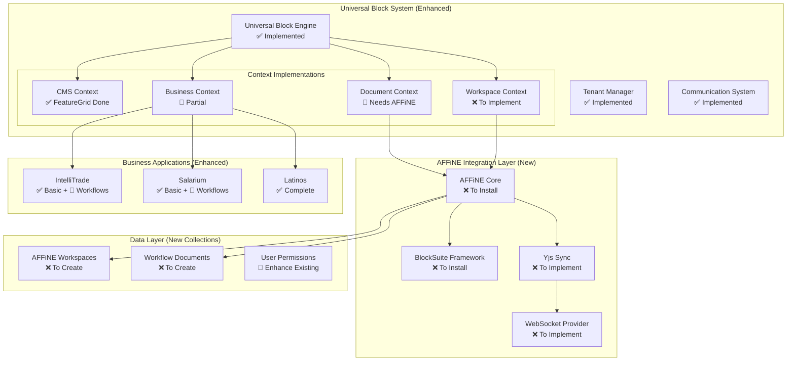
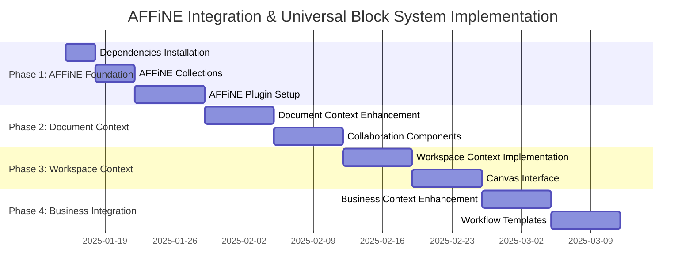

# AFFiNE Integration & Universal Block System - Comprehensive Architecture Plan

## Executive Summary

This document provides a detailed architectural plan for implementing both the AFFiNE Integration Layer (Phase 2) and Universal Block System. The implementation transforms existing Payload CMS blocks into context-aware components that work across CMS, document collaboration, workspace planning, and business process contexts while maintaining zero breaking changes.

## Current State Analysis

✅ **Existing Foundation:**
- Universal Block System core architecture is already implemented
- FeatureGrid migration as proof of concept is complete
- Tenant management and communication systems are in place
- Plugin-based architecture supports business-specific functionality

🔄 **Missing Components:**
- AFFiNE/BlockSuite integration and collections
- Real-time collaboration infrastructure
- Workspace context implementations
- Business workflow integration

## System Architecture Overview



## Implementation Strategy

### Phase 1: AFFiNE Foundation (Week 1-2)
**Goal:** Set up AFFiNE/BlockSuite integration and data models

**Dependencies Installation:**
```bash
# Core AFFiNE packages
npm install @blocksuite/store @blocksuite/blocks @blocksuite/presets
npm install @blocksuite/editor @blocksuite/lit

# Real-time collaboration
npm install yjs y-websocket y-indexeddb y-protocols

# Additional utilities
npm install @types/yjs
```

**Tasks:**
1. **Create AFFiNE Collections**
   - `AFFiNEWorkspaces` collection with tenant isolation
   - `WorkflowDocuments` collection with real-time sync
   - Update existing Users collection with collaboration features

2. **Create AFFiNE Plugin**
   - Shared plugin for AFFiNE integration
   - WebSocket server setup for real-time collaboration
   - Yjs document management with tenant scoping

3. **Data Model Setup**
   - Implement tenant-based access controls
   - Collection hooks for workspace initialization
   - Real-time synchronization configuration

### Phase 2: Document Context Enhancement (Week 3-4)
**Goal:** Enhance existing document context with full AFFiNE collaboration

**Tasks:**
1. **Upgrade Document Context**
   - Integrate AFFiNE Editor into existing document context
   - Add real-time collaboration features
   - Implement conflict resolution strategies

2. **Collaboration Components**
   - User presence indicators
   - Real-time cursor tracking
   - Collaborative editing toolbar
   - Version history and rollback

3. **Enhanced FeatureGrid Document Context**
   - Full AFFiNE Editor integration
   - Real-time collaborative editing
   - Conflict resolution and version control

### Phase 3: Workspace Context Implementation (Week 5-6)
**Goal:** Create visual workspace planning interface

**Tasks:**
1. **Workspace Context**
   - Infinite canvas with AFFiNE integration
   - Drag-and-drop block manipulation
   - Visual design tools and grid system

2. **Block Library**
   - Visual block picker
   - Block configuration panels
   - Template system for common workflows

3. **Canvas Interface**
   - Zoom and pan functionality
   - Grid system with snap-to-grid
   - Block positioning and resizing

### Phase 4: Business Workflow Integration (Week 7-8)
**Goal:** Integrate workflows with existing business applications

**Tasks:**
1. **Enhanced Business Context**
   - KYC workflow integration for IntelliTrade
   - HR process workflows for Salarium
   - Trading strategy workflows for Latinos

2. **Cross-Context Communication**
   - Workflow state management
   - Process automation triggers
   - Business rule execution

3. **Workflow Templates**
   - Pre-built workflow templates for each business
   - Customizable process flows
   - Integration with existing business logic

## Detailed Technical Specifications

### AFFiNE Plugin Architecture

```typescript
// src/plugins/shared/affine-integration/index.ts
export const affineIntegrationPlugin = (): Plugin => (incomingConfig) => {
  return {
    ...incomingConfig,
    collections: [
      ...incomingConfig.collections,
      AFFiNEWorkspaces,
      WorkflowDocuments,
    ],
    endpoints: [
      {
        path: '/api/affine/sync',
        method: 'post',
        handler: handleYjsSync,
      },
      {
        path: '/api/affine/presence',
        method: 'get',
        handler: handlePresenceQuery,
      },
    ],
    onInit: async (payload) => {
      // Initialize WebSocket server for real-time collaboration
      await initializeWebSocketServer(payload)
    },
  }
}
```

### Enhanced Universal Block Architecture

```typescript
// Enhanced Universal Block with AFFiNE support
export interface EnhancedUniversalBlock extends UniversalBlock {
  // AFFiNE-specific capabilities
  affineIntegration: {
    supportsCollaboration: boolean
    supportsCanvas: boolean
    customBlockSuiteBlocks?: string[]
  }
  
  // Enhanced contexts with AFFiNE
  contexts: {
    cms: () => Promise<{ default: React.ComponentType<any> }>
    document: () => Promise<{ 
      default: React.ComponentType<any>
      affineRenderer?: AFFiNERenderer
    }>
    workspace: () => Promise<{ 
      default: React.ComponentType<any>
      canvasRenderer?: CanvasRenderer
    }>
    business: () => Promise<{ 
      default: React.ComponentType<any>
      workflowExecutor?: WorkflowExecutor
    }>
  }
}
```

### Data Model Specifications

#### AFFiNE Workspaces Collection

```typescript
export const AFFiNEWorkspaces: CollectionConfig = {
  slug: 'affine-workspaces',
  admin: {
    group: 'AFFiNE Integration',
    useAsTitle: 'name',
    defaultColumns: ['name', 'tenant', 'collaborators', 'status', 'updatedAt'],
  },
  access: {
    read: ({ req }) => tenantBasedAccess(req, 'affine-workspaces', 'read'),
    create: ({ req }) => tenantBasedAccess(req, 'affine-workspaces', 'create'),
    update: ({ req }) => tenantBasedAccess(req, 'affine-workspaces', 'update'),
    delete: ({ req }) => tenantBasedAccess(req, 'affine-workspaces', 'delete'),
  },
  fields: [
    {
      name: 'name',
      type: 'text',
      required: true,
      admin: {
        description: 'Workspace display name',
      },
    },
    {
      name: 'workspaceId',
      type: 'text',
      unique: true,
      required: true,
      admin: {
        description: 'Unique AFFiNE workspace identifier',
        readOnly: true,
      },
      hooks: {
        beforeChange: [
          ({ operation, value }) => {
            if (operation === 'create' && !value) {
              return `ws_${Date.now()}_${Math.random().toString(36).substr(2, 9)}`
            }
            return value
          },
        ],
      },
    },
    {
      name: 'tenant',
      type: 'relationship',
      relationTo: 'users',
      required: true,
      admin: {
        description: 'Workspace owner/tenant',
      },
    },
    {
      name: 'businessUnit',
      type: 'select',
      options: [
        { label: 'IntelliTrade', value: 'intellitrade' },
        { label: 'Salarium', value: 'salarium' },
        { label: 'Latinos', value: 'latinos' },
        { label: 'Shared', value: 'shared' },
      ],
      required: true,
      admin: {
        description: 'Business unit for tenant isolation',
      },
    },
    {
      name: 'collaborators',
      type: 'relationship',
      relationTo: 'users',
      hasMany: true,
      admin: {
        description: 'Users with access to this workspace',
      },
    },
    {
      name: 'permissions',
      type: 'group',
      fields: [
        {
          name: 'defaultRole',
          type: 'select',
          options: [
            { label: 'Viewer', value: 'viewer' },
            { label: 'Editor', value: 'editor' },
            { label: 'Admin', value: 'admin' },
          ],
          defaultValue: 'viewer',
        },
        {
          name: 'allowPublicAccess',
          type: 'checkbox',
          defaultValue: false,
        },
        {
          name: 'allowGuestEditing',
          type: 'checkbox',
          defaultValue: false,
        },
      ],
    },
    {
      name: 'settings',
      type: 'group',
      fields: [
        {
          name: 'theme',
          type: 'select',
          options: [
            { label: 'Light', value: 'light' },
            { label: 'Dark', value: 'dark' },
            { label: 'Auto', value: 'auto' },
          ],
          defaultValue: 'auto',
        },
        {
          name: 'canvasSettings',
          type: 'group',
          fields: [
            {
              name: 'gridEnabled',
              type: 'checkbox',
              defaultValue: true,
            },
            {
              name: 'snapToGrid',
              type: 'checkbox',
              defaultValue: true,
            },
            {
              name: 'gridSize',
              type: 'number',
              defaultValue: 20,
              min: 10,
              max: 50,
            },
          ],
        },
        {
          name: 'collaborationSettings',
          type: 'group',
          fields: [
            {
              name: 'showCursors',
              type: 'checkbox',
              defaultValue: true,
            },
            {
              name: 'showSelections',
              type: 'checkbox',
              defaultValue: true,
            },
            {
              name: 'enableComments',
              type: 'checkbox',
              defaultValue: true,
            },
          ],
        },
      ],
    },
    {
      name: 'status',
      type: 'select',
      options: [
        { label: 'Active', value: 'active' },
        { label: 'Archived', value: 'archived' },
        { label: 'Deleted', value: 'deleted' },
      ],
      defaultValue: 'active',
      admin: {
        position: 'sidebar',
      },
    },
  ],
  hooks: {
    beforeChange: [
      async ({ data, operation, req }) => {
        if (operation === 'create') {
          // Set tenant from current user
          if (!data.tenant && req.user) {
            data.tenant = req.user.id
          }
        }
      },
    ],
    afterChange: [
      async ({ doc, operation }) => {
        if (operation === 'create') {
          // Initialize AFFiNE workspace
          await initializeAFFiNEWorkspace(doc)
        }
      },
    ],
  },
}
```

#### Workflow Documents Collection

```typescript
export const WorkflowDocuments: CollectionConfig = {
  slug: 'workflow-documents',
  admin: {
    group: 'AFFiNE Integration',
    useAsTitle: 'title',
    defaultColumns: ['title', 'workspace', 'status', 'collaborators', 'updatedAt'],
  },
  access: {
    read: ({ req }) => tenantBasedAccess(req, 'workflow-documents', 'read'),
    create: ({ req }) => tenantBasedAccess(req, 'workflow-documents', 'create'),
    update: ({ req }) => tenantBasedAccess(req, 'workflow-documents', 'update'),
    delete: ({ req }) => tenantBasedAccess(req, 'workflow-documents', 'delete'),
  },
  fields: [
    {
      name: 'title',
      type: 'text',
      required: true,
      admin: {
        description: 'Document title',
      },
    },
    {
      name: 'documentId',
      type: 'text',
      unique: true,
      required: true,
      admin: {
        description: 'Unique AFFiNE document identifier',
        readOnly: true,
      },
      hooks: {
        beforeChange: [
          ({ operation, value }) => {
            if (operation === 'create' && !value) {
              return `doc_${Date.now()}_${Math.random().toString(36).substr(2, 9)}`
            }
            return value
          },
        ],
      },
    },
    {
      name: 'workspace',
      type: 'relationship',
      relationTo: 'affine-workspaces',
      required: true,
      admin: {
        description: 'Parent workspace',
      },
    },
    {
      name: 'documentType',
      type: 'select',
      options: [
        { label: 'Collaborative Document', value: 'document' },
        { label: 'Visual Workspace', value: 'workspace' },
        { label: 'Business Process', value: 'process' },
        { label: 'Mixed Content', value: 'mixed' },
      ],
      required: true,
      defaultValue: 'document',
    },
    {
      name: 'blockData',
      type: 'json',
      admin: {
        description: 'AFFiNE/BlockSuite document data',
      },
    },
    {
      name: 'universalBlocks',
      type: 'array',
      admin: {
        description: 'Universal blocks used in this document',
      },
      fields: [
        {
          name: 'blockId',
          type: 'text',
          required: true,
        },
        {
          name: 'blockType',
          type: 'text',
          required: true,
        },
        {
          name: 'context',
          type: 'select',
          options: [
            { label: 'Document', value: 'document' },
            { label: 'Workspace', value: 'workspace' },
            { label: 'Business', value: 'business' },
          ],
          required: true,
        },
        {
          name: 'configuration',
          type: 'json',
          admin: {
            description: 'Block-specific configuration',
          },
        },
      ],
    },
    {
      name: 'version',
      type: 'number',
      defaultValue: 1,
      admin: {
        description: 'Document version number',
        readOnly: true,
      },
    },
    {
      name: 'collaborators',
      type: 'relationship',
      relationTo: 'users',
      hasMany: true,
      admin: {
        description: 'Active collaborators',
      },
    },
    {
      name: 'status',
      type: 'select',
      options: [
        { label: 'Draft', value: 'draft' },
        { label: 'Active', value: 'active' },
        { label: 'Completed', value: 'completed' },
        { label: 'Archived', value: 'archived' },
      ],
      defaultValue: 'draft',
      admin: {
        position: 'sidebar',
      },
    },
    {
      name: 'synchronization',
      type: 'group',
      admin: {
        description: 'Real-time sync configuration',
      },
      fields: [
        {
          name: 'yjsState',
          type: 'textarea',
          admin: {
            description: 'Yjs document state (base64 encoded)',
            readOnly: true,
          },
        },
        {
          name: 'lastSyncTime',
          type: 'date',
          admin: {
            readOnly: true,
          },
        },
        {
          name: 'conflictResolution',
          type: 'select',
          options: [
            { label: 'Last Writer Wins', value: 'lww' },
            { label: 'Operational Transform', value: 'ot' },
            { label: 'Manual Resolution', value: 'manual' },
          ],
          defaultValue: 'ot',
        },
        {
          name: 'syncEnabled',
          type: 'checkbox',
          defaultValue: true,
        },
      ],
    },
  ],
  hooks: {
    beforeChange: [
      async ({ data, operation }) => {
        if (operation === 'update') {
          // Increment version on content changes
          if (data.blockData) {
            data.version = (data.version || 1) + 1
          }
          
          // Update sync time
          data.synchronization = {
            ...data.synchronization,
            lastSyncTime: new Date(),
          }
        }
      },
    ],
    afterChange: [
      async ({ doc, operation }) => {
        if (operation === 'create') {
          // Initialize Yjs document
          await initializeYjsDocument(doc)
        }
        
        // Update workspace document count
        await updateWorkspaceMetadata(doc.workspace)
      },
    ],
  },
}
```

## Migration Strategy for Existing Blocks

### Zero Breaking Changes Approach

```typescript
// Backward compatibility wrapper
export const createUniversalBlockMigration = (
  legacyBlock: any,
  blockType: string
): EnhancedUniversalBlock => {
  return {
    id: `${blockType.toLowerCase()}-universal`,
    type: blockType,
    version: '1.0.0',
    
    // Preserve existing schema
    schema: extractSchemaFromLegacyBlock(legacyBlock),
    
    // Context implementations
    contexts: {
      // CMS: Exact same functionality
      cms: () => import(`@/blocks/${blockType}/Component`),
      
      // Document: Enhanced with collaboration
      document: () => import(`@/blocks/universal/migration/${blockType}/contexts/document`),
      
      // Workspace: Visual planning interface
      workspace: () => import(`@/blocks/universal/migration/${blockType}/contexts/workspace`),
      
      // Business: Workflow execution
      business: () => import(`@/blocks/universal/migration/${blockType}/contexts/business`),
    },
    
    // AFFiNE integration capabilities
    affineIntegration: {
      supportsCollaboration: true,
      supportsCanvas: true,
    },
    
    // Communication and tenant isolation
    communication: generateCommunicationConfig(blockType),
    tenantIsolation: generateTenantConfig(blockType),
  }
}
```

### Progressive Enhancement Strategy

1. **Phase 1:** Existing blocks work exactly as before (CMS context)
2. **Phase 2:** Add document context with collaboration (opt-in)
3. **Phase 3:** Add workspace context for visual planning (opt-in)
4. **Phase 4:** Add business context for workflow execution (opt-in)

## Business Application Integration

### IntelliTrade KYC Workflow

```typescript
// KYC Process using Universal Blocks
export const KYCWorkflowTemplate = {
  name: 'SARLAFT KYC Process',
  workspace: 'intellitrade-kyc',
  blocks: [
    {
      type: 'FeatureGrid',
      context: 'business',
      config: {
        heading: 'KYC Verification Steps',
        features: [
          { id: 'company-info', title: 'Company Information', required: true },
          { id: 'documents', title: 'Document Upload', required: true },
          { id: 'ai-verification', title: 'AI Verification', automated: true },
          { id: 'compliance-approval', title: 'Compliance Review', approver: 'compliance-officer' }
        ],
        layout: '2col',
        workflowMode: 'sequential'
      }
    }
  ],
  
  workflow: {
    steps: [
      {
        blockId: 'company-info',
        action: 'collectCompanyData',
        validation: 'required-fields',
        nextStep: 'documents'
      },
      {
        blockId: 'documents',
        action: 'uploadDocuments',
        validation: 'document-types',
        aiProcessing: 'document-validation',
        nextStep: 'ai-verification'
      },
      {
        blockId: 'ai-verification',
        action: 'aiRiskAssessment',
        automated: true,
        nextStep: 'compliance-approval'
      },
      {
        blockId: 'compliance-approval',
        action: 'complianceReview',
        approver: 'compliance-officer',
        finalStep: true
      }
    ]
  }
}
```

### Salarium HR Workflows

```typescript
// Employee Onboarding using Universal Blocks
export const EmployeeOnboardingTemplate = {
  name: 'Employee Onboarding Process',
  workspace: 'salarium-onboarding',
  blocks: [
    {
      type: 'ParallaxHero',
      context: 'document',
      config: {
        heading: 'Welcome to the Team!',
        collaborative: true,
        allowCustomization: true
      }
    },
    {
      type: 'FeatureGrid',
      context: 'business',
      config: {
        heading: 'Onboarding Checklist',
        features: 'hr-onboarding-steps',
        workflowMode: 'checklist'
      }
    }
  ]
}
```

### Latinos Trading Strategy Planning

```typescript
// Trading Strategy Design using Universal Blocks
export const TradingStrategyTemplate = {
  name: 'Trading Strategy Designer',
  workspace: 'latinos-strategy',
  blocks: [
    {
      type: 'TradingDashboard',
      context: 'workspace',
      config: {
        enableCollaboration: true,
        visualDesignMode: true,
        realTimeData: true
      }
    }
  ]
}
```

## Performance and Scalability Considerations

### Performance Targets
- **Context Switching:** < 100ms
- **Real-time Sync:** < 500ms latency
- **Bundle Size:** < 20KB per context (lazy loaded)
- **Concurrent Users:** 50+ per document
- **Canvas Performance:** 60 FPS for workspace operations

### Optimization Strategies
- Lazy loading of context implementations
- Efficient Yjs document management
- WebSocket connection pooling
- Tenant-scoped caching
- Progressive loading of collaboration features

## Security and Tenant Isolation

### Multi-Tenant Security
- All Yjs documents scoped by tenant ID
- WebSocket connections authenticated per tenant
- Database queries filtered by tenant access
- Zero cross-tenant data leakage

### Access Control
- Document-level permissions (read/write/admin)
- Real-time permission enforcement
- Secure WebSocket authentication
- API endpoint protection with tenant validation

## Success Metrics

### Technical Metrics
- ✅ Zero breaking changes to existing functionality
- ✅ < 100ms context switching performance
- ✅ Real-time collaboration with < 500ms latency
- ✅ 99.9% uptime for collaborative features

### Business Metrics
- 🎯 50% faster workflow creation
- 🎯 80% reduction in duplicated block code
- 🎯 Seamless user experience across contexts
- 🎯 Support for 10+ business applications

## Implementation Timeline



## Next Steps

1. **Validate Architecture:** Review this plan with stakeholders
2. **Phase 1 Implementation:** Start with AFFiNE foundation and data models
3. **Proof of Concept:** Enhance FeatureGrid document context with full AFFiNE integration
4. **Progressive Rollout:** Implement remaining phases incrementally
5. **Business Integration:** Connect workflows to real business processes

This architecture provides a comprehensive foundation for transforming the current multi-tenant CMS into a Universal Business Platform while preserving all existing functionality and enabling powerful new collaborative and workflow capabilities.