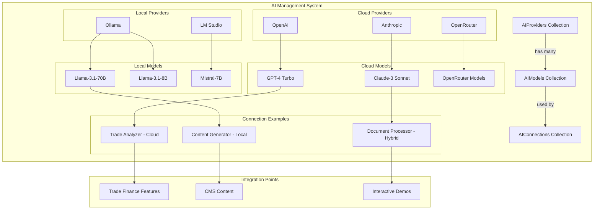
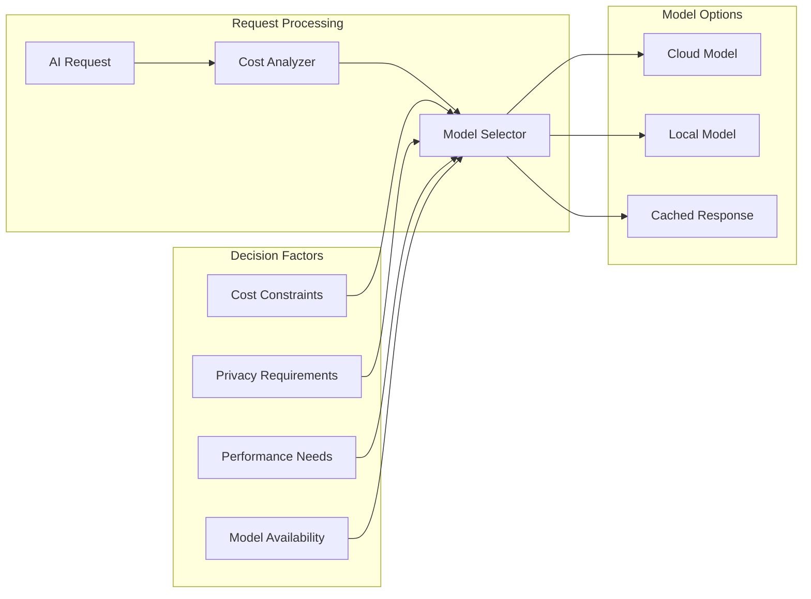
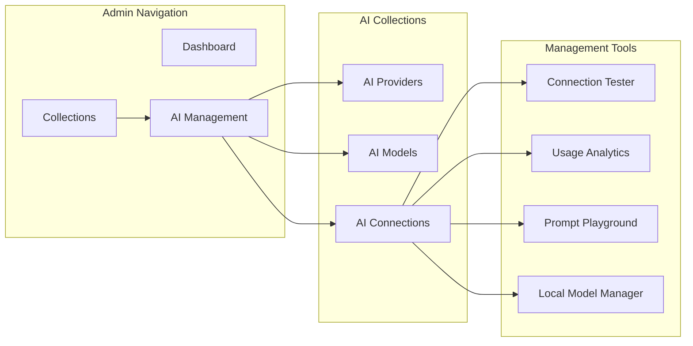

# AI Collection Design Plan for IntelliTrade CMS

## Overview

This document outlines the design for a comprehensive AI collection system that will manage AI providers, models, and connection configurations for the IntelliTrade CMS. The system supports both cloud-based providers (OpenAI, Anthropic, OpenRouter) and local providers (Ollama, LM Studio), following existing architectural patterns and integrating seamlessly with the current trade finance platform.

## Architecture Design

### Collection Structure

The AI system is designed with three interconnected collections following the existing patterns:

```
AIProviders → AIModels → AIConnections
     ↓           ↓           ↓
  (Provider)  (Model)   (Instance)
```

This hierarchical structure provides:
- **Flexibility**: Easy to add new cloud and local providers
- **Cost Optimization**: Mix of cloud and local models based on requirements
- **Privacy Control**: Local models for sensitive operations
- **Scalability**: Can handle multiple AI services and configurations
- **Consistency**: Follows existing collection patterns in the codebase

## Collection Specifications

### 1. AIProviders Collection

**Purpose**: Manages AI service providers including cloud (OpenAI, Anthropic, OpenRouter) and local (Ollama, LM Studio) providers

**Key Features**:
- Provider metadata and authentication configuration
- Support for local and cloud provider types
- Status management (active/inactive/maintenance)
- Local configuration for self-hosted solutions
- Documentation links and descriptions

**Fields Structure**:
```typescript
{
  name: string (required) // e.g., "OpenAI", "Anthropic", "Ollama", "LM Studio"
  slug: string (required, unique) // e.g., "openai", "anthropic", "ollama", "lm-studio"
  baseUrl: string (required) // API endpoint or local URL (e.g., "http://localhost:11434")
  providerType: select // cloud, local, proxy
  authType: select // api-key, bearer, oauth, none
  status: select // active, inactive, maintenance
  description: textarea
  documentation: string // Link to API docs
  localConfig: { // For local providers
    defaultPort: number
    installationPath: string
    requiresGPU: boolean
    supportedFormats: string[] // e.g., ["GGUF", "GGML", "Safetensors"]
  }
}
```

### 2. AIModels Collection

**Purpose**: Defines specific AI models with comprehensive capabilities and pricing

**Key Features**:
- Model specifications and advanced capabilities
- Comprehensive pricing information including caching costs
- Support for multiple modalities and advanced features
- Performance metrics and requirements
- Local model management (size, quantization)

**Fields Structure**:
```typescript
{
  name: string (required) // e.g., "GPT-4", "Claude-3-Sonnet", "Llama-3.1-70B"
  modelId: string (required) // API model identifier
  provider: relationship (AIProviders, required)
  type: select[] // text, image, multimodal, audio, video
  capabilities: {
    maxTokens: number // Max output tokens (e.g., 64000)
    contextWindow: number // Input context window
    supportsStreaming: boolean
    supportsFunctionCalling: boolean
    supportsVision: boolean
    supportsImages: boolean
    supportsComputerUse: boolean
    supportsPromptCaching: boolean
    supportsAudio: boolean
    supportsVideo: boolean
    modelSize: string // For local models (e.g., "7B", "70B")
    quantization: string // For local models (e.g., "Q4_K_M", "Q8_0")
  }
  pricing: {
    inputTokenPrice: number // per 1M tokens (e.g., 3.00)
    outputTokenPrice: number // per 1M tokens (e.g., 15.00)
    cacheReadsPrice: number // per 1M tokens (e.g., 0.30)
    cacheWritesPrice: number // per 1M tokens (e.g., 3.75)
    currency: string
    isLocal: boolean // Free for local models
  }
  performance: {
    averageLatency: number // milliseconds
    tokensPerSecond: number
    memoryRequirement: number // GB RAM required
    diskSpace: number // GB disk space required
  }
  status: select // available, beta, deprecated, unavailable, downloading
}
```

### 3. AIConnections Collection

**Purpose**: Manages specific AI connection instances with configurations

**Key Features**:
- Purpose-specific configurations for different use cases
- Comprehensive parameter settings (temperature, top-k, etc.)
- Usage limits and rate limiting
- System prompts and credentials management
- Usage statistics and cost monitoring
- Local model management

**Fields Structure**:
```typescript
{
  name: string (required) // e.g., "Trade Analysis GPT-4", "Local Content Generator"
  slug: string (required, unique)
  model: relationship (AIModels, required)
  purpose: select // trade-analysis, document-processing, content-generation, etc.
  configuration: {
    temperature: number (0-2, step 0.1)
    topP: number (0-1, step 0.1)
    topK: number (1-100)
    maxTokens: number
    frequencyPenalty: number (-2 to 2, step 0.1)
    presencePenalty: number (-2 to 2, step 0.1)
    usePromptCaching: boolean
    cacheBreaker: string // For cache invalidation
  }
  systemPrompt: textarea
  credentials: {
    apiKey: text (encrypted) // Not needed for local models
    organizationId: text (conditional)
  }
  limits: {
    dailyRequestLimit: number
    monthlyTokenLimit: number
    rateLimitPerMinute: number
    maxCostPerMonth: number // Cost control
  }
  localSettings: { // For local models
    modelPath: string
    loadOnStartup: boolean
    gpuLayers: number
    contextSize: number
  }
  status: select // active, inactive, testing, error, loading
  lastUsed: date (readonly)
  usageStats: {
    totalRequests: number (readonly)
    totalTokensUsed: number (readonly)
    totalCostUSD: number (readonly)
    averageResponseTime: number (readonly)
    cacheHitRate: number (readonly)
  }
}
```

## Provider-Specific Configurations

### Cloud Providers

#### OpenAI
- Models: GPT-4, GPT-4-Turbo, GPT-3.5-Turbo, DALL-E 3
- Features: Function calling, vision, audio
- Pricing: Standard per-token pricing

#### Anthropic
- Models: Claude-3-Opus, Claude-3-Sonnet, Claude-3-Haiku
- Features: Computer use, vision, prompt caching
- Pricing: Input/output pricing with cache pricing

#### OpenRouter
- Models: Access to 100+ models from various providers
- Features: Unified API for multiple providers
- Pricing: Variable based on underlying model

### Local Providers

#### Ollama
- Models: Llama, Mistral, CodeLlama, Vicuna, etc.
- Features: Easy model management, GPU acceleration
- Setup: Docker or native installation
- Cost: Free (hardware costs only)

#### LM Studio
- Models: GGUF format models from Hugging Face
- Features: GUI interface, model discovery
- Setup: Desktop application
- Cost: Free (hardware costs only)

## Integration with IntelliTrade Platform

### Trade Finance Use Cases

1. **Document Analysis**
   - Purpose: `document-processing`
   - Model: Claude-3-Sonnet (high accuracy, supports images)
   - Configuration: Low temperature (0.1) for consistent analysis
   - System Prompt: Trade finance document expertise
   - Features: Vision support for document scanning

2. **Risk Assessment**
   - Purpose: `risk-assessment`
   - Model: GPT-4-Turbo (reasoning capabilities)
   - Configuration: Medium temperature (0.5) for balanced analysis
   - System Prompt: Risk analysis expertise
   - Features: Function calling for data retrieval

3. **Content Generation**
   - Purpose: `content-generation`
   - Model: GPT-4-Turbo (creativity) or Local Llama-3.1-70B
   - Configuration: Higher temperature (0.8) for creative content
   - System Prompt: Trade finance educational content
   - Features: Long-form content generation

4. **Customer Support**
   - Purpose: `customer-support`
   - Model: Claude-3-Haiku (fast responses) or Local Llama-3.1-8B
   - Configuration: Medium temperature (0.6) for helpful responses
   - System Prompt: Customer service expertise
   - Features: Real-time streaming responses

5. **Local Development**
   - Purpose: `development-testing`
   - Model: Ollama Llama-3.1-8B (privacy, no API costs)
   - Configuration: Variable temperature for testing
   - System Prompt: Development and testing scenarios
   - Features: Complete privacy, no internet required

6. **Computer Use Automation**
   - Purpose: `automation`
   - Model: Claude-3-Sonnet (computer use capability)
   - Configuration: Low temperature (0.2) for consistent actions
   - System Prompt: Trade platform automation expertise
   - Features: Screen interaction, form filling

### CMS Integration Points

- **Content Management**: AI-powered content generation for blog posts and educational materials
- **Demo Enhancement**: AI-driven interactive demos and explanations
- **User Onboarding**: Intelligent tutorials and guidance
- **Data Analysis**: AI-powered insights from trade transaction data
- **Cost Optimization**: Automatic selection between cloud and local models

## Admin Interface Design

### Collection Grouping
All AI collections will be grouped under "AI Management" in the admin interface, similar to how trade finance collections are grouped under "IntelliTrade".

### Custom Components

1. **Connection Tester**
   - Button to test API connectivity
   - Real-time status indicators for local and cloud models
   - Error message display with troubleshooting tips
   - Local model status (loaded/unloaded)

2. **Usage Dashboard**
   - Visual charts for token usage and costs
   - Cost tracking and projections
   - Performance metrics comparison (cloud vs local)
   - Cache hit rate monitoring

3. **Model Comparison Tool**
   - Side-by-side capability comparison
   - Performance benchmarks
   - Cost analysis (including hardware costs for local)
   - Feature matrix

4. **Prompt Playground**
   - Test prompts with different configurations
   - Real-time parameter adjustment
   - Response comparison between models
   - Caching test functionality

5. **Local Model Manager**
   - Download and install local models
   - Model size and requirements display
   - GPU utilization monitoring
   - Model switching interface

### Validation and Security

1. **API Key Encryption**
   - Custom encrypted field component
   - Secure storage in database
   - Environment variable fallback

2. **Connection Validation**
   - Pre-save API connectivity testing
   - Local model availability checking
   - Rate limit validation
   - Model capability verification

3. **Usage Monitoring**
   - Real-time usage tracking
   - Cost limit enforcement
   - Performance monitoring
   - Alert system for issues

## Implementation Phases

### Phase 1: Core Collections (Week 1)
- Create AIProviders collection with local provider support
- Create AIModels collection with comprehensive capabilities
- Basic admin interface setup
- Seed data for cloud providers (OpenAI, Anthropic, OpenRouter)
- Seed data for local providers (Ollama, LM Studio)

### Phase 2: Connection Management (Week 2)
- Create AIConnections collection
- Implement configuration management for local and cloud
- Add validation hooks for different provider types
- Create connection testing functionality
- Local model detection and management

### Phase 3: Admin Enhancements (Week 3)
- Custom admin components
- Usage dashboard with cost tracking
- Model comparison tool (cloud vs local)
- Prompt playground with caching support
- Local model installer interface

### Phase 4: Integration (Week 4)
- Integrate with existing trade finance features
- Add AI-powered content generation
- Implement demo enhancements
- Usage analytics and cost monitoring
- Local model performance optimization

### Phase 5: Advanced Features (Week 5)
- Advanced usage analytics
- Cost optimization recommendations (cloud vs local)
- Performance monitoring and benchmarking
- Automated model selection based on task requirements
- Prompt caching optimization

## Technical Considerations

### Database Schema
- Follow existing naming conventions (kebab-case for slugs)
- Use appropriate field types and validations
- Implement proper relationships and indexes
- Consider data migration strategies
- Support for local model metadata

### Security
- Encrypt sensitive credentials
- Implement proper access controls
- Audit trail for configuration changes
- Rate limiting and abuse prevention
- Local model security considerations

### Performance
- Efficient query patterns
- Caching strategies for frequently accessed data
- Lazy loading for large datasets
- Connection pooling for API calls
- Local model memory management

### Monitoring
- Usage tracking and analytics
- Error logging and alerting
- Performance metrics collection
- Cost tracking and optimization
- Local model performance monitoring

## Success Metrics

1. **Functionality**
   - All AI providers (cloud and local) successfully configured
   - Connection testing works reliably for all provider types
   - Usage limits enforced correctly
   - Local models load and respond properly

2. **Usability**
   - Admin interface intuitive for both cloud and local setups
   - Configuration changes take effect immediately
   - Error messages clear and actionable
   - Model switching seamless

3. **Performance**
   - API response times under 2 seconds for cloud models
   - Local model response times competitive
   - Admin interface loads under 1 second
   - No impact on existing CMS performance

4. **Cost Optimization**
   - Effective cost tracking and alerts
   - Successful cloud/local model selection
   - Cache hit rates above 30% where applicable
   - Cost savings measurable

## Mermaid Diagrams

### System Architecture


### Cost Optimization Flow


### Admin Interface Flow


## Seed Data Examples

### Cloud Providers
```typescript
// OpenAI
{
  name: "OpenAI",
  slug: "openai",
  baseUrl: "https://api.openai.com/v1",
  providerType: "cloud",
  authType: "api-key",
  status: "active"
}

// Anthropic
{
  name: "Anthropic",
  slug: "anthropic",
  baseUrl: "https://api.anthropic.com",
  providerType: "cloud",
  authType: "api-key",
  status: "active"
}

// OpenRouter
{
  name: "OpenRouter",
  slug: "openrouter",
  baseUrl: "https://openrouter.ai/api/v1",
  providerType: "proxy",
  authType: "api-key",
  status: "active"
}
```

### Local Providers
```typescript
// Ollama
{
  name: "Ollama",
  slug: "ollama",
  baseUrl: "http://localhost:11434",
  providerType: "local",
  authType: "none",
  status: "active",
  localConfig: {
    defaultPort: 11434,
    requiresGPU: false,
    supportedFormats: ["GGUF"]
  }
}

// LM Studio
{
  name: "LM Studio",
  slug: "lm-studio",
  baseUrl: "http://localhost:1234",
  providerType: "local",
  authType: "none",
  status: "active",
  localConfig: {
    defaultPort: 1234,
    requiresGPU: false,
    supportedFormats: ["GGUF", "GGML"]
  }
}
```

### Model Examples
```typescript
// Claude-3-Sonnet with comprehensive capabilities
{
  name: "Claude-3-Sonnet",
  modelId: "claude-3-sonnet-20240229",
  provider: "anthropic",
  type: ["text", "image", "multimodal"],
  capabilities: {
    maxTokens: 64000,
    contextWindow: 200000,
    supportsStreaming: true,
    supportsFunctionCalling: true,
    supportsVision: true,
    supportsImages: true,
    supportsComputerUse: true,
    supportsPromptCaching: true
  },
  pricing: {
    inputTokenPrice: 3.00,
    outputTokenPrice: 15.00,
    cacheReadsPrice: 0.30,
    cacheWritesPrice: 3.75,
    currency: "USD",
    isLocal: false
  }
}

// Local Llama model
{
  name: "Llama-3.1-8B-Instruct",
  modelId: "llama3.1:8b",
  provider: "ollama",
  type: ["text"],
  capabilities: {
    maxTokens: 8192,
    contextWindow: 128000,
    supportsStreaming: true,
    modelSize: "8B",
    quantization: "Q4_K_M"
  },
  pricing: {
    isLocal: true
  },
  performance: {
    memoryRequirement: 8,
    diskSpace: 4.7
  }
}
```

## Next Steps

1. **Review and Approval**: Review this comprehensive design plan with stakeholders
2. **Technical Validation**: Validate technical approach with development team
3. **Local Setup Testing**: Test Ollama and LM Studio integration approaches
4. **Resource Planning**: Allocate development resources for implementation
5. **Timeline Confirmation**: Confirm implementation timeline and milestones
6. **Implementation Start**: Begin Phase 1 development

This design provides a comprehensive, scalable, and cost-effective AI management system that supports both cloud and local AI providers, integrating seamlessly with the existing IntelliTrade CMS architecture while providing powerful AI capabilities for trade finance operations with optimal cost management.