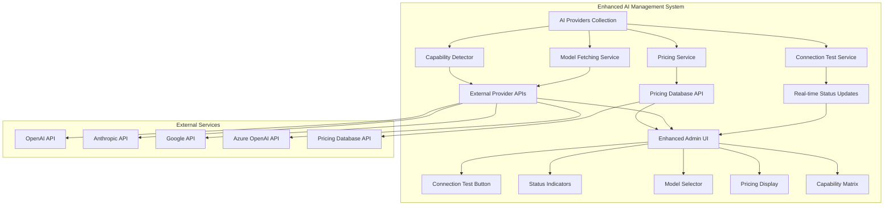

# Enhanced AI Providers System - Implementation Plan

## Overview
Transform the basic AI Providers collection into a comprehensive, first-class AI management system with advanced features, real-time connection testing, dynamic model lists, and external pricing integration.

## Current State Analysis
The existing AI Providers collection (`src/plugins/shared/ai-management/index.ts`) is minimal with only basic fields:
- Basic provider info (name, provider, baseUrl, apiKey)
- Simple configuration (model, maxTokens, temperature)
- Basic status tracking

## Required Enhancements

### 1. Comprehensive Data Model
```typescript
interface EnhancedAIProvider {
  // Basic Info
  name: string
  provider: 'openai' | 'anthropic' | 'google' | 'azure' | 'ollama' | 'lmstudio'
  baseUrl: string
  apiKey?: string
  
  // Capabilities
  capabilities: {
    supportsImages: boolean
    supportsComputerUse: boolean
    supportsPromptCaching: boolean
    supportsFunctionCalling: boolean
    supportsStreaming: boolean
    supportsVision: boolean
  }
  
  // Pricing (per 1M tokens)
  pricing: {
    inputPrice: number        // $3.00 / 1M tokens
    outputPrice: number       // $15.00 / 1M tokens
    cacheReadsPrice?: number  // $0.30 / 1M tokens
    cacheWritesPrice?: number // $3.75 / 1M tokens
    currency: 'USD'
  }
  
  // Model Configuration
  models: {
    availableModels: string[] // Fetched from external API
    defaultModel: string
    maxOutputTokens: number   // 64,000 tokens
    contextWindow: number
  }
  
  // Advanced Parameters
  parameters: {
    temperature: { min: 0, max: 2, default: 0.7 }
    topP: { min: 0, max: 1, default: 1 }
    topK?: number
    frequencyPenalty: { min: -2, max: 2, default: 0 }
    presencePenalty: { min: -2, max: 2, default: 0 }
  }
  
  // Connection Testing
  connectionTest: {
    status: 'connected' | 'disconnected' | 'testing' | 'error'
    lastTestDate: Date
    lastTestError?: string
    responseTime?: number
    testEndpoint: string
    autoTestOnSave: boolean
  }
  
  // Metadata
  metadata: {
    website: string
    documentation: string
    supportContact: string
    version: string
    tags: string[]
  }
}
```

### 2. External Data Integration Requirements
- **Model Lists API**: Fetch available models from provider APIs
- **Pricing Database**: External service for up-to-date pricing
- **Capability Matrix**: Dynamic capability detection
- **Real-time Updates**: WebSocket or polling for status updates

### 3. Connection Testing System
- **Auto-test on Save**: Automatic connection validation when provider is saved
- **Auto-test on Load**: Test connection when admin page loads
- **Manual Test Button**: Green/red button for on-demand testing
- **Status Indicators**: Visual connection status throughout admin
- **Performance Metrics**: Response time tracking and display

## Implementation Strategy

### Phase 1: Enhanced Data Model ⏳
**Priority**: HIGH
**Estimated Effort**: Medium

**Tasks**:
1. Update AI Management Plugin schema with comprehensive fields
2. Create database migration script for new columns
3. Update TypeScript definitions
4. Test schema changes with existing data

**Files to Modify**:
- `src/plugins/shared/ai-management/index.ts` - Enhanced collection schema
- `src/payload-types.ts` - Type definitions (auto-generated)
- `.kilocode/tests/database/` - New migration script

### Phase 2: External Data Integration ⏳
**Priority**: HIGH
**Estimated Effort**: Large

**Tasks**:
1. Create Model Fetching Service for dynamic model lists
2. Implement Pricing API Integration for real-time pricing
3. Build Capability Detection system
4. Create external API abstraction layer

**New Files**:
- `src/services/ai-providers/ModelFetchingService.ts`
- `src/services/ai-providers/PricingService.ts`
- `src/services/ai-providers/CapabilityDetector.ts`
- `src/api/ai-providers/models/route.ts`
- `src/api/ai-providers/pricing/route.ts`

### Phase 3: Connection Testing System ⏳
**Priority**: HIGH
**Estimated Effort**: Medium

**Tasks**:
1. Create Connection Test API endpoint
2. Implement real-time status updates
3. Build test automation on save/load
4. Add performance monitoring

**New Files**:
- `src/api/ai-providers/test-connection/route.ts`
- `src/services/ai-providers/ConnectionTester.ts`
- `src/hooks/useConnectionStatus.ts`

### Phase 4: Enhanced Admin UI ⏳
**Priority**: MEDIUM
**Estimated Effort**: Large

**Tasks**:
1. Create custom admin components for connection testing
2. Build visual status indicators
3. Design advanced configuration forms
4. Implement real-time status updates in UI

**New Files**:
- `src/plugins/shared/ai-management/components/ConnectionTestButton.tsx`
- `src/plugins/shared/ai-management/components/StatusIndicator.tsx`
- `src/plugins/shared/ai-management/components/PricingDisplay.tsx`
- `src/plugins/shared/ai-management/components/ModelSelector.tsx`
- `src/plugins/shared/ai-management/components/CapabilityMatrix.tsx`

## Database Schema Changes

```sql
-- Enhanced ai_providers table structure
-- Capabilities
ALTER TABLE ai_providers ADD COLUMN supports_images BOOLEAN DEFAULT FALSE;
ALTER TABLE ai_providers ADD COLUMN supports_computer_use BOOLEAN DEFAULT FALSE;
ALTER TABLE ai_providers ADD COLUMN supports_prompt_caching BOOLEAN DEFAULT FALSE;
ALTER TABLE ai_providers ADD COLUMN supports_function_calling BOOLEAN DEFAULT FALSE;
ALTER TABLE ai_providers ADD COLUMN supports_streaming BOOLEAN DEFAULT TRUE;
ALTER TABLE ai_providers ADD COLUMN supports_vision BOOLEAN DEFAULT FALSE;

-- Pricing (stored as cents to avoid floating point issues)
ALTER TABLE ai_providers ADD COLUMN input_price_cents INTEGER; -- $3.00 = 300 cents
ALTER TABLE ai_providers ADD COLUMN output_price_cents INTEGER; -- $15.00 = 1500 cents
ALTER TABLE ai_providers ADD COLUMN cache_reads_price_cents INTEGER; -- $0.30 = 30 cents
ALTER TABLE ai_providers ADD COLUMN cache_writes_price_cents INTEGER; -- $3.75 = 375 cents

-- Model Configuration
ALTER TABLE ai_providers ADD COLUMN max_output_tokens INTEGER DEFAULT 4096;
ALTER TABLE ai_providers ADD COLUMN context_window INTEGER DEFAULT 4096;
ALTER TABLE ai_providers ADD COLUMN available_models TEXT; -- JSON array

-- Advanced Parameters
ALTER TABLE ai_providers ADD COLUMN top_p DECIMAL(3,2) DEFAULT 1.0;
ALTER TABLE ai_providers ADD COLUMN top_k INTEGER;
ALTER TABLE ai_providers ADD COLUMN frequency_penalty DECIMAL(3,2) DEFAULT 0.0;
ALTER TABLE ai_providers ADD COLUMN presence_penalty DECIMAL(3,2) DEFAULT 0.0;

-- Connection Testing
ALTER TABLE ai_providers ADD COLUMN connection_status TEXT DEFAULT 'disconnected';
ALTER TABLE ai_providers ADD COLUMN last_test_date DATETIME;
ALTER TABLE ai_providers ADD COLUMN last_test_error TEXT;
ALTER TABLE ai_providers ADD COLUMN response_time_ms INTEGER;
ALTER TABLE ai_providers ADD COLUMN test_endpoint TEXT;
ALTER TABLE ai_providers ADD COLUMN auto_test_on_save BOOLEAN DEFAULT TRUE;

-- Metadata
ALTER TABLE ai_providers ADD COLUMN website TEXT;
ALTER TABLE ai_providers ADD COLUMN documentation TEXT;
ALTER TABLE ai_providers ADD COLUMN support_contact TEXT;
ALTER TABLE ai_providers ADD COLUMN version TEXT;
ALTER TABLE ai_providers ADD COLUMN tags TEXT; -- JSON array
```

## API Endpoints Design

```typescript
// New API endpoints for enhanced AI management
POST /api/ai-providers/test-connection/:id
  // Test connection to specific provider
  // Returns: { status, responseTime, error? }

GET /api/ai-providers/models/:provider
  // Fetch available models for provider type
  // Returns: { models: string[], lastUpdated: Date }

GET /api/ai-providers/pricing/:provider
  // Get current pricing for provider
  // Returns: { inputPrice, outputPrice, cacheReads?, cacheWrites? }

POST /api/ai-providers/refresh-models/:id
  // Refresh model list for specific provider
  // Returns: { models: string[], updated: boolean }

GET /api/ai-providers/status/:id
  // Get real-time status of provider
  // Returns: { status, lastTest, responseTime }

POST /api/ai-providers/bulk-test
  // Test all active providers
  // Returns: { results: Array<{id, status, responseTime}> }
```

## Technical Architecture



## Success Criteria

### Functional Requirements ✅
- [ ] Real-time connection testing with visual indicators
- [ ] Dynamic model lists fetched from external APIs
- [ ] Comprehensive pricing information display
- [ ] Advanced parameter configuration (topP, topK, etc.)
- [ ] Capability matrix showing provider features
- [ ] Auto-testing on save/load functionality
- [ ] Performance metrics tracking

### Technical Requirements ✅
- [ ] Database schema supports all new fields
- [ ] API endpoints for external data integration
- [ ] Custom admin UI components
- [ ] Real-time status updates
- [ ] Error handling and recovery
- [ ] Performance optimization

### User Experience Goals ✅
- [ ] Intuitive connection status visualization
- [ ] One-click connection testing
- [ ] Comprehensive provider information at a glance
- [ ] Easy model selection and configuration
- [ ] Clear pricing information display
- [ ] Responsive and fast admin interface

## Risk Assessment

### High Risk 🔴
- **External API Dependencies**: Provider APIs may change or become unavailable
- **Rate Limiting**: Testing connections may hit API rate limits
- **Data Consistency**: Keeping external data synchronized

### Medium Risk 🟡
- **Performance Impact**: Real-time testing may slow down admin interface
- **Database Migration**: Complex schema changes on existing data
- **UI Complexity**: Advanced features may overwhelm users

### Mitigation Strategies
- **Caching**: Cache external data with TTL
- **Graceful Degradation**: Fallback to basic functionality if external services fail
- **Progressive Enhancement**: Implement features incrementally
- **Comprehensive Testing**: Unit and integration tests for all components

## Next Steps

1. **Immediate**: Update AI Management Plugin schema
2. **Short-term**: Implement database migration and connection testing
3. **Medium-term**: Build external data integration
4. **Long-term**: Create enhanced admin UI components

This plan creates a truly first-class AI management system that rivals commercial AI management platforms while being fully integrated into the Payload CMS ecosystem.