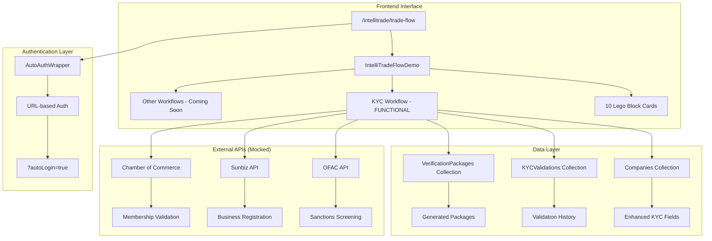
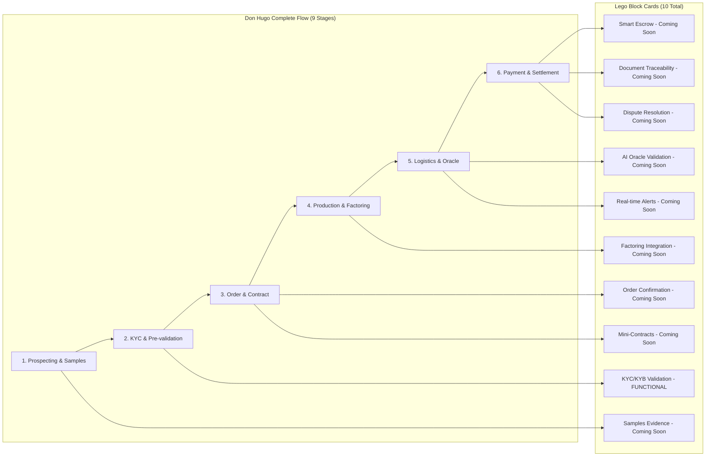
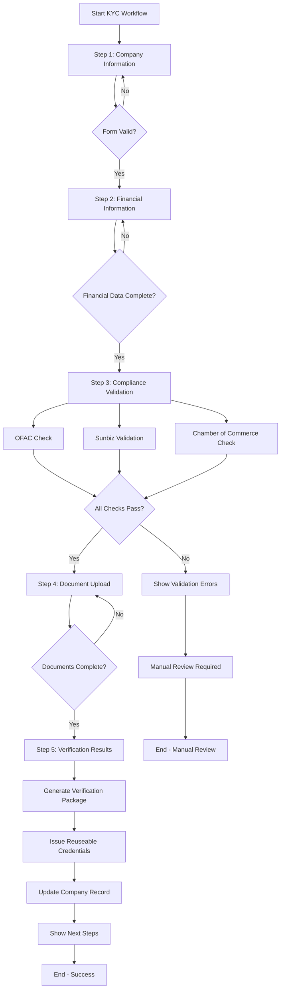
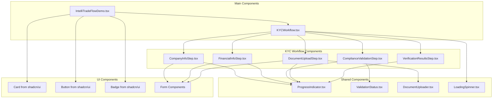
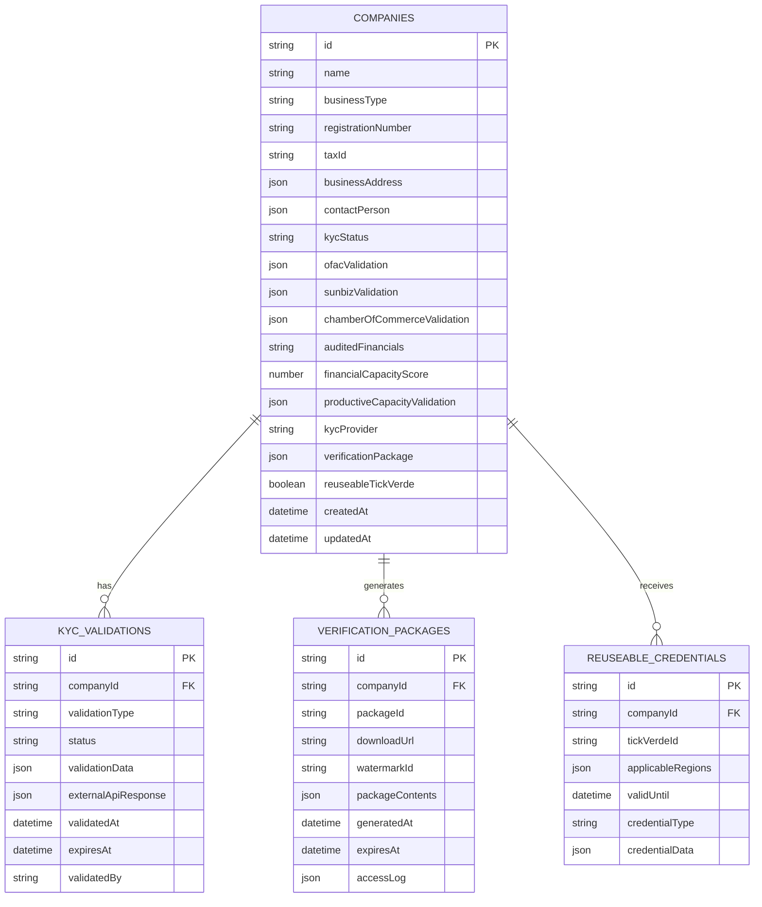
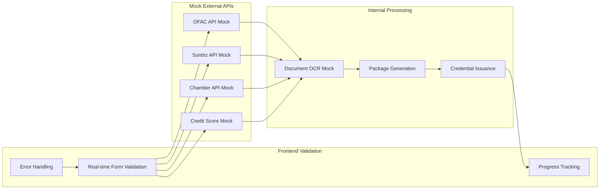
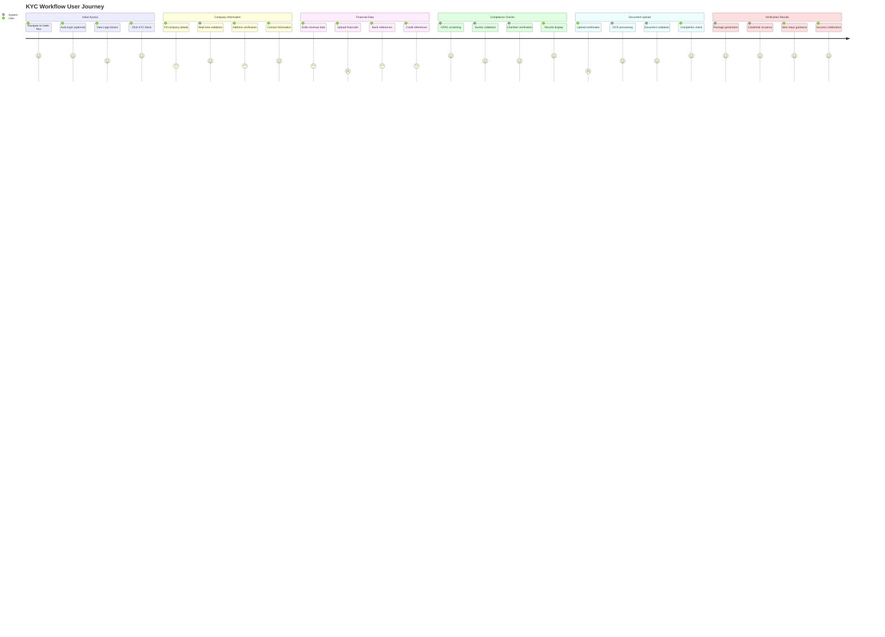
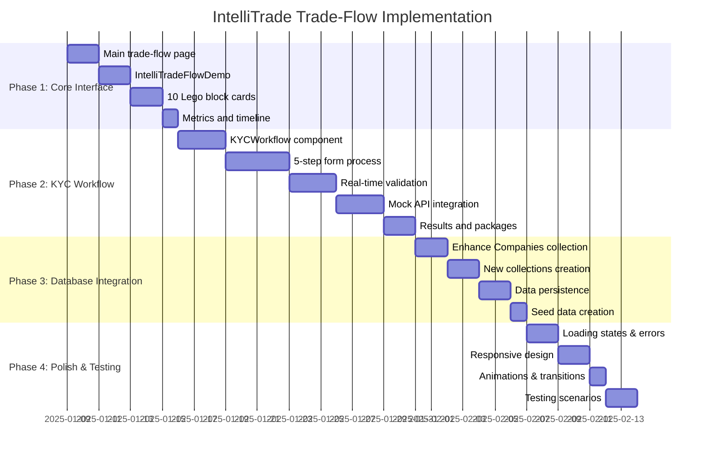
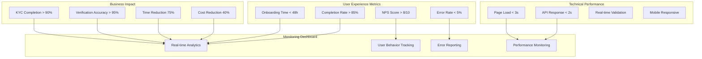

# IntelliTrade Trade-Flow Architecture Diagrams

## System Architecture Overview

## Lego Blocks Architecture

## KYC Workflow Process Flow

## KYC Data Flow

```mermaid
sequenceDiagram
    participant U as User
    participant F as Frontend
    participant A as API
    participant D as Database
    participant E as External APIs
    
    U->>F: Start KYC Process
    F->>A: Initialize KYC Session
    A->>D: Create KYC Record
    
    U->>F: Submit Company Info
    F->>A: Validate Company Data
    A->>E: Check OFAC Lists
    E-->>A: OFAC Results
    A->>E: Validate Sunbiz
    E-->>A: Sunbiz Results
    A->>E: Check Chamber of Commerce
    E-->>A: Chamber Results
    
    A->>D: Save Validation Results
    A-->>F: Return Validation Status
    F-->>U: Show Validation Results
    
    U->>F: Upload Documents
    F->>A: Process Documents
    A->>A: OCR Processing (Mock)
    A->>D: Save Document References
    
    A->>A: Generate Verification Package
    A->>D: Save Package & Credentials
    A-->>F: Return Success + Package
    F-->>U: Show Completion & Next Steps
```

## Component Architecture

## Database Schema Enhancement

## API Integration Flow

## User Experience Flow

## Implementation Timeline

## Success Metrics Dashboard

This comprehensive set of diagrams provides a clear visual representation of the IntelliTrade trade-flow architecture, making it easier for developers to understand the system structure, data flow, and implementation approach. The diagrams complement the detailed architectural specification and provide a roadmap for successful implementation.