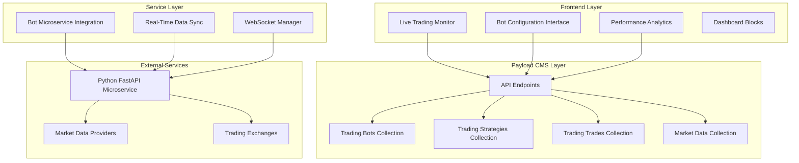

# Latinos Trading Bot System - Comprehensive Documentation

## Table of Contents

1. [System Overview](#system-overview)
2. [Installation & Setup Guide](#installation--setup-guide)
3. [Component Documentation](#component-documentation)
4. [Integration Guide](#integration-guide)
5. [Usage Examples](#usage-examples)
6. [Troubleshooting](#troubleshooting)
7. [API Reference](#api-reference)
8. [Development Guidelines](#development-guidelines)

---

## System Overview

The Latinos Trading Bot System is a comprehensive automated trading platform built as a plugin for the multi-tenant Payload CMS architecture. It provides a complete solution for creating, managing, and monitoring trading bots with real-time data synchronization and performance analytics.

### Architecture Overview



### Key Features

- **Multi-Bot Management**: Create and manage multiple trading bots with different strategies
- **Real-Time Monitoring**: Live dashboard with WebSocket-based updates
- **Strategy Configuration**: Flexible trading strategy system with customizable parameters
- **Performance Analytics**: Comprehensive charts and metrics for bot performance
- **Microservice Integration**: Seamless integration with Python FastAPI trading engine
- **Risk Management**: Built-in stop-loss and take-profit mechanisms
- **Market Data Sync**: Real-time market data synchronization and storage

### Technology Stack

- **Frontend**: React 19.1.0, TypeScript, TailwindCSS
- **Backend**: Payload CMS 3.43.0, Next.js 15.3.0
- **Database**: SQLite (configurable)
- **Real-Time**: WebSocket connections
- **External Integration**: Python FastAPI microservice
- **Charts**: Custom React components with performance visualization

---

## Installation & Setup Guide

### Prerequisites

- Node.js (^18.20.2 or >=20.9.0)
- pnpm package manager
- Python FastAPI microservice (for full functionality)

### Environment Variables

Create a `.env.local` file with the following variables:

```bash
# Business Mode Configuration
BUSINESS_MODE=latinos

# Microservice Configuration
BOT_MICROSERVICE_URL=http://localhost:8000
BOT_MICROSERVICE_WS_URL=ws://localhost:8000/ws/trades
BOT_MICROSERVICE_TIMEOUT=10000

# Database Configuration
DATABASE_PATH=./databases/latinos.db

# Server Configuration
NEXT_PUBLIC_SERVER_URL=http://localhost:3003
PORT=3003
```

### Installation Steps

1. **Install Dependencies**
   ```bash
   pnpm install
   ```

2. **Configure Environment**
   ```bash
   cp .env.example .env.local
   # Edit .env.local with your configuration
   ```

3. **Generate Types**
   ```bash
   pnpm generate:types
   ```

4. **Seed Database** (Optional)
   ```bash
   node seed-script.js
   ```

5. **Start Development Server**
   ```bash
   pnpm dev
   ```

### Plugin Activation

The Latinos plugin is automatically activated when `BUSINESS_MODE=latinos` or `BUSINESS_MODE=all` is set in the environment variables.

---

## Component Documentation

### Collections

#### TradingBots Collection

**Location**: [`src/plugins/business/latinos/collections/TradingBots.ts`](src/plugins/business/latinos/collections/TradingBots.ts)

**Purpose**: Stores trading bot configurations and performance data.

**Key Fields**:
- `name` (text, required): Unique bot identifier
- `status` (select): active | paused | stopped | error
- `strategy` (relationship): Link to trading strategy
- `symbol` (text, required): Trading symbol (e.g., AAPL, BTC-USD)
- `exchange` (select): NASDAQ | NYSE | AMEX | CRYPTO
- `investmentAmount` (number): Amount per trade in USD
- `riskLevel` (select): conservative | moderate | aggressive
- `maxDailyTrades` (number): Maximum trades per day
- `stopLossPercentage` (number): Stop loss percentage (1-20%)
- `takeProfitPercentage` (number): Take profit percentage (2-50%)
- `microserviceId` (text): ID in Python microservice
- `totalTrades` (number): Total executed trades
- `successfulTrades` (number): Successful trades count
- `totalProfit` (number): Total profit/loss

**Hooks**:
- `beforeChange`: Syncs with Python microservice on create/update
- `afterDelete`: Cleans up microservice data on deletion

#### TradingStrategies Collection

**Location**: [`src/plugins/business/latinos/collections/TradingStrategies.ts`](src/plugins/business/latinos/collections/TradingStrategies.ts)

**Purpose**: Defines trading strategies and their parameters.

**Key Fields**:
- `name` (text, required): Strategy name
- `type` (select): rsi | ma_crossover | macd | bollinger | custom
- `description` (textarea): Strategy description
- `defaultParameters` (json): Default strategy parameters
- `riskProfile` (select): Risk level classification
- `backtestResults` (group): Historical performance data

#### TradingTrades Collection

**Location**: [`src/plugins/business/latinos/collections/TradingTrades.ts`](src/plugins/business/latinos/collections/TradingTrades.ts)

**Purpose**: Records individual trade executions and results.

**Key Fields**:
- `bot` (relationship): Associated trading bot
- `symbol` (text): Trading symbol
- `side` (select): buy | sell
- `quantity` (number): Trade quantity
- `price` (number): Execution price
- `status` (select): open | filled | cancelled | expired | rejected
- `stopLoss` (number): Stop loss price
- `takeProfit` (number): Take profit price
- `profit` (number): Trade profit/loss
- `microserviceTradeId` (text): External trade ID

#### TradingFormulas Collection

**Location**: [`src/plugins/business/latinos/collections/TradingFormulas.ts`](src/plugins/business/latinos/collections/TradingFormulas.ts)

**Purpose**: Stores formula configurations for bot execution.

**Key Fields**:
- `name` (text, required): Formula name
- `bot` (relationship): Associated bot
- `interval` (select): Execution interval (1m, 5m, 15m, 1h, 1d)
- `parameters` (json): Formula-specific parameters
- `conditions` (array): Trading conditions and actions

#### MarketData Collection

**Location**: [`src/plugins/business/latinos/collections/MarketData.ts`](src/plugins/business/latinos/collections/MarketData.ts)

**Purpose**: Stores real-time market data for trading symbols.

**Key Fields**:
- `symbol` (text, unique): Trading symbol
- `currentPrice` (number): Current market price
- `volume` (number): Trading volume
- `change24h` (number): 24-hour price change
- `changePercent24h` (number): 24-hour percentage change
- `high24h` / `low24h` (number): Daily high/low prices
- `marketCap` (number): Market capitalization
- `lastUpdated` (date): Last update timestamp

### Services

#### BotMicroserviceIntegration Service

**Location**: [`src/plugins/business/latinos/services/botMicroservice.ts`](src/plugins/business/latinos/services/botMicroservice.ts)

**Purpose**: Handles communication with the Python FastAPI trading microservice.

**Key Methods**:

```typescript
// Formula Management
createFormula(botData: any): Promise<MicroserviceResponse<{ id: string }>>
updateFormula(microserviceId: string, updates: Partial<FormulaData>): Promise<MicroserviceResponse>
deleteFormula(microserviceId: string): Promise<MicroserviceResponse>

// Trade Management
getTrades(): Promise<MicroserviceResponse<TradeData[]>>
getBotTrades(microserviceId: string): Promise<MicroserviceResponse<TradeData[]>>

// System Control
getSystemStatus(): Promise<MicroserviceResponse<SystemStatus>>
startSystem(): Promise<MicroserviceResponse>
stopSystem(): Promise<MicroserviceResponse>

// Bot Control
startBot(microserviceId: string): Promise<MicroserviceResponse>
stopBot(microserviceId: string): Promise<MicroserviceResponse>
getBotStatus(microserviceId: string): Promise<MicroserviceResponse<BotStatus>>

// Health Check
testConnection(): Promise<MicroserviceResponse>
```

**Configuration**:
- Base URL: `process.env.BOT_MICROSERVICE_URL` (default: http://localhost:8000)
- Timeout: `process.env.BOT_MICROSERVICE_TIMEOUT` (default: 10000ms)

#### RealTimeDataSync Service

**Location**: [`src/plugins/business/latinos/services/realTimeSync.ts`](src/plugins/business/latinos/services/realTimeSync.ts)

**Purpose**: Manages WebSocket connections for real-time data synchronization.

**Key Features**:
- Automatic reconnection with exponential backoff
- Event-driven architecture with custom listeners
- Heartbeat mechanism for connection health
- Data synchronization with Payload collections

**Key Methods**:

```typescript
// Connection Management
startSync(): Promise<void>
stopSync(): Promise<void>
reconnect(): Promise<void>

// Event Management
addEventListener(eventType: string, callback: Function): void
removeEventListener(eventType: string, callback: Function): void

// Status
getConnectionStatus(): ConnectionStatus
isConnected(): boolean

// Communication
sendMessage(message: any): boolean
```

**WebSocket Message Types**:
- `trade_update`: New trade execution
- `bot_status_update`: Bot status change
- `system_status_update`: System status change
- `market_data_update`: Market data update
- `error`: Error notifications

### Blocks

#### LiveTradingDashboard Block

**Location**: [`src/plugins/business/latinos/blocks/LiveTradingDashboard.ts`](src/plugins/business/latinos/blocks/LiveTradingDashboard.ts)

**Purpose**: Provides a configurable real-time trading dashboard for content pages.

**Configuration Options**:
- Display toggles for different dashboard sections
- Refresh interval settings (1-60 seconds)
- Real-time WebSocket updates
- Grid layout configuration (1-4 columns)
- Theme selection (light/dark/auto)
- Data filters (bots, symbols, status)
- Alert thresholds and notifications
- Custom CSS and JavaScript

#### BotPerformanceAnalytics Block

**Location**: [`src/plugins/business/latinos/blocks/BotPerformanceAnalytics.ts`](src/plugins/business/latinos/blocks/BotPerformanceAnalytics.ts)

**Purpose**: Provides detailed performance analytics and charts for trading bots.

**Configuration Options**:
- Time frame settings (24h, 7d, 30d, 90d, 1y, all)
- Chart types (line, bar, area, candlestick)
- Metrics selection and formatting
- Export options (CSV, Excel, PDF, JSON)
- Performance alerts and thresholds
- Color scheme customization
- Filter options for bots and strategies

### React Components

#### LiveTradingMonitor Component

**Location**: [`src/plugins/business/latinos/components/LiveTradingMonitor.tsx`](src/plugins/business/latinos/components/LiveTradingMonitor.tsx)

**Purpose**: Real-time dashboard component for monitoring trading activity.

**Features**:
- Auto-refreshing data with configurable intervals
- System status monitoring
- Active trades display
- Market data visualization
- Recent trades table
- Error handling and loading states

**Props**:
```typescript
interface LiveTradingMonitorProps {
  refreshInterval?: number  // Default: 5000ms
  className?: string
}
```

#### BotConfigurationInterface Component

**Location**: [`src/plugins/business/latinos/components/BotConfigurationInterface.tsx`](src/plugins/business/latinos/components/BotConfigurationInterface.tsx)

**Purpose**: Complete interface for managing trading bots and strategies.

**Features**:
- Bot creation, editing, and deletion
- Strategy selection and configuration
- Performance charts and analytics
- Real-time status updates
- Tabbed interface (Bots/Analytics)

**Props**:
```typescript
interface BotConfigurationInterfaceProps {
  className?: string
  showCharts?: boolean  // Default: true
}
```

### Custom Hooks

#### useBotData Hook

**Location**: [`src/plugins/business/latinos/hooks/useBotData.ts`](src/plugins/business/latinos/hooks/useBotData.ts)

**Purpose**: Centralized state management for bot data with CRUD operations.

**Features**:
- Automatic data fetching and caching
- Real-time updates with auto-refresh
- CRUD operations with loading states
- Error handling and recovery
- Computed values (totals, success rates)

**Usage**:
```typescript
const {
  bots,
  strategies,
  selectedBot,
  loading,
  error,
  createBot,
  updateBot,
  deleteBot,
  selectBot,
  totalProfit,
  successRate
} = useBotData({
  autoRefresh: true,
  refreshInterval: 30000
})
```

#### useTradeData Hook

**Location**: [`src/plugins/business/latinos/hooks/useTradeData.ts`](src/plugins/business/latinos/hooks/useTradeData.ts)

**Purpose**: Manages trade data fetching and real-time updates.

**Features**:
- Trade history management
- Real-time trade updates
- Filtering and pagination
- Performance metrics calculation

---

## Integration Guide

### Python FastAPI Microservice Integration

The Latinos Trading Bot System integrates with a Python FastAPI microservice for actual trading execution. Here's how to set up the integration:

#### Microservice Requirements

The Python microservice should provide the following endpoints:

**Formula Management**:
- `POST /api/formulas` - Create trading formula
- `PUT /api/formulas/{id}` - Update trading formula
- `DELETE /api/formulas/{id}` - Delete trading formula

**Trade Management**:
- `GET /api/trades` - Get all trades
- `GET /api/trades?bot_id={id}` - Get trades for specific bot

**System Control**:
- `GET /api/system/status` - Get system status
- `POST /api/system/start` - Start trading system
- `POST /api/system/stop` - Stop trading system

**Bot Control**:
- `POST /api/bots/{id}/start` - Start specific bot
- `POST /api/bots/{id}/stop` - Stop specific bot
- `GET /api/bots/{id}/status` - Get bot status

**Health Check**:
- `GET /api/health` - Health check endpoint

**WebSocket**:
- `WS /ws/trades` - Real-time trade updates

#### Data Synchronization

The system automatically synchronizes data between Payload CMS and the microservice:

1. **Bot Creation**: When a bot is created in CMS, a corresponding formula is created in the microservice
2. **Bot Updates**: Changes to bot configuration are synced to the microservice
3. **Bot Deletion**: Deleting a bot removes the associated formula from the microservice
4. **Real-Time Updates**: WebSocket connection provides real-time trade and status updates

#### Error Handling

The integration includes comprehensive error handling:
- Connection failures are logged but don't prevent CMS operations
- Retry mechanisms for transient failures
- Graceful degradation when microservice is unavailable
- User notifications for integration issues

### Environment Configuration

```bash
# Required for microservice integration
BOT_MICROSERVICE_URL=http://localhost:8000
BOT_MICROSERVICE_WS_URL=ws://localhost:8000/ws/trades
BOT_MICROSERVICE_TIMEOUT=10000

# Optional authentication (if microservice requires it)
BOT_MICROSERVICE_API_KEY=your_api_key_here
```

---

## Usage Examples

### Creating a Trading Bot

```typescript
// Using the useBotData hook
const { createBot, strategies } = useBotData()

const newBot = await createBot({
  name: "AAPL RSI Bot",
  symbol: "AAPL",
  exchange: "NASDAQ",
  strategy: strategies.find(s => s.type === 'rsi').id,
  investmentAmount: 1000,
  riskLevel: "moderate",
  maxDailyTrades: 5,
  stopLossPercentage: 5,
  takeProfitPercentage: 10
})
```

### Monitoring Live Trading Data

```typescript
// Using the LiveTradingMonitor component
<LiveTradingMonitor 
  refreshInterval={5000}
  className="my-dashboard"
/>
```

### Setting Up Real-Time Data Sync

```typescript
import { realTimeSync } from '@/plugins/business/latinos/services/realTimeSync'

// Start real-time synchronization
await realTimeSync.startSync()

// Listen for trade updates
realTimeSync.addEventListener('tradeSync', (tradeData) => {
  console.log('New trade:', tradeData)
})

// Listen for bot status updates
realTimeSync.addEventListener('botStatusSync', (botStatus) => {
  console.log('Bot status update:', botStatus)
})
```

### Creating Custom Dashboard Blocks

```typescript
// In your page content, add the LiveTradingDashboard block
{
  blockType: 'liveTradingDashboard',
  title: 'My Trading Dashboard',
  displayOptions: {
    showPerformanceMetrics: true,
    showActiveTrades: true,
    showMarketData: true,
    showSystemStatus: true,
    showBotList: true
  },
  refreshSettings: {
    refreshInterval: 5,
    enableAutoRefresh: true,
    enableRealTimeUpdates: true
  },
  layout: {
    gridColumns: '3',
    cardSize: 'medium',
    theme: 'auto'
  }
}
```

### API Usage Examples

```typescript
// Fetch all bots
const response = await fetch('/api/latinos/bots')
const { data: bots } = await response.json()

// Create a new bot
const newBot = await fetch('/api/latinos/bots', {
  method: 'POST',
  headers: { 'Content-Type': 'application/json' },
  body: JSON.stringify({
    name: "My Bot",
    symbol: "BTC-USD",
    strategy: "strategy_id",
    investmentAmount: 500
  })
})

// Start a bot
await fetch(`/api/latinos/bots/${botId}/start`, {
  method: 'POST'
})

// Get system status
const status = await fetch('/api/latinos/system/status')
const systemData = await status.json()
```

---

## Troubleshooting

### Common Issues

#### 1. Microservice Connection Failed

**Symptoms**: 
- "Connection failed" errors in bot creation
- System status shows as unavailable
- Real-time updates not working

**Solutions**:
- Verify `BOT_MICROSERVICE_URL` is correct
- Ensure Python microservice is running
- Check firewall/network connectivity
- Verify microservice health endpoint: `GET /api/health`

#### 2. WebSocket Connection Issues

**Symptoms**:
- Real-time updates not appearing
- Connection status shows disconnected
- Console errors about WebSocket failures

**Solutions**:
- Check `BOT_MICROSERVICE_WS_URL` configuration
- Verify WebSocket endpoint is available
- Check browser WebSocket support
- Review network proxy settings

#### 3. Bot Creation Fails

**Symptoms**:
- Bot created in CMS but not in microservice
- Warning messages about microservice sync
- Bot status remains "stopped"

**Solutions**:
- Verify required fields are provided
- Check microservice API compatibility
- Review microservice logs for errors
- Ensure strategy exists and is valid

#### 4. Data Not Syncing

**Symptoms**:
- Trade data not appearing in CMS
- Bot statistics not updating
- Market data outdated

**Solutions**:
- Check real-time sync service status
- Verify WebSocket connection
- Review sync service logs
- Restart real-time sync service

### Debug Mode

Enable debug logging by setting:

```bash
NODE_ENV=development
```

This will enable detailed logging in:
- Bot microservice integration
- Real-time data sync service
- WebSocket connections
- API endpoints

### Health Checks

Use the test connection endpoint to verify integration:

```bash
curl -X GET "http://localhost:3003/api/latinos/test-connection"
```

Expected response:
```json
{
  "success": true,
  "connected": true,
  "microserviceUrl": "http://localhost:8000",
  "configured": true,
  "message": "Connection successful",
  "timestamp": "2024-01-01T12:00:00.000Z"
}
```

---

## API Reference

### Bot Management Endpoints

#### GET /api/latinos/bots
Get all trading bots.

**Response**:
```json
{
  "success": true,
  "data": [
    {
      "id": "bot_id",
      "name": "Bot Name",
      "status": "active",
      "symbol": "AAPL",
      "totalProfit": 150.50,
      "totalTrades": 25,
      "successfulTrades": 18
    }
  ],
  "totalDocs": 10,
  "page": 1,
  "totalPages": 1
}
```

#### POST /api/latinos/bots
Create a new trading bot.

**Request Body**:
```json
{
  "name": "My Bot",
  "symbol": "AAPL",
  "exchange": "NASDAQ",
  "strategy": "strategy_id",
  "investmentAmount": 1000,
  "riskLevel": "moderate",
  "maxDailyTrades": 5,
  "stopLossPercentage": 5,
  "takeProfitPercentage": 10
}
```

#### GET /api/latinos/bots/:id
Get a specific trading bot.

#### PATCH /api/latinos/bots/:id
Update a trading bot.

#### DELETE /api/latinos/bots/:id
Delete a trading bot.

#### POST /api/latinos/bots/:id/start
Start a trading bot.

#### POST /api/latinos/bots/:id/stop
Stop a trading bot.

### System Management Endpoints

#### GET /api/latinos/system/status
Get trading system status.

**Response**:
```json
{
  "success": true,
  "data": {
    "is_running": true,
    "active_bots": 3,
    "total_trades_today": 15,
    "system_health": "healthy",
    "last_update": "2024-01-01T12:00:00Z"
  }
}
```

#### POST /api/latinos/system/start
Start the trading system.

#### POST /api/latinos/system/stop
Stop the trading system.

### Trade Data Endpoints

#### GET /api/latinos/trades/active
Get currently active trades.

#### GET /api/latinos/trades/recent
Get recent trades with pagination.

**Query Parameters**:
- `limit`: Number of trades to return (default: 20)
- `page`: Page number (default: 1)

### Market Data Endpoints

#### GET /api/latinos/market-data
Get current market data for all symbols.

**Response**:
```json
{
  "success": true,
  "data": {
    "AAPL": {
      "symbol": "AAPL",
      "currentPrice": 150.25,
      "change24h": 2.50,
      "changePercent24h": 1.69,
      "volume": 50000000,
      "lastUpdated": "2024-01-01T12:00:00Z"
    }
  },
  "totalSymbols": 10
}
```

### Utility Endpoints

#### GET /api/latinos/test-connection
Test microservice connection.

#### GET /api/latinos/live-data
Get comprehensive live trading data (combines multiple data sources).

---

## Development Guidelines

### Code Organization

The Latinos plugin follows the established plugin architecture:

```
src/plugins/business/latinos/
├── index.ts                 # Plugin entry point
├── collections/            # Payload collections
├── blocks/                 # Content blocks
├── components/             # React components
├── endpoints/              # API endpoints
├── hooks/                  # Custom React hooks
├── services/               # Business logic services
└── utils/                  # Utility functions
```

### Best Practices

1. **Error Handling**: Always implement comprehensive error handling with user-friendly messages
2. **Loading States**: Provide loading indicators for all async operations
3. **Real-Time Updates**: Use WebSocket connections for real-time data when possible
4. **Data Validation**: Validate all inputs both client-side and server-side
5. **Performance**: Implement proper caching and pagination for large datasets
6. **Security**: Ensure all endpoints require proper authentication
7. **Testing**: Write unit tests for critical business logic
8. **Documentation**: Keep documentation updated with code changes

### Adding New Features

When extending the system:

1. **Collections**: Add new fields to existing collections or create new ones
2. **Components**: Create reusable React components following the established patterns
3. **Endpoints**: Add new API endpoints with proper error handling and authentication
4. **Services**: Extend existing services or create new ones for complex business logic
5. **Hooks**: Create custom hooks for data management and state synchronization

### Performance Considerations

- Use React.memo for expensive components
- Implement proper pagination for large datasets
- Cache frequently accessed data
- Optimize WebSocket message handling
- Use proper database indexing for collections

### Security Considerations

- All endpoints require authentication
- Validate and sanitize all inputs
- Use environment variables for sensitive configuration
- Implement proper CORS settings
- Secure WebSocket connections

---

This documentation provides a comprehensive guide to the Latinos Trading Bot System. For additional support or questions, refer to the individual component files and their inline documentation.