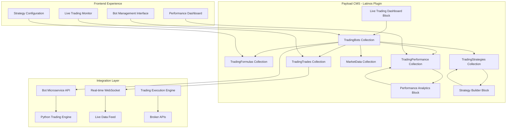

# Latinos Trading Bot System - Implementation Plan

## Overview
Design and implement a comprehensive trading bot collection system for the Latinos business plugin, integrating with the existing Python FastAPI trading microservice at `/home/paulo/Programs/trading-bot` to create a complete automated trading platform within the Payload CMS ecosystem.

## Current State Analysis
The existing trading bot implementation includes:
- **Python FastAPI Microservice**: Complete trading engine with formula management
- **Node.js Backend Integration**: API layer connecting frontend to microservice  
- **React Frontend Components**: Full UI for bot configuration and monitoring
- **Database Models**: Formulas, Trades, System Status tracking
- **Real-time Trading Logic**: Technical indicators, order management, performance tracking

## Required Implementation

### 1. Core Collections Design

#### TradingBots Collection
```typescript
export const TradingBots: CollectionConfig = {
  slug: 'trading-bots',
  admin: {
    useAsTitle: 'name',
    group: 'Latinos Trading',
  },
  fields: [
    {
      name: 'name',
      type: 'text',
      required: true,
      admin: {
        description: 'Unique name for this trading bot'
      }
    },
    {
      name: 'status',
      type: 'select',
      options: [
        { label: 'Active', value: 'active' },
        { label: 'Paused', value: 'paused' },
        { label: 'Stopped', value: 'stopped' },
        { label: 'Error', value: 'error' }
      ],
      defaultValue: 'stopped'
    },
    {
      name: 'strategy',
      type: 'relationship',
      relationTo: 'trading-strategies',
      required: true
    },
    {
      name: 'symbol',
      type: 'text',
      required: true,
      admin: {
        description: 'Trading symbol (e.g., AAPL, BTC-USD)'
      }
    },
    {
      name: 'exchange',
      type: 'select',
      options: [
        { label: 'NASDAQ', value: 'NASDAQ' },
        { label: 'NYSE', value: 'NYSE' },
        { label: 'AMEX', value: 'AMEX' },
        { label: 'Crypto', value: 'CRYPTO' }
      ],
      defaultValue: 'NASDAQ'
    },
    {
      name: 'investmentAmount',
      type: 'number',
      required: true,
      min: 100,
      admin: {
        description: 'Amount to invest per trade (USD)'
      }
    },
    {
      name: 'riskLevel',
      type: 'select',
      options: [
        { label: 'Conservative', value: 'conservative' },
        { label: 'Moderate', value: 'moderate' },
        { label: 'Aggressive', value: 'aggressive' }
      ],
      defaultValue: 'moderate'
    },
    {
      name: 'maxDailyTrades',
      type: 'number',
      defaultValue: 5,
      min: 1,
      max: 50
    },
    {
      name: 'stopLossPercentage',
      type: 'number',
      defaultValue: 5,
      min: 1,
      max: 20,
      admin: {
        description: 'Stop loss percentage (1-20%)'
      }
    },
    {
      name: 'takeProfitPercentage',
      type: 'number',
      defaultValue: 10,
      min: 2,
      max: 50,
      admin: {
        description: 'Take profit percentage (2-50%)'
      }
    },
    {
      name: 'microserviceId',
      type: 'text',
      admin: {
        description: 'ID in the Python microservice',
        readOnly: true
      }
    },
    {
      name: 'lastExecution',
      type: 'date',
      admin: {
        readOnly: true
      }
    },
    {
      name: 'totalTrades',
      type: 'number',
      defaultValue: 0,
      admin: {
        readOnly: true
      }
    },
    {
      name: 'successfulTrades',
      type: 'number',
      defaultValue: 0,
      admin: {
        readOnly: true
      }
    },
    {
      name: 'totalProfit',
      type: 'number',
      defaultValue: 0,
      admin: {
        readOnly: true
      }
    }
  ],
  hooks: {
    beforeChange: [
      async ({ data, req, operation }) => {
        // Sync with Python microservice when bot is created/updated
        if (operation === 'create' || operation === 'update') {
          // Call microservice API to create/update formula
          // Store microservice ID in microserviceId field
        }
      }
    ],
    afterDelete: [
      async ({ doc }) => {
        // Clean up microservice formula when bot is deleted
        if (doc.microserviceId) {
          // Call microservice API to delete formula
        }
      }
    ]
  }
}
```

#### TradingFormulas Collection
```typescript
export const TradingFormulas: CollectionConfig = {
  slug: 'trading-formulas',
  admin: {
    useAsTitle: 'name',
    group: 'Latinos Trading',
  },
  fields: [
    {
      name: 'name',
      type: 'text',
      required: true
    },
    {
      name: 'bot',
      type: 'relationship',
      relationTo: 'trading-bots',
      required: true
    },
    {
      name: 'interval',
      type: 'select',
      options: [
        { label: '1 Minute', value: '1m' },
        { label: '5 Minutes', value: '5m' },
        { label: '15 Minutes', value: '15m' },
        { label: '1 Hour', value: '1h' },
        { label: '1 Day', value: '1d' }
      ],
      required: true
    },
    {
      name: 'parameters',
      type: 'json',
      admin: {
        description: 'Formula-specific parameters (RSI periods, MA lengths, etc.)'
      }
    },
    {
      name: 'conditions',
      type: 'array',
      fields: [
        {
          name: 'indicator',
          type: 'select',
          options: [
            { label: 'RSI', value: 'rsi' },
            { label: 'Moving Average', value: 'ma' },
            { label: 'MACD', value: 'macd' },
            { label: 'Bollinger Bands', value: 'bb' },
            { label: 'Volume', value: 'volume' }
          ]
        },
        {
          name: 'operator',
          type: 'select',
          options: [
            { label: 'Greater Than', value: 'gt' },
            { label: 'Less Than', value: 'lt' },
            { label: 'Crosses Above', value: 'cross_above' },
            { label: 'Crosses Below', value: 'cross_below' }
          ]
        },
        {
          name: 'value',
          type: 'number'
        },
        {
          name: 'action',
          type: 'select',
          options: [
            { label: 'Buy', value: 'buy' },
            { label: 'Sell', value: 'sell' },
            { label: 'Hold', value: 'hold' }
          ]
        }
      ]
    },
    {
      name: 'isActive',
      type: 'checkbox',
      defaultValue: true
    }
  ]
}
```

#### TradingTrades Collection
```typescript
export const TradingTrades: CollectionConfig = {
  slug: 'trading-trades',
  admin: {
    useAsTitle: 'id',
    group: 'Latinos Trading',
    defaultColumns: ['bot', 'symbol', 'side', 'quantity', 'price', 'status', 'createdAt']
  },
  fields: [
    {
      name: 'bot',
      type: 'relationship',
      relationTo: 'trading-bots',
      required: true
    },
    {
      name: 'symbol',
      type: 'text',
      required: true
    },
    {
      name: 'side',
      type: 'select',
      options: [
        { label: 'Buy', value: 'buy' },
        { label: 'Sell', value: 'sell' }
      ],
      required: true
    },
    {
      name: 'quantity',
      type: 'number',
      required: true,
      min: 0
    },
    {
      name: 'price',
      type: 'number',
      required: true,
      min: 0
    },
    {
      name: 'status',
      type: 'select',
      options: [
        { label: 'Open', value: 'open' },
        { label: 'Filled', value: 'filled' },
        { label: 'Cancelled', value: 'cancelled' },
        { label: 'Expired', value: 'expired' },
        { label: 'Rejected', value: 'rejected' }
      ],
      required: true
    },
    {
      name: 'stopLoss',
      type: 'number',
      min: 0
    },
    {
      name: 'takeProfit',
      type: 'number',
      min: 0
    },
    {
      name: 'filledAt',
      type: 'date'
    },
    {
      name: 'profit',
      type: 'number',
      admin: {
        description: 'Profit/Loss for this trade'
      }
    },
    {
      name: 'isSuccessful',
      type: 'checkbox'
    },
    {
      name: 'microserviceTradeId',
      type: 'text',
      admin: {
        description: 'Trade ID from Python microservice'
      }
    }
  ]
}
```

#### TradingStrategies Collection
```typescript
export const TradingStrategies: CollectionConfig = {
  slug: 'trading-strategies',
  admin: {
    useAsTitle: 'name',
    group: 'Latinos Trading',
  },
  fields: [
    {
      name: 'name',
      type: 'text',
      required: true
    },
    {
      name: 'description',
      type: 'textarea'
    },
    {
      name: 'type',
      type: 'select',
      options: [
        { label: 'RSI Strategy', value: 'rsi' },
        { label: 'Moving Average Crossover', value: 'ma_crossover' },
        { label: 'MACD Strategy', value: 'macd' },
        { label: 'Bollinger Bands', value: 'bollinger' },
        { label: 'Custom', value: 'custom' }
      ],
      required: true
    },
    {
      name: 'defaultParameters',
      type: 'json',
      admin: {
        description: 'Default parameters for this strategy type'
      }
    },
    {
      name: 'riskProfile',
      type: 'select',
      options: [
        { label: 'Conservative', value: 'conservative' },
        { label: 'Moderate', value: 'moderate' },
        { label: 'Aggressive', value: 'aggressive' }
      ]
    },
    {
      name: 'backtestResults',
      type: 'group',
      fields: [
        {
          name: 'totalReturn',
          type: 'number'
        },
        {
          name: 'sharpeRatio',
          type: 'number'
        },
        {
          name: 'maxDrawdown',
          type: 'number'
        },
        {
          name: 'winRate',
          type: 'number'
        }
      ]
    }
  ]
}
```

#### MarketData Collection
```typescript
export const MarketData: CollectionConfig = {
  slug: 'market-data',
  admin: {
    useAsTitle: 'symbol',
    group: 'Latinos Trading',
  },
  fields: [
    {
      name: 'symbol',
      type: 'text',
      required: true,
      unique: true
    },
    {
      name: 'currentPrice',
      type: 'number',
      required: true
    },
    {
      name: 'volume',
      type: 'number'
    },
    {
      name: 'change24h',
      type: 'number'
    },
    {
      name: 'changePercent24h',
      type: 'number'
    },
    {
      name: 'high24h',
      type: 'number'
    },
    {
      name: 'low24h',
      type: 'number'
    },
    {
      name: 'marketCap',
      type: 'number'
    },
    {
      name: 'lastUpdated',
      type: 'date',
      defaultValue: () => new Date()
    }
  ]
}
```

### 2. Custom Blocks for Frontend

#### Live Trading Dashboard Block
```typescript
export const LiveTradingDashboard: Block = {
  slug: 'liveTradingDashboard',
  labels: {
    singular: 'Live Trading Dashboard',
    plural: 'Live Trading Dashboards',
  },
  fields: [
    {
      name: 'title',
      type: 'text',
      defaultValue: 'Live Trading Dashboard'
    },
    {
      name: 'showPerformanceMetrics',
      type: 'checkbox',
      defaultValue: true
    },
    {
      name: 'showActiveTrades',
      type: 'checkbox',
      defaultValue: true
    },
    {
      name: 'showMarketData',
      type: 'checkbox',
      defaultValue: true
    },
    {
      name: 'refreshInterval',
      type: 'number',
      defaultValue: 5,
      admin: {
        description: 'Refresh interval in seconds'
      }
    }
  ]
}
```

#### Bot Performance Analytics Block
```typescript
export const BotPerformanceAnalytics: Block = {
  slug: 'botPerformanceAnalytics',
  labels: {
    singular: 'Bot Performance Analytics',
    plural: 'Bot Performance Analytics',
  },
  fields: [
    {
      name: 'title',
      type: 'text',
      defaultValue: 'Performance Analytics'
    },
    {
      name: 'timeframe',
      type: 'select',
      options: [
        { label: '24 Hours', value: '24h' },
        { label: '7 Days', value: '7d' },
        { label: '30 Days', value: '30d' },
        { label: '90 Days', value: '90d' },
        { label: '1 Year', value: '1y' }
      ],
      defaultValue: '30d'
    },
    {
      name: 'showProfitChart',
      type: 'checkbox',
      defaultValue: true
    },
    {
      name: 'showTradeHistory',
      type: 'checkbox',
      defaultValue: true
    }
  ]
}
```

### 3. Integration Architecture

#### Microservice Integration Service
```typescript
// src/plugins/business/latinos/services/botMicroservice.ts
export class BotMicroserviceIntegration {
  private baseUrl: string
  
  constructor() {
    this.baseUrl = process.env.BOT_MICROSERVICE_URL || 'http://localhost:8000'
  }
  
  async createFormula(botData: any) {
    const formulaData = {
      name: botData.name,
      symbol: botData.symbol,
      exchange: botData.exchange,
      interval: botData.interval || '1h',
      parameters: botData.parameters || {},
      is_active: botData.status === 'active'
    }
    
    const response = await fetch(`${this.baseUrl}/api/formulas`, {
      method: 'POST',
      headers: { 'Content-Type': 'application/json' },
      body: JSON.stringify(formulaData)
    })
    
    return response.json()
  }
  
  async updateFormula(microserviceId: string, updates: any) {
    const response = await fetch(`${this.baseUrl}/api/formulas/${microserviceId}`, {
      method: 'PUT',
      headers: { 'Content-Type': 'application/json' },
      body: JSON.stringify(updates)
    })
    
    return response.json()
  }
  
  async deleteFormula(microserviceId: string) {
    const response = await fetch(`${this.baseUrl}/api/formulas/${microserviceId}`, {
      method: 'DELETE'
    })
    
    return response.json()
  }
  
  async getTrades() {
    const response = await fetch(`${this.baseUrl}/api/trades`)
    return response.json()
  }
  
  async getSystemStatus() {
    const response = await fetch(`${this.baseUrl}/api/system/status`)
    return response.json()
  }
  
  async startSystem() {
    const response = await fetch(`${this.baseUrl}/api/system/start`, {
      method: 'POST'
    })
    return response.json()
  }
  
  async stopSystem() {
    const response = await fetch(`${this.baseUrl}/api/system/stop`, {
      method: 'POST'
    })
    return response.json()
  }
}
```

#### Real-time Data Sync Service
```typescript
// src/plugins/business/latinos/services/realTimeSync.ts
export class RealTimeDataSync {
  private wsConnection: WebSocket | null = null
  
  async startSync() {
    // Connect to microservice WebSocket for real-time updates
    this.wsConnection = new WebSocket('ws://localhost:8000/ws/trades')
    
    this.wsConnection.onmessage = async (event) => {
      const data = JSON.parse(event.data)
      
      if (data.type === 'trade_update') {
        await this.syncTradeData(data.trade)
      } else if (data.type === 'bot_status_update') {
        await this.syncBotStatus(data.bot)
      }
    }
  }
  
  private async syncTradeData(tradeData: any) {
    // Update TradingTrades collection with new trade data
    const payload = await import('payload')
    
    await payload.default.create({
      collection: 'trading-trades',
      data: {
        microserviceTradeId: tradeData.id,
        symbol: tradeData.symbol,
        side: tradeData.side,
        quantity: tradeData.quantity,
        price: tradeData.price,
        status: tradeData.status,
        filledAt: tradeData.filled_at,
        profit: tradeData.profit,
        isSuccessful: tradeData.is_successful
      }
    })
  }
  
  private async syncBotStatus(botData: any) {
    // Update TradingBots collection with status changes
    const payload = await import('payload')
    
    const bots = await payload.default.find({
      collection: 'trading-bots',
      where: {
        microserviceId: {
          equals: botData.id
        }
      }
    })
    
    if (bots.docs.length > 0) {
      await payload.default.update({
        collection: 'trading-bots',
        id: bots.docs[0].id,
        data: {
          lastExecution: botData.last_execution,
          totalTrades: botData.total_trades,
          successfulTrades: botData.successful_trades,
          totalProfit: botData.total_profit
        }
      })
    }
  }
}
```

### 4. Frontend Components

#### Live Trading Monitor Component
```typescript
// src/plugins/business/latinos/components/LiveTradingMonitor.tsx
export const LiveTradingMonitor: React.FC = () => {
  const [activeTrades, setActiveTrades] = useState([])
  const [systemStatus, setSystemStatus] = useState(null)
  const [marketData, setMarketData] = useState({})
  
  useEffect(() => {
    // Set up real-time data fetching
    const interval = setInterval(async () => {
      const trades = await fetch('/api/latinos/trades/active').then(r => r.json())
      const status = await fetch('/api/latinos/system/status').then(r => r.json())
      const market = await fetch('/api/latinos/market-data').then(r => r.json())
      
      setActiveTrades(trades)
      setSystemStatus(status)
      setMarketData(market)
    }, 5000)
    
    return () => clearInterval(interval)
  }, [])
  
  return (
    <div className="live-trading-monitor">
      <div className="grid grid-cols-1 md:grid-cols-3 gap-6">
        <SystemStatusCard status={systemStatus} />
        <ActiveTradesCard trades={activeTrades} />
        <MarketDataCard data={marketData} />
      </div>
      
      <div className="mt-8">
        <RecentTradesTable trades={activeTrades} />
      </div>
    </div>
  )
}
```

#### Bot Configuration Interface
```typescript
// src/plugins/business/latinos/components/BotConfigurationInterface.tsx
export const BotConfigurationInterface: React.FC = () => {
  const [bots, setBots] = useState([])
  const [selectedBot, setSelectedBot] = useState(null)
  const [isCreating, setIsCreating] = useState(false)
  
  const handleCreateBot = async (botData: any) => {
    const response = await fetch('/api/latinos/bots', {
      method: 'POST',
      headers: { 'Content-Type': 'application/json' },
      body: JSON.stringify(botData)
    })
    
    if (response.ok) {
      const newBot = await response.json()
      setBots(prev => [...prev, newBot])
      setIsCreating(false)
    }
  }
  
  const handleUpdateBot = async (botId: string, updates: any) => {
    const response = await fetch(`/api/latinos/bots/${botId}`, {
      method: 'PATCH',
      headers: { 'Content-Type': 'application/json' },
      body: JSON.stringify(updates)
    })
    
    if (response.ok) {
      const updatedBot = await response.json()
      setBots(prev => prev.map(bot => bot.id === botId ? updatedBot : bot))
    }
  }
  
  return (
    <div className="bot-configuration">
      <div className="flex justify-between items-center mb-6">
        <h2 className="text-2xl font-bold">Trading Bots</h2>
        <button 
          onClick={() => setIsCreating(true)}
          className="btn btn-primary"
        >
          Create New Bot
        </button>
      </div>
      
      <div className="grid grid-cols-1 lg:grid-cols-2 gap-6">
        <BotsList 
          bots={bots} 
          onSelect={setSelectedBot}
          onUpdate={handleUpdateBot}
        />
        
        {selectedBot && (
          <BotDetailsPanel 
            bot={selectedBot}
            onUpdate={handleUpdateBot}
          />
        )}
      </div>
      
      {isCreating && (
        <BotCreationModal 
          onSubmit={handleCreateBot}
          onCancel={() => setIsCreating(false)}
        />
      )}
    </div>
  )
}
```

### 5. API Endpoints

#### Bot Management API
```typescript
// src/plugins/business/latinos/endpoints/bots.ts
export const botsEndpoint = {
  path: '/latinos/bots',
  method: 'get',
  handler: async (req, res) => {
    const bots = await req.payload.find({
      collection: 'trading-bots',
      limit: 100
    })
    
    res.json(bots)
  }
}

export const createBotEndpoint = {
  path: '/latinos/bots',
  method: 'post',
  handler: async (req, res) => {
    const botData = req.body
    
    // Create bot in Payload
    const bot = await req.payload.create({
      collection: 'trading-bots',
      data: botData
    })
    
    // Sync with microservice
    const microservice = new BotMicroserviceIntegration()
    const formula = await microservice.createFormula(botData)
    
    // Update bot with microservice ID
    const updatedBot = await req.payload.update({
      collection: 'trading-bots',
      id: bot.id,
      data: {
        microserviceId: formula.id
      }
    })
    
    res.json(updatedBot)
  }
}
```

#### Real-time Data API
```typescript
// src/plugins/business/latinos/endpoints/realtime.ts
export const liveDataEndpoint = {
  path: '/latinos/live-data',
  method: 'get',
  handler: async (req, res) => {
    const microservice = new BotMicroserviceIntegration()
    
    const [trades, status, performance] = await Promise.all([
      microservice.getTrades(),
      microservice.getSystemStatus(),
      req.payload.find({
        collection: 'trading-trades',
        limit: 10,
        sort: '-createdAt'
      })
    ])
    
    res.json({
      trades,
      status,
      recentTrades: performance.docs
    })
  }
}
```

## Implementation Strategy

### Phase 1: Core Collections ⏳
**Priority**: HIGH
**Estimated Effort**: Medium
**Timeline**: Week 1

**Tasks**:
1. Create TradingBots, TradingFormulas, TradingTrades collections
2. Implement basic CRUD operations
3. Set up microservice integration layer
4. Test collection functionality

**Files to Create**:
- `src/plugins/business/latinos/collections/TradingBots.ts`
- `src/plugins/business/latinos/collections/TradingFormulas.ts`
- `src/plugins/business/latinos/collections/TradingTrades.ts`
- `src/plugins/business/latinos/collections/TradingStrategies.ts`
- `src/plugins/business/latinos/collections/MarketData.ts`
- `src/plugins/business/latinos/services/botMicroservice.ts`

### Phase 2: Real-time Integration ⏳
**Priority**: HIGH
**Estimated Effort**: Large
**Timeline**: Week 2

**Tasks**:
1. Implement WebSocket connection to microservice
2. Create real-time data synchronization
3. Build live trading dashboard block
4. Test real-time functionality

**Files to Create**:
- `src/plugins/business/latinos/services/realTimeSync.ts`
- `src/plugins/business/latinos/blocks/LiveTradingDashboard.ts`
- `src/plugins/business/latinos/components/LiveTradingMonitor.tsx`
- `src/plugins/business/latinos/endpoints/realtime.ts`

### Phase 3: Advanced Features ⏳
**Priority**: MEDIUM
**Estimated Effort**: Large
**Timeline**: Week 3

**Tasks**:
1. Implement performance analytics
2. Create strategy builder interface
3. Add market data integration
4. Build comprehensive admin UI

**Files to Create**:
- `src/plugins/business/latinos/blocks/BotPerformanceAnalytics.ts`
- `src/plugins/business/latinos/components/BotConfigurationInterface.tsx`
- `src/plugins/business/latinos/components/StrategyBuilder.tsx`
- `src/plugins/business/latinos/services/marketDataService.ts`

### Phase 4: Frontend Polish ⏳
**Priority**: LOW
**Estimated Effort**: Medium
**Timeline**: Week 4

**Tasks**:
1. Complete UI components
2. Implement mobile responsiveness
3. Add user experience optimizations
4. Comprehensive testing

**Files to Create**:
- `src/plugins/business/latinos/components/BotsList.tsx`
- `src/plugins/business/latinos/components/BotDetailsPanel.tsx`
- `src/plugins/business/latinos/components/BotCreationModal.tsx`
- `src/plugins/business/latinos/components/PerformanceCharts.tsx`

## Technical Architecture



## Success Criteria

### Functional Requirements ✅
- [ ] Complete bot lifecycle management (create, edit, delete, start/stop)
- [ ] Real-time trade monitoring and status updates
- [ ] Integration with existing Python trading microservice
- [ ] Live performance analytics and reporting
- [ ] Strategy configuration and management
- [ ] Market data integration and display
- [ ] User-friendly admin interface

### Technical Requirements ✅
- [ ] Seamless microservice integration
- [ ] Real-time data synchronization
- [ ] Responsive frontend components
- [ ] Comprehensive API endpoints
- [ ] Error handling and recovery
- [ ] Performance optimization

### User Experience Goals ✅
- [ ] Intuitive bot management interface
- [ ] Real-time trading visualization
- [ ] Clear performance metrics display
- [ ] Easy strategy configuration
- [ ] Mobile-responsive design
- [ ] Fast and reliable operation

## Benefits of This Architecture

1. **Leverages Existing Infrastructure** - Reuses the proven Python trading engine
2. **Seamless CMS Integration** - Native Payload collections with full admin interface
3. **Real-time Capabilities** - Live trading monitoring and updates
4. **Scalable Design** - Plugin-based architecture allows easy expansion
5. **User-Friendly** - Intuitive interface for bot management and monitoring
6. **Production Ready** - Built on battle-tested trading algorithms

## Risk Assessment

### High Risk 🔴
- **Microservice Dependencies**: Python service must be running and accessible
- **Real-time Data Sync