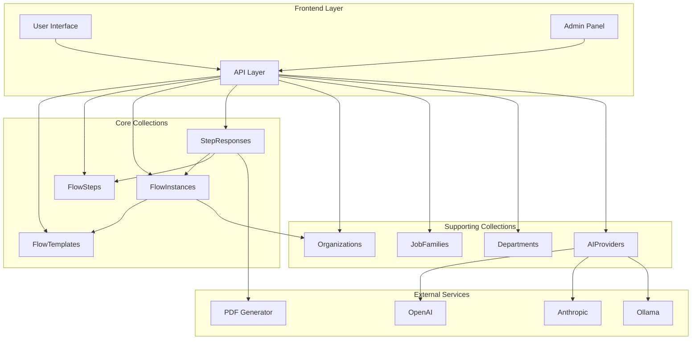
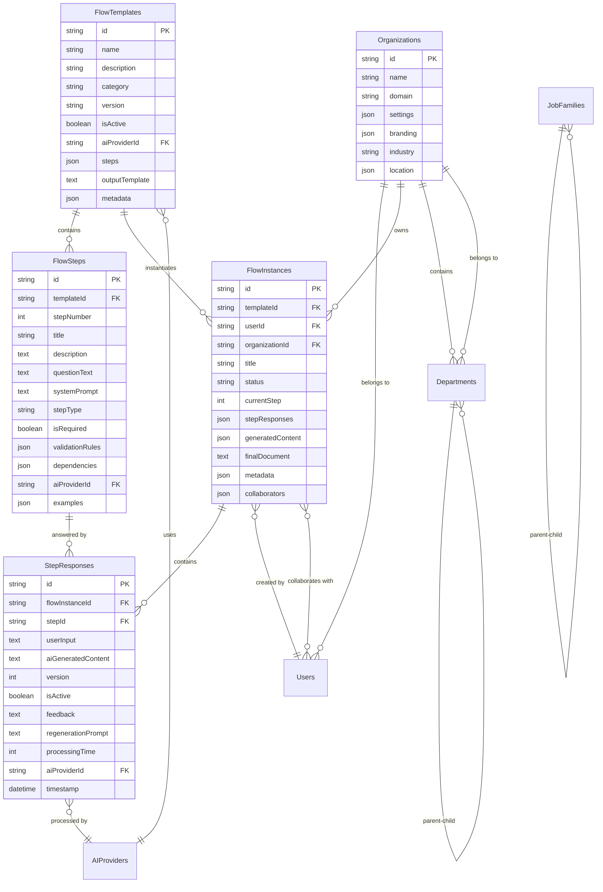
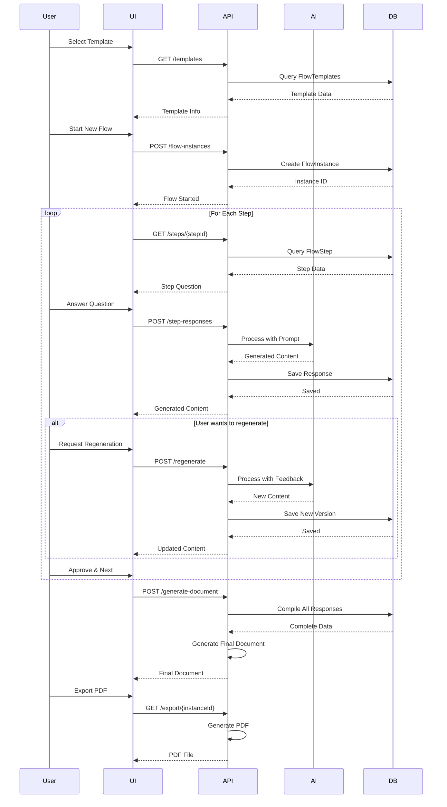
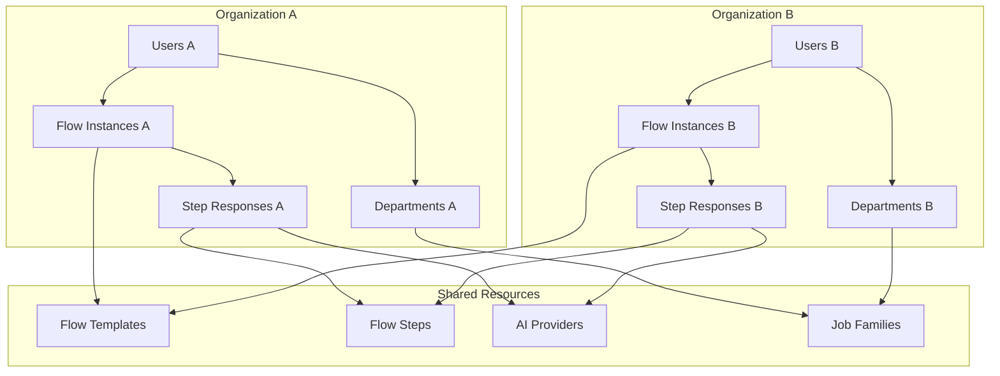
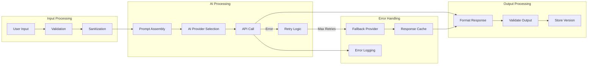
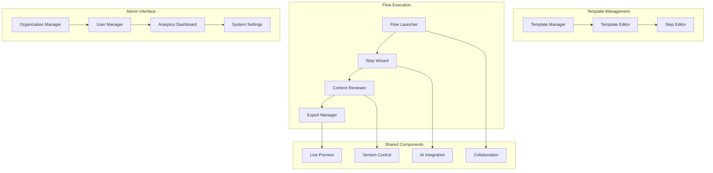
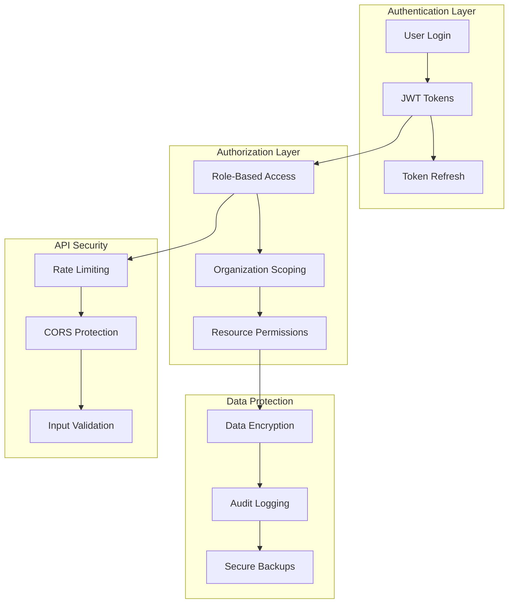

# Salarium System Architecture Diagrams

## System Overview Architecture

## Data Relationship Model

## Workflow Process Flow

## Multi-Tenant Data Isolation

## AI Processing Pipeline

## User Interface Component Structure

## Security and Access Control

This architecture provides a comprehensive view of how the Salarium system integrates with the existing IntelliTrade CMS while maintaining clean separation of concerns and scalable design patterns.