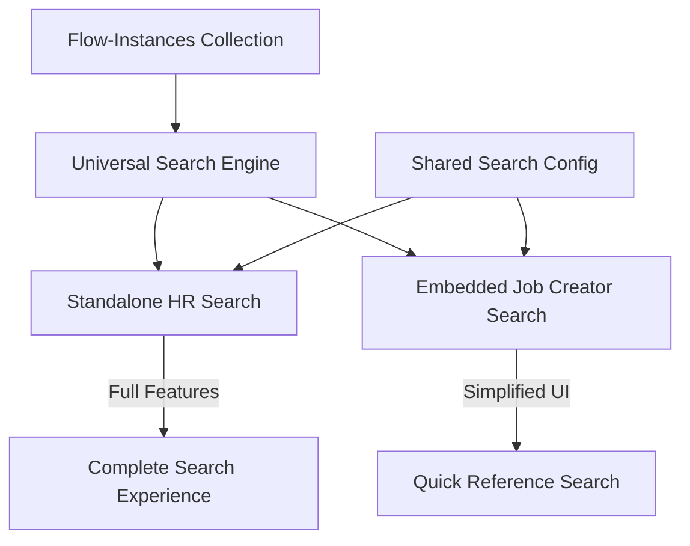
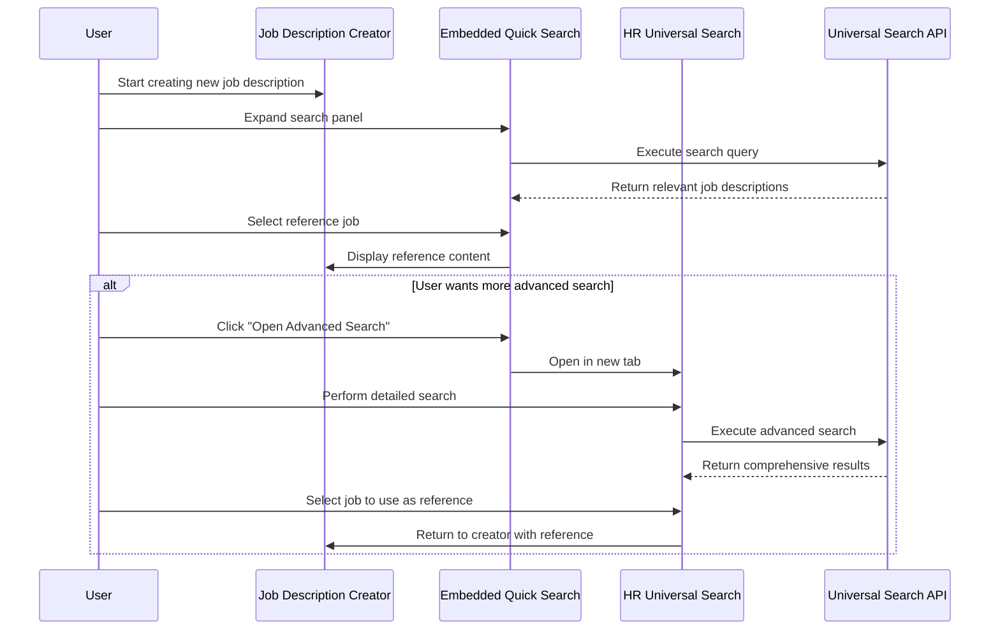

# Universal Search Integration for Salarium Job Descriptions

## Overview

This document outlines the plan for integrating the Universal Search functionality into the Salarium HR platform's job description workflow. Based on the requirements, we'll implement a hybrid approach that includes both a standalone HR search tool and a simplified embedded search component within the job description creator.

## Architecture Overview



## 1. Component Structure

We'll create two new components that both leverage the existing universal search infrastructure:

### A. Standalone HR Search Tool

```
src/plugins/business/salarium/components/HRUniversalSearch/
├── index.tsx                # Main component export
├── HRUniversalSearch.tsx    # Standalone search page 
├── SearchActions.tsx        # HR-specific search actions
└── README.md                # Component documentation
```

### B. Embedded Job Creator Search Component

```
src/plugins/business/salarium/components/JobDescriptionWorkflow/components/
├── QuickSearch/             # Embedded search component
   ├── index.tsx             # Main component export
   ├── QuickSearch.tsx       # Simplified search interface
   ├── SearchResults.tsx     # Compact results display
   └── ReferencePanel.tsx    # Side-by-side reference view
```

## 2. Technical Implementation Details

### 2.1 Shared Search Configuration

We'll create a shared configuration to ensure both components use the same search logic:

```typescript
// src/plugins/business/salarium/configs/jobDescriptionSearchConfig.ts

import { salariumSearchConfig } from '@/plugins/shared/universal-search/business-config/salarium'
import { UniversalSearchConfig } from '@/plugins/shared/universal-search/types/config.types'

/**
 * Job description specific search configuration that extends the base Salarium config
 */
export const jobDescriptionSearchConfig: UniversalSearchConfig = {
  // Base on existing Salarium search config
  ...salariumSearchConfig,
  
  // Override with job description specific settings
  collection: 'flow-instances',
  displayName: 'Job Descriptions',
  
  // Add job description specific fields
  searchableFields: [
    { name: 'title', weight: 2.5, boost: 'exact' },
    { name: 'stepResponses.aiGeneratedContent', weight: 2.0, type: 'richText' },
    // Additional fields specific to job descriptions
  ],
  
  // Reference actions
  actions: [
    {
      id: 'useAsReference',
      label: 'Use as Reference',
      icon: 'FileText',
      requiresSelection: true,
      handler: 'useJobDescriptionAsReference',
    },
    {
      id: 'viewSideBySide',
      label: 'Compare Side by Side',
      icon: 'Columns',
      requiresSelection: true, 
      handler: 'viewSideBySide',
    },
    // Keep original actions
    ...salariumSearchConfig.actions,
  ],
}
```

### 2.2 Standalone HR Search Component

```typescript
// src/plugins/business/salarium/components/HRUniversalSearch/HRUniversalSearch.tsx

import { UniversalSearch } from '@/plugins/shared/universal-search/components/UniversalSearch'
import { jobDescriptionSearchConfig } from '../../configs/jobDescriptionSearchConfig'

export const HRUniversalSearch: React.FC = () => {
  // Handle HR-specific actions
  const handleAction = (actionId: string, result: any) => {
    switch (actionId) {
      case 'useAsReference':
        // Handle using as reference
        break
      case 'viewSideBySide':
        // Handle side by side comparison
        break
      default:
        // Handle default actions
    }
  }

  return (
    <div className="max-w-7xl mx-auto p-6">
      <div className="mb-6">
        <h1 className="text-3xl font-bold">Job Description Search</h1>
        <p className="text-gray-600 mt-2">
          Search across existing job descriptions to find relevant references
        </p>
      </div>
      
      <UniversalSearch 
        config={jobDescriptionSearchConfig}
        onAction={handleAction}
        aiEnabled={true}
        showFilters={true}
        showStats={true}
        autoFocus={true}
      />
    </div>
  )
}
```

### 2.3 Embedded Quick Search Component

```typescript
// src/plugins/business/salarium/components/JobDescriptionWorkflow/components/QuickSearch/QuickSearch.tsx

import React, { useState } from 'react'
import { useUniversalSearch } from '@/plugins/shared/universal-search/hooks/useUniversalSearch'
import { jobDescriptionSearchConfig } from '@/plugins/business/salarium/configs/jobDescriptionSearchConfig'
import { Button } from '@/components/ui/button'
import { Input } from '@/components/ui/input'
import { Loader2, Search, X } from 'lucide-react'

interface QuickSearchProps {
  onSelectReference: (content: any) => void
}

export const QuickSearch: React.FC<QuickSearchProps> = ({ onSelectReference }) => {
  const [isExpanded, setIsExpanded] = useState(false)
  const [query, setQuery] = useState('')
  
  // Use the same universal search hook but with simplified options
  const { results, loading, executeSearch } = useUniversalSearch({
    collection: jobDescriptionSearchConfig.collection,
    config: jobDescriptionSearchConfig,
    initialQuery: '',
    aiEnabled: true,
    // Set smaller result size for the compact UI
    defaultOptions: { maxResults: 5, includeHighlights: true }
  })
  
  // Handle search execution
  const handleSearch = () => {
    if (query.trim()) {
      executeSearch({ query: query.trim() })
    }
  }
  
  // Handle selecting a reference job description
  const handleSelectReference = (result: any) => {
    onSelectReference(result)
    setIsExpanded(false)
  }
  
  if (!isExpanded) {
    return (
      <Button 
        variant="outline" 
        className="w-full mb-4 flex items-center justify-center gap-2"
        onClick={() => setIsExpanded(true)}
      >
        <Search className="w-4 h-4" />
        Find Existing Job Descriptions as Reference
      </Button>
    )
  }
  
  return (
    <div className="mb-6 p-4 border border-gray-200 rounded-lg shadow-sm bg-white">
      <div className="flex items-center justify-between mb-3">
        <h3 className="text-lg font-medium">Search Existing Job Descriptions</h3>
        <Button variant="ghost" size="sm" onClick={() => setIsExpanded(false)}>
          <X className="w-4 h-4" />
        </Button>
      </div>
      
      <div className="flex gap-2 mb-4">
        <Input
          placeholder="Search for existing job titles, skills, or departments..."
          value={query}
          onChange={(e) => setQuery(e.target.value)}
          onKeyDown={(e) => e.key === 'Enter' && handleSearch()}
          className="flex-1"
        />
        <Button onClick={handleSearch} disabled={loading}>
          {loading ? <Loader2 className="w-4 h-4 animate-spin mr-2" /> : <Search className="w-4 h-4 mr-2" />}
          Search
        </Button>
      </div>
      
      {/* Simplified results view */}
      <div className="max-h-80 overflow-y-auto">
        {results.length > 0 ? (
          <div className="space-y-2">
            {results.map((result) => (
              <div 
                key={result.id}
                className="p-3 hover:bg-gray-50 rounded-md cursor-pointer border border-gray-100"
                onClick={() => handleSelectReference(result)}
              >
                <h4 className="font-medium text-indigo-600">{result.title}</h4>
                <div className="flex items-center text-xs text-gray-500 mt-1 gap-3">
                  <span>{result.metadata?.department?.name || 'General'}</span>
                  <span>•</span>
                  <span>{result.metadata?.experienceLevel || 'Any Level'}</span>
                </div>
              </div>
            ))}
          </div>
        ) : loading ? (
          <div className="text-center py-8 text-gray-500">Searching...</div>
        ) : query ? (
          <div className="text-center py-8 text-gray-500">No results found</div>
        ) : (
          <div className="text-center py-8 text-gray-500">
            Enter search terms to find existing job descriptions
          </div>
        )}
      </div>
      
      <div className="mt-3 text-right">
        <Button 
          variant="link" 
          className="text-sm"
          onClick={() => window.open('/salarium/hr-search', '_blank')}
        >
          Open Advanced Search
        </Button>
      </div>
    </div>
  )
}
```

## 3. Integration Points

### 3.1 Integrating with JobDescriptionWorkflow

```typescript
// Modification to src/plugins/business/salarium/components/JobDescriptionWorkflow.tsx

// Import the QuickSearch component
import { QuickSearch } from './components/QuickSearch'

// Inside the JobDescriptionWorkflow component:
export default function JobDescriptionWorkflow() {
  // Existing state...
  const [referenceJob, setReferenceJob] = useState(null)
  const [showReferencePanel, setShowReferencePanel] = useState(false)
  
  // Handle selecting a reference job
  const handleReferenceSelection = (jobDescription) => {
    setReferenceJob(jobDescription)
    setShowReferencePanel(true)
    
    // Optional: Pre-populate some fields based on the reference
    if (currentStep === 1 && !userInput) {
      // Maybe suggest a similar title, but don't auto-fill
      // This is just for context, not direct copying
    }
  }
  
  // Add the QuickSearch component at the appropriate location in the render method
  // For example, at the beginning of each step in the workflow:
  
  // Inside the render method where appropriate
  return (
    <div>
      {/* Existing JSX */}
      
      {/* Add QuickSearch at the top of the form when we're at step 1 and haven't processed yet */}
      {currentStep === 1 && !hasProcessed && (
        <QuickSearch onSelectReference={handleReferenceSelection} />
      )}
      
      {/* Show reference panel if a reference is selected */}
      {showReferencePanel && referenceJob && (
        <div className="mb-4 p-3 bg-blue-50 border border-blue-200 rounded-lg">
          <div className="flex items-center justify-between mb-2">
            <h4 className="font-medium">Reference: {referenceJob.title}</h4>
            <Button 
              variant="ghost" 
              size="sm" 
              onClick={() => setShowReferencePanel(false)}
            >
              <X className="w-4 h-4" />
            </Button>
          </div>
          <div className="text-sm text-blue-800">
            {/* Display relevant content from the reference job */}
            {referenceJob.highlights?.map((highlight, i) => (
              <p key={i} className="mb-1" dangerouslySetInnerHTML={{ __html: highlight.text }} />
            ))}
          </div>
        </div>
      )}
      
      {/* Existing form fields and buttons */}
    </div>
  )
}
```

### 3.2 Adding Page Route for Standalone Search

```typescript
// src/app/(frontend)/salarium/hr-search/page.tsx

import { HRUniversalSearch } from '@/plugins/business/salarium/components/HRUniversalSearch'

export default function HRSearchPage() {
  return <HRUniversalSearch />
}
```

## 4. Navigation Integration

```typescript
// Update the Salarium navigation to include the HR Search tool

// Example navigation update
const salariumNavItems = [
  {
    label: 'Dashboard',
    href: '/salarium',
    icon: 'Dashboard',
  },
  {
    label: 'Job Description Creator',
    href: '/salarium/job-flow',
    icon: 'FileText',
  },
  {
    label: 'HR Search',
    href: '/salarium/hr-search',
    icon: 'Search',
    isNew: true, // Highlight as a new feature
  },
  // Other navigation items
]
```

## 5. User Experience Flow



## 6. Design Considerations

1. **Reusability**: Both components use the same universal search engine, configurations, and hooks to ensure consistency.

2. **Progressive Enhancement**: The quick search starts simple (just a button) and expands when needed, avoiding UI clutter during the creation process.

3. **Context-Awareness**: The embedded search is positioned strategically at the beginning of the workflow where references are most valuable.

4. **Clear Separation**: The standalone tool provides comprehensive search capabilities while the embedded component offers a streamlined experience.

5. **Integration Points**: Well-defined methods for handling references between components.

## 7. Implementation Plan

### Phase 1: Foundation (Estimated: 2-3 days)
- Create the shared job description search configuration
- Set up folder structure for both components
- Create basic component shells

### Phase 2: Standalone Search (Estimated: 3-4 days)
- Implement HRUniversalSearch component
- Create the page route
- Add navigation integration
- Test standalone search functionality

### Phase 3: Embedded Search (Estimated: 4-5 days)
- Implement QuickSearch component
- Create the reference panel
- Integrate with JobDescriptionWorkflow
- Test embedded search functionality

### Phase 4: Integration & Polish (Estimated: 2-3 days)
- Connect both components to ensure they work together
- Add animations and transitions
- Fix any bugs or edge cases
- Optimize performance

### Phase 5: Testing & Deployment (Estimated: 2 days)
- Conduct thorough testing across browsers
- Get feedback from stakeholders
- Make final adjustments
- Deploy to production

## 8. Success Metrics

1. **Usability**: HR users can easily find and reference existing job descriptions
2. **Efficiency**: Time to create new job descriptions is reduced by 30%+
3. **Consistency**: New job descriptions maintain consistent terminology and structure
4. **Adoption**: At least 80% of users utilize the search functionality before creating new job descriptions
5. **Technical**: Search results delivered in under 200ms