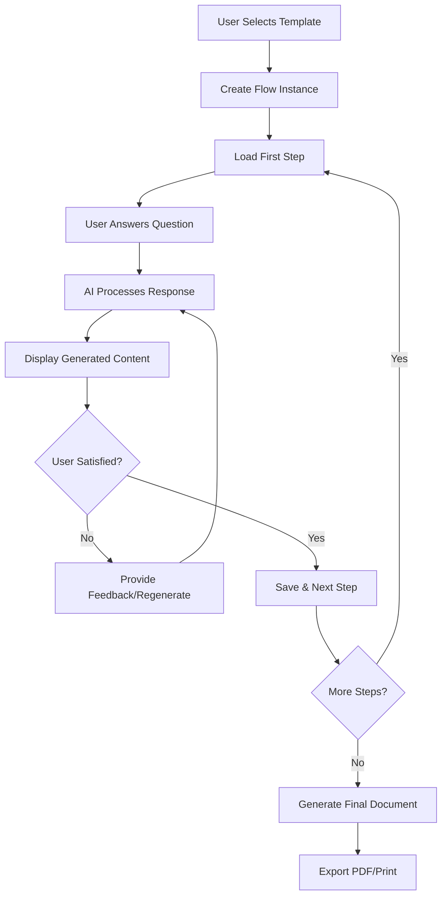

# Salarium Workflow System - Updated Design Plan

## Overview

The Salarium system is a document flow template engine that enables AI-assisted content generation through structured workflows. The first implementation focuses on job description creation (without compensation details), with plans to expand to other HR document types including a separate compensation flow.

## System Architecture

### Core Collections Design

#### 1. FlowTemplates Collection
**Purpose**: Define reusable workflow blueprints
**Location**: `src/collections/FlowTemplates/index.ts`

```typescript
{
  slug: 'flow-templates',
  fields: [
    'name', // e.g., "Job Description Creation"
    'description', // Template purpose and usage
    'category', // 'hr', 'legal', 'marketing', etc.
    'version', // Template versioning
    'isActive', // Enable/disable template
    'aiProvider', // Relationship to AIProviders collection
    'steps', // Array of step definitions
    'outputTemplate', // Final document template
    'metadata' // Tags, difficulty, estimated time
  ]
}
```

#### 2. FlowSteps Collection
**Purpose**: Define individual steps within templates
**Location**: `src/collections/FlowSteps/index.ts`

```typescript
{
  slug: 'flow-steps',
  fields: [
    'stepNumber', // Order in the flow
    'title', // e.g., "Job Title"
    'description', // Step instructions
    'questionText', // User-facing question
    'systemPrompt', // AI processing prompt
    'stepType', // 'text', 'select', 'textarea', 'file-upload'
    'isRequired', // Mandatory step
    'validationRules', // Input validation
    'dependencies', // Conditional logic
    'aiProvider', // Override template AI provider
    'examples' // Sample inputs/outputs
  ]
}
```

#### 3. FlowInstances Collection
**Purpose**: Track individual workflow executions
**Location**: `src/collections/FlowInstances/index.ts`

```typescript
{
  slug: 'flow-instances',
  fields: [
    'templateId', // Relationship to FlowTemplates
    'userId', // Owner/creator
    'organizationId', // Multi-tenant isolation
    'title', // Instance name
    'status', // 'draft', 'in-progress', 'completed', 'archived'
    'currentStep', // Progress tracking
    'stepResponses', // Array of user responses
    'generatedContent', // AI-generated content per step
    'finalDocument', // Complete generated document
    'metadata', // Creation date, completion time, etc.
    'collaborators' // Shared access
  ]
}
```

#### 4. StepResponses Collection
**Purpose**: Store user inputs and AI-generated content with versioning
**Location**: `src/collections/StepResponses/index.ts`

```typescript
{
  slug: 'step-responses',
  fields: [
    'flowInstanceId', // Parent flow instance
    'stepId', // Which step this responds to
    'userInput', // Original user response
    'aiGeneratedContent', // AI-processed content
    'version', // Content iteration number
    'isActive', // Current version flag
    'feedback', // User feedback on AI output
    'regenerationPrompt', // Additional context for regeneration
    'processingTime', // AI response time
    'aiProvider', // Which AI was used
    'timestamp'
  ]
}
```

### Supporting Collections

#### 5. Organizations Collection
**Purpose**: Multi-tenant data isolation
**Location**: `src/collections/Organizations/index.ts`

```typescript
{
  slug: 'organizations',
  fields: [
    'name', // Company name
    'domain', // Email domain for auto-assignment
    'settings', // Organization-specific configurations
    'subscription', // Plan and limits
    'branding', // Logo, colors, templates
    'users', // Relationship to Users
    'industry', // Industry classification
    'location' // Geographic information
  ]
}
```

#### 6. JobFamilies Collection
**Purpose**: Standardized job categorization
**Location**: `src/collections/JobFamilies/index.ts`

```typescript
{
  slug: 'job-families',
  fields: [
    'name', // e.g., "Engineering", "Sales", "Marketing"
    'description',
    'parentFamily', // Hierarchical structure
    'industryAlignment', // Related industries
    'commonSkills', // Typical skills for this family
    'careerProgression' // Typical advancement paths
  ]
}
```

#### 7. Departments Collection
**Purpose**: Organizational structure
**Location**: `src/collections/Departments/index.ts`

```typescript
{
  slug: 'departments',
  fields: [
    'name',
    'organizationId', // Multi-tenant relationship
    'parentDepartment', // Hierarchical structure
    'headOfDepartment', // Manager relationship
    'budget', // Department budget
    'headcount', // Current team size
    'location', // Physical/virtual location
    'responsibilities' // Department scope
  ]
}
```

## Workflow User Experience

### Flow Execution Process



### Step Interaction Flow

1. **Question Display**: Show step question with context and examples
2. **User Input**: Collect user response with validation
3. **AI Processing**: Send user input + system prompt to AI provider
4. **Content Display**: Show generated content with formatting
5. **Iteration Loop**: Allow regeneration with additional context
6. **Approval**: User confirms content and proceeds

## Technical Implementation

### AI Integration Strategy

**Leverage Existing AIProviders Collection**:
- Use configured AI providers (OpenAI, Anthropic, etc.)
- Support provider-specific optimizations
- Handle rate limiting and error recovery
- Store AI interaction metadata

**Prompt Engineering Framework**:
```typescript
interface StepPrompt {
  systemPrompt: string;
  userContext: string;
  examples?: string[];
  constraints?: string[];
  outputFormat?: 'text' | 'markdown' | 'structured';
}
```

### Multi-Tenant Architecture

**Data Isolation**:
- Organization-scoped collections
- User access controls per organization
- Shared templates with private instances
- Billing and usage tracking per organization

**Access Control Matrix**:
```
Template Management: Admin only
Template Usage: All organization users
Instance Management: Creator + collaborators
Content Export: Creator + collaborators
```

### Content Versioning System

**Version Management**:
- Track all content iterations per step
- Allow rollback to previous versions
- Compare versions side-by-side
- Audit trail for content changes

**Storage Strategy**:
- Store complete content versions (not diffs)
- Implement soft deletion for version history
- Compress old versions for storage efficiency

## Job Description Template Specification (Updated)

### Step-by-Step Workflow

**Step 1: Job Title**
- Question: "What is the job title?"
- System Prompt: "Create a standardized, professional job title from the user's input. Follow industry conventions and ensure clarity. If the input is informal or unclear, suggest a more professional alternative while maintaining the core meaning."
- Validation: Required, 5-100 characters
- Examples: "Software Engineer", "Senior Marketing Manager"

**Step 2: Job Mission**
- Question: "Describe the primary purpose and mission of this role."
- System Prompt: "Create a compelling job mission statement following HR best practices. The mission should be clear, concise, and reflect both organizational goals and employee value. Format: 'To [primary purpose] by [key activities] in order to [organizational impact]'."
- Validation: Required, 50-500 characters

**Step 3: Job Scope & Reach**
- Question: "What is the scope and reach of this position?"
- System Prompt: "Define the job's scope including team size, budget responsibility, geographic reach, and organizational impact. Structure this as bullet points covering: Team Leadership, Budget/Resources, Geographic Scope, Internal/External Stakeholders."

**Step 4: Key Responsibilities**
- Question: "List the main responsibilities and duties."
- System Prompt: "Transform the user's input into 5-8 clear, action-oriented responsibility statements. Start each with a strong action verb, be specific about outcomes, and organize by priority/importance."

**Step 5: Required Qualifications**
- Question: "What are the essential qualifications and requirements?"
- System Prompt: "Organize qualifications into: Education Requirements, Experience Requirements, Technical Skills, Certifications/Licenses. Distinguish between 'Required' and 'Preferred' qualifications. Ensure requirements are legally compliant and directly job-related."

### Updated Output Template Structure

```markdown
# [Job Title]

## Position Overview
[Generated mission statement]

## Scope & Impact
[Generated scope description]

## Key Responsibilities
[Generated responsibility list]

## Qualifications
### Required
[Required qualifications]

### Preferred
[Preferred qualifications]

## About [Organization Name]
[Organization description from profile]

---
*Generated by IntelliTrade Salarium on [Date]*
```

## Future Template: Compensation & Benefits Flow

*Note: This will be implemented as a separate workflow template that can be combined with job descriptions or used independently.*

### Planned Steps for Compensation Flow:

**Step 1: Base Salary Structure**
- Question: "What is the base salary range for this position?"
- System Prompt: "Create a professional salary range statement based on market data, internal equity, and role requirements. Include geographic considerations if applicable."

**Step 2: Variable Compensation**
- Question: "Describe any bonuses, commissions, or variable pay components."
- System Prompt: "Structure variable compensation details including performance metrics, payout schedules, and eligibility criteria."

**Step 3: Benefits Package**
- Question: "What benefits are included with this position?"
- System Prompt: "Organize benefits into categories: Health & Wellness, Retirement, Time Off, Insurance, and Additional Perks. Present in a clear, compelling format."

**Step 4: Professional Development**
- Question: "What professional development opportunities are available?"
- System Prompt: "Detail learning and development opportunities including training budgets, conference attendance, certification support, and career advancement paths."

**Step 5: Work Arrangements**
- Question: "What are the work arrangement options?"
- System Prompt: "Describe work flexibility including remote work options, hybrid schedules, travel requirements, and office expectations."

**Step 6: Performance & Review Cycle**
- Question: "How is performance evaluated and when?"
- System Prompt: "Outline the performance management process including review frequency, goal-setting process, and advancement criteria."

### Compensation Template Output Structure:

```markdown
# Compensation Package: [Job Title]

## Base Compensation
[Salary range and structure]

## Variable Compensation
[Bonuses, commissions, incentives]

## Benefits Package
### Health & Wellness
[Health insurance, wellness programs]

### Retirement & Financial
[401k, retirement plans, financial benefits]

### Time Off & Flexibility
[PTO, holidays, sabbaticals]

### Additional Benefits
[Perks, discounts, unique offerings]

## Professional Development
[Learning opportunities, career growth]

## Work Arrangements
[Remote work, flexibility, travel]

## Performance Management
[Review process, advancement criteria]

---
*Generated by IntelliTrade Salarium on [Date]*
```

## Implementation Phases

### Phase 1: Core Infrastructure (Week 1-2)
- Create base collections (FlowTemplates, FlowSteps, FlowInstances)
- Implement AI integration with existing providers
- Build basic admin interface for template management
- Create organization and user management

### Phase 2: Job Description Template (Week 3-4)
- Implement job description workflow (5 steps, no compensation)
- Create step-by-step user interface
- Build content versioning system
- Implement PDF export functionality

### Phase 3: Enhanced Features (Week 5-6)
- Add collaboration features
- Implement template sharing
- Create analytics and reporting
- Build mobile-responsive interface

### Phase 4: Compensation Flow (Week 7-8)
- Implement compensation & benefits template
- Add template combination features
- Create advanced AI features
- Add integration APIs

## Success Metrics

### User Experience Metrics
- Template completion rate > 85%
- Average time to complete job description < 25 minutes (reduced from 30)
- User satisfaction score > 4.5/5
- Content regeneration rate < 20% per step

### Technical Metrics
- AI response time < 5 seconds
- System uptime > 99.5%
- Export success rate > 99%
- Multi-tenant data isolation 100%

### Business Metrics
- Monthly active organizations
- Templates created per organization
- Document exports per month
- User retention rate

## Risk Mitigation

### AI Provider Dependencies
- Support multiple AI providers
- Implement fallback mechanisms
- Cache successful responses
- Monitor API costs and limits

### Data Security
- Encrypt sensitive content
- Implement audit logging
- Regular security assessments
- GDPR/privacy compliance

### Scalability Concerns
- Database indexing strategy
- Content archiving policies
- Performance monitoring
- Load balancing for AI requests

## Next Steps

1. **Stakeholder Review**: Present this updated plan for feedback and approval
2. **Technical Validation**: Verify AI provider integration approach
3. **UI/UX Design**: Create wireframes for workflow interface
4. **Development Sprint Planning**: Break down implementation into detailed tasks
5. **Testing Strategy**: Define acceptance criteria and test cases

This updated plan provides a focused foundation for building the Salarium workflow system, starting with a streamlined job description template and setting up the architecture for future expansion into compensation and other HR document flows.