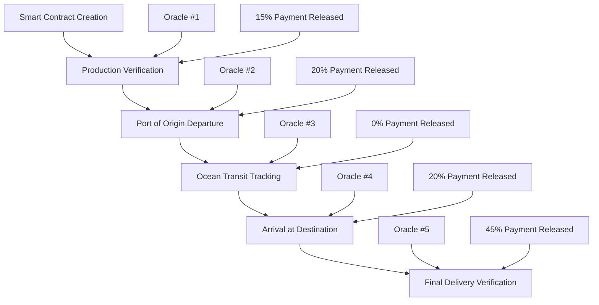
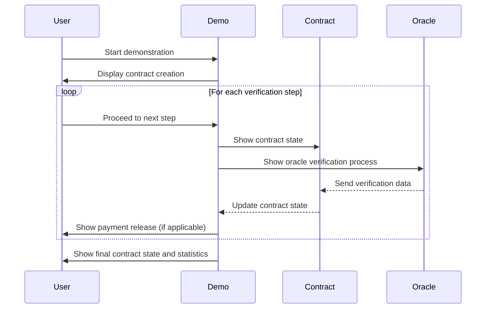

# IntelliTrade Smart Contract Export Process Demo Plan

## Overview

This interactive demonstration will allow users to:
1. Understand the smart contract creation process for an export transaction
2. Follow the export journey through various verification checkpoints
3. See how oracle interactions verify each milestone
4. Understand how payments are automatically released based on verified progress

The demo will use the "Don Hugo Peanut Pilot" as the real-world example, showcasing how the entire process flows from contract creation to final delivery and payment.

## Technical Approach

We'll create a moderately technical demonstration that:
- Shows simplified smart contract code snippets
- Visualizes the verification process at each milestone
- Demonstrates oracle interactions without overwhelming technical details
- Highlights the financial implications (payments, escrow releases) at each step

## Design and Implementation Plan



### 1. New Collection: ExportTransactions

First, we'll create a new collection to store demonstration data:

```typescript
// ExportTransactions Collection
{
  slug: 'export-transactions',
  fields: [
    {
      name: 'title',
      type: 'text',
      required: true,
    },
    {
      name: 'contractAddress',
      type: 'text',
    },
    {
      name: 'exporter',
      type: 'text',
      required: true,
    },
    {
      name: 'importer',
      type: 'text',
      required: true,
    },
    {
      name: 'product',
      type: 'text',
      required: true,
    },
    {
      name: 'amount',
      type: 'number',
      required: true,
    },
    {
      name: 'currency',
      type: 'select',
      options: [
        { label: 'USD', value: 'usd' },
        { label: 'USDC', value: 'usdc' },
        { label: 'USDT', value: 'usdt' },
      ],
      defaultValue: 'usdc',
    },
    {
      name: 'status',
      type: 'select',
      options: [
        { label: 'Created', value: 'created' },
        { label: 'In Progress', value: 'in-progress' },
        { label: 'Completed', value: 'completed' },
      ],
      defaultValue: 'created',
    },
    {
      name: 'verificationSteps',
      type: 'array',
      fields: [
        {
          name: 'stepName',
          type: 'text',
          required: true,
        },
        {
          name: 'description',
          type: 'textarea',
        },
        {
          name: 'status',
          type: 'select',
          options: [
            { label: 'Pending', value: 'pending' },
            { label: 'Verified', value: 'verified' },
            { label: 'Failed', value: 'failed' },
          ],
          defaultValue: 'pending',
        },
        {
          name: 'verifiedBy',
          type: 'text',
        },
        {
          name: 'timestamp',
          type: 'date',
        },
        {
          name: 'paymentReleased',
          type: 'number',
        },
        {
          name: 'evidenceType',
          type: 'select',
          options: [
            { label: 'Photo', value: 'photo' },
            { label: 'GPS', value: 'gps' },
            { label: 'Document', value: 'document' },
            { label: 'Multiple', value: 'multiple' },
          ],
        },
        {
          name: 'evidence',
          type: 'upload',
          relationTo: 'media',
          hasMany: true,
        },
        {
          name: 'contractCode',
          type: 'code',
          admin: {
            language: 'javascript',
          },
        },
        {
          name: 'oracleInteraction',
          type: 'code',
          admin: {
            language: 'javascript',
          },
        },
      ],
    },
    {
      name: 'smartContractCode',
      type: 'code',
      admin: {
        language: 'javascript',
      },
    },
  ],
}
```

### 2. New Block: SmartContractDemo

We'll create a new interactive block for the demo:

```typescript
// SmartContractDemo Block
{
  slug: 'smart-contract-demo',
  interfaceName: 'SmartContractDemoBlock',
  fields: [
    {
      name: 'heading',
      type: 'text',
    },
    {
      name: 'description',
      type: 'textarea',
    },
    {
      name: 'transaction',
      type: 'relationship',
      relationTo: 'export-transactions',
      required: true,
    },
    {
      name: 'showTechnicalDetails',
      type: 'checkbox',
      label: 'Show technical code snippets',
      defaultValue: true,
    },
    {
      name: 'animationSpeed',
      type: 'select',
      options: [
        { label: 'Slow', value: 'slow' },
        { label: 'Medium', value: 'medium' },
        { label: 'Fast', value: 'fast' },
      ],
      defaultValue: 'medium',
    },
    {
      name: 'interactiveMode',
      type: 'select',
      options: [
        { label: 'Step by Step (Manual)', value: 'manual' },
        { label: 'Automatic Playthrough', value: 'auto' },
        { label: 'Both Options', value: 'both' },
      ],
      defaultValue: 'both',
    },
  ],
}
```

### 3. New Component: OracleVerificationCard

```typescript
// A component to visualize oracle verifications
interface OracleVerificationCardProps {
  title: string;
  timestamp: Date;
  evidenceType: 'photo' | 'gps' | 'document' | 'multiple';
  evidence: Media[];
  verified: boolean;
  verifier: string;
  paymentReleased: number;
  showCode: boolean;
  oracleCode: string;
}
```

### 4. New Component: SmartContractVisualizer

```typescript
// A component to visualize the smart contract
interface SmartContractVisualizerProps {
  contractAddress: string;
  contractCode: string;
  showCode: boolean;
  status: 'created' | 'in-progress' | 'completed';
  completedSteps: number;
  totalSteps: number;
}
```

### 5. Implementation Phases

#### Phase 1: Data Structure and Backend (Week 1)

1. **Create ExportTransactions Collection**
   - Implement collection with all fields
   - Create seed data for "Don Hugo Peanut Pilot"
   - Add mock verification steps with appropriate data

2. **Create Smart Contract Code Samples**
   - Develop simplified but realistic Solidity code examples
   - Create oracle interaction code examples
   - Document code with clear explanations

#### Phase 2: UI Components (Week 2)

3. **Build SmartContractDemo Block**
   - Implement configuration options
   - Create component framework
   - Set up interactive controls

4. **Build OracleVerificationCard Component**
   - Design verification visualization
   - Implement evidence display
   - Add technical detail toggles

5. **Build SmartContractVisualizer Component**
   - Create contract state visualization
   - Implement code display with syntax highlighting
   - Add progress tracking

#### Phase 3: Interactive Features (Week 3)

6. **Implement Step-by-Step Navigation**
   - Create navigation controls for manual progression
   - Add explanations for each step
   - Implement highlight effects for current step

7. **Develop Automatic Playthrough**
   - Create animation sequence for automatic playthrough
   - Add timing controls
   - Implement pause/resume functionality

8. **Add Oracle Interactions**
   - Visualize data flow between oracles and contract
   - Show verification process
   - Illustrate payment releases

#### Phase 4: Integration & Testing (Week 4)

9. **Integrate with Existing Timeline Components**
   - Connect with AnimatedTimeline for process visualization
   - Use StatCounter for key metrics
   - Incorporate FeatureGrid for related features

10. **Test User Experience**
    - Verify technical accuracy
    - Ensure accessibility for non-technical users
    - Optimize performance

11. **Documentation and Help Content**
    - Create supporting explanations
    - Add glossary for technical terms
    - Develop guided tour

## Detailed Content for the Interactive Demo

### Example Transaction: Don Hugo Peanut Pilot

```json
{
  "title": "Don Hugo Peanut Export - Batch #1",
  "contractAddress": "0x7a3E8F126a5D91C58EA6F53EaB37C6439E63F1F9",
  "exporter": "Don Hugo Farms",
  "importer": "Global Nut Distributors Ltd.",
  "product": "Premium Grade A Peanuts",
  "amount": 75000,
  "currency": "usdc",
  "status": "in-progress",
  "smartContractCode": "// Simplified smart contract code\npragmatic solidity ^0.8.0;\n\ncontract ExportEscrow {\n  address public importer;\n  address public exporter;\n  uint256 public totalAmount;\n  mapping(uint8 => bool) public milestoneCompleted;\n  mapping(uint8 => uint256) public milestonePayment;\n  \n  constructor(address _exporter, uint256 _amount) payable {\n    importer = msg.sender;\n    exporter = _exporter;\n    totalAmount = _amount;\n    \n    // Set milestone payment percentages\n    milestonePayment[1] = 15; // Production verification\n    milestonePayment[2] = 20; // Port departure\n    milestonePayment[3] = 0;  // Ocean transit\n    milestonePayment[4] = 20; // Port arrival\n    milestonePayment[5] = 45; // Final delivery\n  }\n  \n  function verifyMilestone(uint8 milestone, bytes calldata oracleSignature) external {\n    require(isValidOracle(msg.sender), \"Not authorized oracle\");\n    require(!milestoneCompleted[milestone], \"Milestone already verified\");\n    require(validateSignature(oracleSignature), \"Invalid oracle signature\");\n    \n    milestoneCompleted[milestone] = true;\n    uint256 paymentAmount = (totalAmount * milestonePayment[milestone]) / 100;\n    \n    if(paymentAmount > 0) {\n      // Release payment to exporter\n      payable(exporter).transfer(paymentAmount);\n      emit PaymentReleased(milestone, paymentAmount);\n    }\n    \n    emit MilestoneVerified(milestone);\n  }\n  \n  // Additional contract functions...\n}"
}
```

### Verification Steps Content

Each verification step will include:

1. **Production Verification**
   - Description: "Verification of peanut production at Don Hugo Farms facility"
   - Evidence: Photos of harvested peanuts, quality inspection certificate
   - Oracle Interaction: GPS verification of photos matching production facility coordinates
   - Payment: 15% released upon verification
   - Simplified Code:
     ```javascript
     function verifyProduction(bytes32 photoHash, uint256 timestamp, int256 lat, int256 long) {
       require(isRegisteredFacility(lat, long), "Location not registered");
       require(validatePhotoHash(photoHash), "Invalid photo evidence");
       verifyMilestone(1, generateSignature(photoHash, timestamp, lat, long));
     }
     ```

2. **Port of Origin Departure**
   - Description: "Verification of goods arrival and loading at Puerto de Buenos Aires"
   - Evidence: Bill of lading, container photos, port authority documentation
   - Oracle Interaction: Document verification and port authority confirmation
   - Payment: 20% released upon verification
   - Simplified Code:
     ```javascript
     function verifyPortDeparture(bytes32 documentHash, uint256 timestamp, bytes32 billOfLadingId) {
       require(validateDocument(documentHash, "billOfLading"), "Invalid document");
       require(validatePortAuthority(billOfLadingId), "Port authority verification failed");
       verifyMilestone(2, generateSignature(documentHash, timestamp, billOfLadingId));
     }
     ```

3. **Ocean Transit Tracking**
   - Description: "Verification of container location during ocean transit"
   - Evidence: GPS tracking data, shipping company updates
   - Oracle Interaction: GPS data validation from shipping carrier API
   - Payment: 0% (monitoring only)
   - Simplified Code:
     ```javascript
     function verifyTransitLocation(bytes32 vesselId, uint256 timestamp, int256 lat, int256 long) {
       require(isRegisteredVessel(vesselId), "Unknown vessel");
       require(isOnCourse(vesselId, lat, long), "Vessel off expected course");
       // No payment released, just update status
       logTransitUpdate(3, generateSignature(vesselId, timestamp, lat, long));
     }
     ```

4. **Arrival at Destination Port**
   - Description: "Verification of arrival at Port of Los Angeles"
   - Evidence: Import documentation, customs clearance, container photos
   - Oracle Interaction: Customs authority API verification
   - Payment: 20% released upon verification
   - Simplified Code:
     ```javascript
     function verifyPortArrival(bytes32 documentHash, uint256 timestamp, bytes32 customsId) {
       require(validateDocument(documentHash, "importDeclaration"), "Invalid document");
       require(validateCustomsAuthority(customsId), "Customs verification failed");
       verifyMilestone(4, generateSignature(documentHash, timestamp, customsId));
     }
     ```

5. **Final Delivery Verification**
   - Description: "Verification of delivery to Global Nut Distributors warehouse"
   - Evidence: Delivery receipt, quality inspection, warehouse photos
   - Oracle Interaction: Receiver confirmation and quality verification
   - Payment: 45% released upon verification (final payment)
   - Simplified Code:
     ```javascript
     function verifyFinalDelivery(bytes32 receiptHash, uint256 timestamp, bytes32 qualityReportId) {
       require(validateDocument(receiptHash, "deliveryReceipt"), "Invalid receipt");
       require(validateQualityReport(qualityReportId), "Quality verification failed");
       verifyMilestone(5, generateSignature(receiptHash, timestamp, qualityReportId));
       // Complete contract after final milestone
       completeTransaction();
     }
     ```

## User Experience Flow



## Success Metrics for the Demo

1. **Comprehension**: Users should be able to explain the export verification process after using the demo
2. **Engagement**: Average time spent with the demo > 3 minutes
3. **Technical Balance**: Positive feedback from both technical and non-technical users
4. **Conversion Impact**: Increased conversion to registration after viewing the demo

## Integration with Existing Components

The demo will leverage several existing components:

1. **AnimatedTimeline**: For visualizing the export journey through each verification point
2. **StatCounter**: For displaying key metrics like processing time and cost savings
3. **FeatureGrid**: For highlighting related platform features
4. **ParallaxHero**: For an engaging introduction to the demo experience

## Alignment with Marketing Goals

This interactive demonstration directly supports several key marketing objectives:

1. **Educational Value**: Provides clear understanding of the platform's core value proposition
2. **Problem-Solution Visualization**: Clearly shows how IntelliTrade solves traditional trade finance problems
3. **Technical Credibility**: Demonstrates the platform's technical sophistication without overwhelming users
4. **Conversion Support**: Creates confidence in the platform's capabilities to drive registration

## Next Steps

After the initial implementation, we should consider:

1. **Expanded Scenarios**: Creating additional export scenarios beyond the Don Hugo Peanut Pilot
2. **User Customization**: Allowing users to modify parameters to see different outcomes
3. **Mobile Optimization**: Ensuring the demo works well on tablets and mobile devices
4. **Performance Metrics**: Adding analytics to measure engagement with the demo