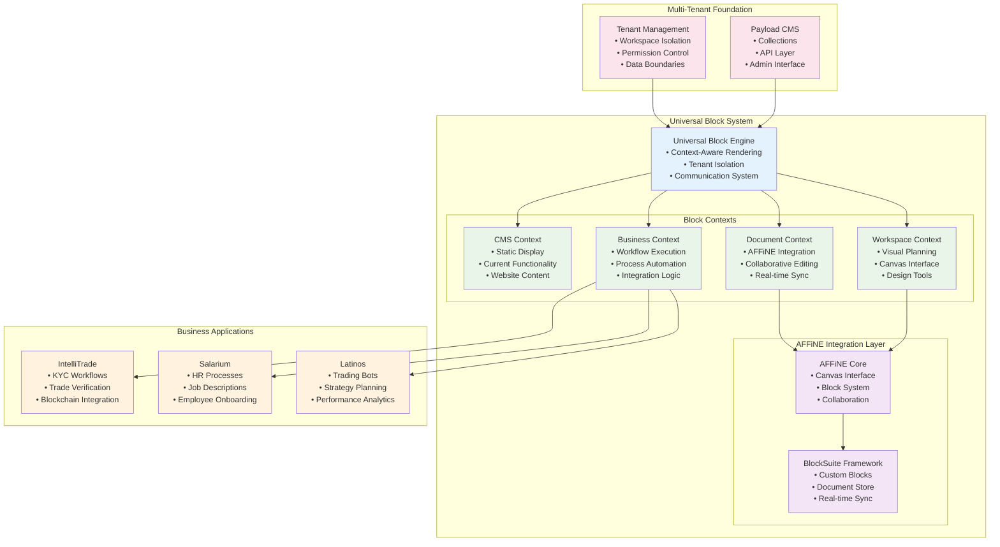
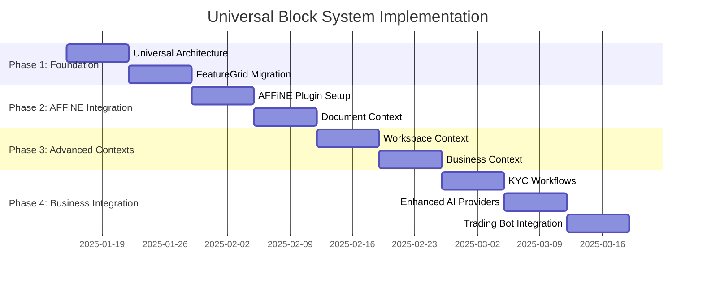

# Universal Block System with AFFiNE Integration

## Strategic Overview

This unified task consolidates the best ideas from all previous tasks into a single, implementable plan that transforms your current Payload CMS blocks into a Universal Block System powered by AFFiNE/BlockSuite integration. This approach provides immediate value while creating the foundation for all future workflow and collaboration features.

## Why This Unified Approach

### Problems Solved
1. **Current Block Limitations**: Your existing blocks ([`FeatureGrid`](src/blocks/FeatureGrid/Component.tsx:1), [`ParallaxHero`](src/blocks/ParallaxHero/Component.tsx:1)) only work in CMS context
2. **Workflow Fragmentation**: Different systems for content, collaboration, planning, and business processes
3. **Code Duplication**: Similar blocks needed for different contexts across business domains
4. **Limited Collaboration**: No real-time editing or collaborative planning capabilities
5. **Scalability Issues**: Current architecture doesn't support the multi-tenant workflow needs

### Strategic Benefits
- **Immediate Value**: Enhances existing blocks with collaboration and planning capabilities
- **Foundation for All Features**: Enables KYC workflows, enhanced AI providers, trading bot interfaces
- **Incremental Implementation**: Builds on existing code without breaking changes
- **Future-Proof Architecture**: Supports all planned business applications

## Architecture Overview



## Implementation Plan

### Phase 1: Universal Block Foundation (Week 1-2)

#### 1.1 Install AFFiNE/BlockSuite Dependencies
```bash
# Core AFFiNE packages
npm install @blocksuite/store @blocksuite/blocks @blocksuite/presets
npm install @blocksuite/editor @blocksuite/lit

# Additional dependencies for integration
npm install yjs y-websocket y-indexeddb
```

#### 1.2 Create Universal Block Architecture
```typescript
// Directory structure
src/blocks/universal/
├── core/
│   ├── UniversalBlock.ts          # Base universal block interface
│   ├── BlockEngine.ts             # Context-aware rendering engine
│   ├── CommunicationSystem.ts     # Tenant-based block communication
│   └── types.ts                   # TypeScript interfaces
├── contexts/
│   ├── cms/                       # Current Payload functionality
│   ├── document/                  # AFFiNE collaborative editing
│   ├── workspace/                 # Visual planning interface
│   └── business/                  # Workflow execution
├── shared/
│   ├── components/                # Reusable UI components
│   ├── hooks/                     # React hooks for block communication
│   └── utils/                     # Shared utilities
└── migration/
    ├── FeatureGrid/               # Migrated FeatureGrid block
    ├── ParallaxHero/              # Migrated ParallaxHero block
    └── templates/                 # Migration templates
```

#### 1.3 Universal Block Core Implementation
```typescript
// src/blocks/universal/core/UniversalBlock.ts
interface UniversalBlock {
  // Block identity
  id: string
  type: string
  version: string
  
  // Core data schema (shared across contexts)
  schema: BlockSchema
  
  // Context implementations
  contexts: {
    cms: () => Promise<React.ComponentType>
    document: () => Promise<React.ComponentType>
    workspace: () => Promise<React.ComponentType>
    business: () => Promise<React.ComponentType>
  }
  
  // Communication capabilities
  communication: {
    publishes: string[]
    subscribes: string[]
  }
  
  // Multi-tenant support
  tenantIsolation: TenantIsolationConfig
}

// src/blocks/universal/core/BlockEngine.ts
class UniversalBlockEngine {
  async renderBlock(
    block: UniversalBlock,
    context: BlockContext,
    tenant: Tenant
  ): Promise<React.ComponentType> {
    // Load context-specific implementation
    const contextRenderer = await this.loadContext(block.type, context.name)
    
    // Apply tenant isolation
    const isolatedRenderer = this.applyTenantIsolation(contextRenderer, tenant)
    
    // Enable block communication
    const communicativeRenderer = this.enableCommunication(isolatedRenderer, block)
    
    return communicativeRenderer
  }
}
```

#### 1.4 Migrate FeatureGrid as Proof of Concept
```typescript
// src/blocks/universal/migration/FeatureGrid/index.ts
export const UniversalFeatureGrid: UniversalBlock = {
  id: 'feature-grid-universal',
  type: 'FeatureGrid',
  version: '1.0.0',
  
  schema: {
    heading: { type: 'text', required: true },
    description: { type: 'text' },
    layout: { type: 'select', options: ['2col', '3col', '4col'] },
    features: { type: 'relationship', relationTo: 'features' },
    showNumbers: { type: 'boolean', default: true },
    animated: { type: 'boolean', default: true }
  },
  
  contexts: {
    // CMS: Your existing component (identical functionality)
    cms: () => import('./contexts/cms'),
    
    // Document: Collaborative editing with AFFiNE
    document: () => import('./contexts/document'),
    
    // Workspace: Interactive planning interface
    workspace: () => import('./contexts/workspace'),
    
    // Business: Workflow execution
    business: () => import('./contexts/business')
  },
  
  communication: {
    publishes: ['selectedFeatures', 'layoutChange', 'completionStatus'],
    subscribes: ['userPreferences', 'designTokens', 'workflowState']
  }
}
```

### Phase 2: AFFiNE Integration (Week 3-4)

#### 2.1 AFFiNE Workspace Plugin
```typescript
// src/plugins/shared/affine-integration/index.ts
export const affineIntegrationPlugin = (): Plugin => (incomingConfig) => {
  return {
    ...incomingConfig,
    collections: [
      ...incomingConfig.collections,
      {
        slug: 'affine-workspaces',
        admin: { group: 'AFFiNE Integration' },
        fields: [
          { name: 'name', type: 'text', required: true },
          { name: 'tenant', type: 'relationship', relationTo: 'users' },
          { name: 'workspaceId', type: 'text', unique: true },
          { name: 'collaborators', type: 'relationship', relationTo: 'users', hasMany: true },
          { name: 'workflowTemplates', type: 'json' },
          { name: 'settings', type: 'json' },
          { name: 'permissions', type: 'json' }
        ]
      },
      {
        slug: 'workflow-documents',
        admin: { group: 'AFFiNE Integration' },
        fields: [
          { name: 'title', type: 'text', required: true },
          { name: 'workspace', type: 'relationship', relationTo: 'affine-workspaces' },
          { name: 'documentId', type: 'text', unique: true },
          { name: 'blockData', type: 'json' },
          { name: 'version', type: 'number', defaultValue: 1 },
          { name: 'collaborators', type: 'relationship', relationTo: 'users', hasMany: true },
          { name: 'status', type: 'select', options: ['draft', 'active', 'completed'] }
        ]
      }
    ]
  }
}
```

#### 2.2 Document Context Implementation
```typescript
// src/blocks/universal/migration/FeatureGrid/contexts/document.tsx
import { AFFiNEEditor } from '@blocksuite/editor'
import { Doc } from '@blocksuite/store'

export const DocumentFeatureGrid: React.FC<FeatureGridProps> = (props) => {
  const { isEditing, collaborators, onUpdate } = useDocumentContext()
  const [doc, setDoc] = useState<Doc | null>(null)
  
  useEffect(() => {
    // Initialize AFFiNE document
    const newDoc = new Doc({ id: `feature-grid-${props.id}` })
    setDoc(newDoc)
    
    // Set up real-time collaboration
    setupCollaboration(newDoc, collaborators)
  }, [props.id, collaborators])
  
  return (
    <div className="relative">
      {/* Collaborative editing toolbar */}
      {isEditing && (
        <CollaborativeToolbar
          collaborators={collaborators}
          onAddFeature={() => onUpdate('features', [...props.features, newFeature])}
          onLayoutChange={(layout) => onUpdate('layout', layout)}
        />
      )}
      
      {/* AFFiNE Editor Integration */}
      <div className="affine-editor-container">
        {doc && (
          <AFFiNEEditor
            doc={doc}
            mode={isEditing ? 'editable' : 'readonly'}
            onBlockChange={handleBlockChange}
          />
        )}
      </div>
      
      {/* Feature Grid with collaborative editing */}
      <div className={cn('grid', getGridColumns(props.layout))}>
        {props.features.map((feature, index) => (
          <EditableFeatureCard
            key={feature.id}
            feature={feature}
            isEditing={isEditing}
            onChange={(updatedFeature) => updateFeature(index, updatedFeature)}
            collaborators={getFeatureCollaborators(feature.id)}
          />
        ))}
      </div>
    </div>
  )
}
```

#### 2.3 Workspace Context Implementation
```typescript
// src/blocks/universal/migration/FeatureGrid/contexts/workspace.tsx
export const WorkspaceFeatureGrid: React.FC<FeatureGridProps> = (props) => {
  const { canvasMode, onDragEnd } = useWorkspaceContext()
  const { publish, subscribe } = useBlockCommunication('feature-grid')
  
  return (
    <div className="workspace-container">
      {/* Planning tools */}
      <WorkspaceToolbar>
        <LayoutDesigner 
          currentLayout={props.layout}
          onLayoutChange={(layout) => {
            publish('layoutChange', layout)
            props.onUpdate?.({ layout })
          }}
        />
        <FeatureLibrary 
          onDragStart={handleDragStart}
          availableFeatures={props.availableFeatures}
        />
        <StyleEditor 
          onStyleChange={(styles) => publish('styleUpdate', styles)}
        />
      </WorkspaceToolbar>
      
      {/* Interactive canvas with AFFiNE integration */}
      <AFFiNECanvas>
        <DragDropContext onDragEnd={onDragEnd}>
          <Droppable droppableId="feature-grid">
            {(provided) => (
              <div ref={provided.innerRef} {...provided.droppableProps}>
                {props.features.map((feature, index) => (
                  <Draggable key={feature.id} draggableId={feature.id} index={index}>
                    {(provided) => (
                      <InteractiveFeatureCard
                        ref={provided.innerRef}
                        {...provided.draggableProps}
                        {...provided.dragHandleProps}
                        feature={feature}
                        onEdit={() => openFeatureEditor(feature)}
                        onDelete={() => removeFeature(feature.id)}
                      />
                    )}
                  </Draggable>
                ))}
              </div>
            )}
          </Droppable>
        </DragDropContext>
      </AFFiNECanvas>
    </div>
  )
}
```

### Phase 3: Business Context & Workflow Integration (Week 5-6)

#### 3.1 Business Context Implementation
```typescript
// src/blocks/universal/migration/FeatureGrid/contexts/business.tsx
export const BusinessFeatureGrid: React.FC<FeatureGridProps> = (props) => {
  const { workflowState, executeStep } = useBusinessContext()
  const { publish, subscribe } = useBlockCommunication('feature-grid')
  
  useEffect(() => {
    // Subscribe to workflow state changes
    const unsubscribe = subscribe('workflow-engine', 'currentStep', (step) => {
      setCurrentStep(step)
    })
    return unsubscribe
  }, [])
  
  return (
    <div className="business-process-container">
      {/* Process execution interface */}
      <ProcessHeader
        currentStep={workflowState.currentStep}
        totalSteps={props.features.length}
        progress={workflowState.progress}
      />
      
      {/* Feature-based process steps */}
      <div className="process-grid">
        {props.features.map((feature, index) => (
          <ProcessStepCard
            key={feature.id}
            feature={feature}
            stepNumber={index + 1}
            status={getStepStatus(index)}
            onExecute={() => {
              executeStep(index)
              publish('stepCompleted', { stepIndex: index, feature })
            }}
            onValidate={() => validateStep(index)}
            data={workflowState.stepData[index]}
          />
        ))}
      </div>
      
      {/* Process controls */}
      <ProcessControls
        onNext={nextStep}
        onPrevious={previousStep}
        onComplete={() => {
          completeWorkflow()
          publish('workflowCompleted', { features: props.features })
        }}
      />
    </div>
  )
}
```

#### 3.2 Universal Communication System
```typescript
// src/blocks/universal/core/CommunicationSystem.ts
class UniversalTenantCommunication {
  private tenantId: string
  private store: Map<string, any>
  private events: EventEmitter
  private persistence: PersistenceAdapter
  
  constructor(tenantId: string) {
    this.tenantId = tenantId
    this.store = new Map()
    this.events = new EventEmitter()
    this.persistence = new PersistenceAdapter(tenantId)
  }
  
  // Universal API for all contexts
  set(key: string, value: any): void {
    const scopedKey = this.getScopedKey(key)
    
    // Update in-memory store
    this.store.set(scopedKey, value)
    
    // Persist to database
    this.persistence.save(scopedKey, value)
    
    // Notify all subscribers (real-time)
    this.events.emit('data-changed', { key: scopedKey, value })
  }
  
  get(key: string): any {
    const scopedKey = this.getScopedKey(key)
    return this.store.get(scopedKey)
  }
  
  subscribe(key: string, callback: Function): () => void {
    const scopedKey = this.getScopedKey(key)
    
    // Call immediately with current value
    const currentValue = this.store.get(scopedKey)
    if (currentValue !== undefined) {
      callback(currentValue)
    }
    
    // Listen for future changes
    const listener = ({ key: eventKey, value }) => {
      if (eventKey === scopedKey) {
        callback(value)
      }
    }
    
    this.events.on('data-changed', listener)
    
    // Return unsubscribe function
    return () => this.events.off('data-changed', listener)
  }
  
  private getScopedKey(key: string): string {
    return `${this.tenantId}:${key}`
  }
}

// React hook for block communication
export function useBlockCommunication(blockId: string) {
  const { tenantId } = useTenant()
  const communication = useMemo(
    () => new UniversalTenantCommunication(tenantId),
    [tenantId]
  )
  
  const publish = useCallback((key: string, value: any) => {
    communication.set(`${blockId}:${key}`, value)
  }, [blockId, communication])
  
  const subscribe = useCallback((sourceBlockId: string, key: string, callback: Function) => {
    return communication.subscribe(`${sourceBlockId}:${key}`, callback)
  }, [communication])
  
  return { publish, subscribe }
}
```

### Phase 4: Business Application Integration (Week 7-8)

#### 4.1 KYC Workflow Integration
```typescript
// src/plugins/business/intellitrade/workflows/kyc-process.ts
export const KYCWorkflowTemplate = {
  name: 'SARLAFT KYC Process',
  blocks: [
    {
      type: 'FeatureGrid',
      context: 'business',
      config: {
        features: [
          { id: 'company-info', title: 'Company Information', required: true },
          { id: 'documents', title: 'Document Upload', required: true },
          { id: 'verification', title: 'AI Verification', automated: true },
          { id: 'approval', title: 'Compliance Approval', approver: 'compliance-officer' }
        ],
        layout: '2col',
        workflowMode: 'sequential'
      }
    }
  ],
  
  steps: [
    {
      blockId: 'company-info',
      action: 'collectCompanyData',
      validation: 'required-fields',
      nextStep: 'documents'
    },
    {
      blockId: 'documents',
      action: 'uploadDocuments',
      validation: 'document-types',
      aiProcessing: 'document-validation',
      nextStep: 'verification'
    },
    {
      blockId: 'verification',
      action: 'aiRiskAssessment',
      automated: true,
      nextStep: 'approval'
    },
    {
      blockId: 'approval',
      action: 'complianceReview',
      approver: 'compliance-officer',
      finalStep: true
    }
  ]
}
```

#### 4.2 Enhanced AI Providers Integration
```typescript
// src/plugins/shared/ai-management/enhanced/index.ts
export const enhancedAIProvidersPlugin = (): Plugin => (incomingConfig) => {
  return {
    ...incomingConfig,
    collections: [
      ...incomingConfig.collections,
      {
        slug: 'ai-providers-enhanced',
        fields: [
          // Basic configuration
          { name: 'name', type: 'text', required: true },
          { name: 'provider', type: 'select', options: ['openai', 'anthropic', 'google'] },
          { name: 'apiKey', type: 'text', required: true },
          
          // Enhanced capabilities
          { name: 'capabilities', type: 'group', fields: [
            { name: 'supportsImages', type: 'checkbox' },
            { name: 'supportsComputerUse', type: 'checkbox' },
            { name: 'supportsPromptCaching', type: 'checkbox' },
            { name: 'supportsFunctionCalling', type: 'checkbox' }
          ]},
          
          // Real-time connection testing
          { name: 'connectionTest', type: 'group', fields: [
            { name: 'status', type: 'select', options: ['connected', 'disconnected', 'testing'] },
            { name: 'lastTestDate', type: 'date' },
            { name: 'responseTime', type: 'number' },
            { name: 'autoTestOnSave', type: 'checkbox', defaultValue: true }
          ]},
          
          // Dynamic model lists
          { name: 'availableModels', type: 'json' },
          { name: 'defaultModel', type: 'text' },
          
          // Pricing information
          { name: 'pricing', type: 'group', fields: [
            { name: 'inputPrice', type: 'number' },
            { name: 'outputPrice', type: 'number' },
            { name: 'currency', type: 'text', defaultValue: 'USD' }
          ]}
        ],
        
        hooks: {
          beforeChange: [
            async ({ data, operation }) => {
              if (operation === 'create' || operation === 'update') {
                // Auto-test connection on save
                if (data.connectionTest?.autoTestOnSave) {
                  const testResult = await testAIProviderConnection(data)
                  data.connectionTest = {
                    ...data.connectionTest,
                    status: testResult.success ? 'connected' : 'disconnected',
                    lastTestDate: new Date(),
                    responseTime: testResult.responseTime
                  }
                }
                
                // Fetch available models
                const models = await fetchAvailableModels(data.provider, data.apiKey)
                data.availableModels = models
              }
            }
          ]
        }
      }
    ]
  }
}
```

#### 4.3 Latinos Trading Bot Integration
```typescript
// src/plugins/business/latinos/blocks/TradingDashboard.ts
export const TradingDashboardBlock: Block = {
  slug: 'tradingDashboard',
  labels: {
    singular: 'Trading Dashboard',
    plural: 'Trading Dashboards'
  },
  fields: [
    {
      name: 'title',
      type: 'text',
      defaultValue: 'Live Trading Dashboard'
    },
    {
      name: 'universalBlockConfig',
      type: 'group',
      fields: [
        {
          name: 'enableCollaboration',
          type: 'checkbox',
          defaultValue: true,
          admin: {
            description: 'Enable real-time collaboration for strategy planning'
          }
        },
        {
          name: 'workspaceMode',
          type: 'checkbox',
          defaultValue: false,
          admin: {
            description: 'Enable workspace mode for strategy design'
          }
        },
        {
          name: 'businessMode',
          type: 'checkbox',
          defaultValue: true,
          admin: {
            description: 'Enable business mode for bot execution'
          }
        }
      ]
    }
  ]
}

// Universal Trading Dashboard implementation
export const UniversalTradingDashboard: UniversalBlock = {
  id: 'trading-dashboard-universal',
  type: 'TradingDashboard',
  version: '1.0.0',
  
  contexts: {
    cms: () => import('./contexts/cms'),        // Static display
    document: () => import('./contexts/document'), // Collaborative strategy editing
    workspace: () => import('./contexts/workspace'), // Strategy design canvas
    business: () => import('./contexts/business')    // Live trading execution
  },
  
  communication: {
    publishes: ['botStatus', 'tradeExecuted', 'strategyUpdated'],
    subscribes: ['marketData', 'userPreferences', 'riskParameters']
  }
}
```

## Migration Strategy

### Preserving Current Functionality
```typescript
// Ensure zero breaking changes
const migrationStrategy = {
  phase1: {
    // Keep existing blocks working exactly as they are
    preserveExisting: true,
    addUniversalWrapper: true,
    defaultContext: 'cms'
  },
  
  phase2: {
    // Gradually add new contexts
    addDocumentContext: true,
    enableCollaboration: true,
    maintainBackwardCompatibility: true
  },
  
  phase3: {
    // Enable advanced features
    addWorkspaceContext: true,
    addBusinessContext: true,
    enableCrossContextCommunication: true
  }
}
```

### Backward Compatibility
```typescript
// Existing block usage continues to work
<FeatureGrid 
  heading="IntelliTrade Features"
  features={features}
  layout="3col"
/>

// New universal block usage (opt-in)
<UniversalFeatureGrid
  context="document"  // New: context-aware rendering
  heading="IntelliTrade Features"
  features={features}
  layout="3col"
  collaborators={['user1', 'user2']}  // New: collaboration
  onUpdate={handleUpdate}  // New: real-time updates
/>
```

## Success Metrics

### Technical Metrics
- **Zero Breaking Changes**: All existing blocks continue to work identically
- **Performance**: <100ms context switching time
- **Bundle Size**: <20KB per context (lazy loaded)
- **Collaboration**: Real-time updates <500ms latency

### Business Metrics
- **Development Speed**: 50% faster block creation for new contexts
- **Code Reuse**: 80% reduction in duplicated block code
- **User Experience**: Seamless context switching
- **Scalability**: Support for 10+ business applications

## Implementation Timeline



## Next Steps

1. **Architecture Review**: Validate this unified approach with stakeholders
2. **Proof of Concept**: Implement Phase 1 with FeatureGrid migration
3. **AFFiNE Integration**: Set up BlockSuite and collaborative editing
4. **Business Validation**: Test with real KYC and trading bot scenarios
5. **Full Implementation**: Complete all phases with comprehensive testing

This unified approach transforms your platform from a multi-tenant CMS into a Universal Business Platform while preserving all existing functionality and providing a clear path for all planned features.