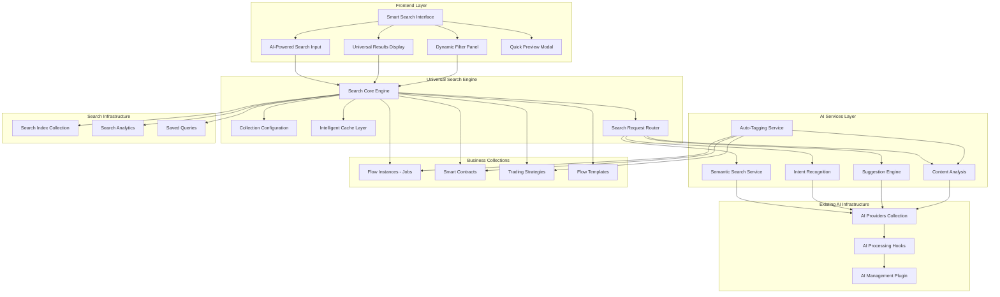
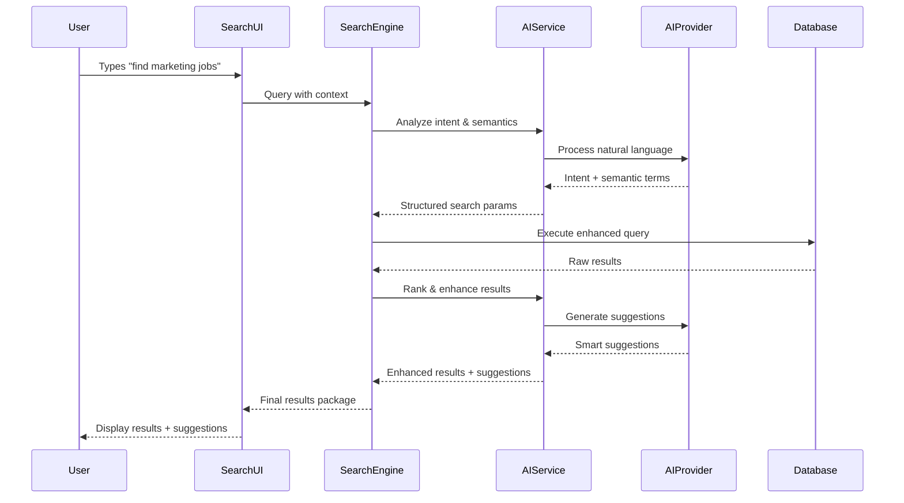
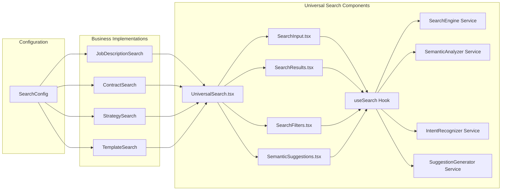

# Universal AI-Powered Search System - Implementation Plan

## Architecture Overview

This document provides a detailed implementation plan for the Universal AI-Powered Search System, following the design philosophy of being **creative, amazing, powerful, real-time, beautiful, practical, solid, modular, reusable and understandable**.

## System Architecture Diagram



## AI Integration Flow



## Component Architecture



## Implementation Phases

### Phase 1: Universal Core Infrastructure (Week 1-2)

#### 1.1 Core Search Engine
- [ ] Create universal search plugin structure
- [ ] Implement basic search engine with configuration system
- [ ] Add collection-agnostic search logic
- [ ] Create TypeScript interfaces and types

#### 1.2 AI Integration Foundation
- [ ] Connect to existing AI management plugin
- [ ] Create semantic search service
- [ ] Implement intent recognition service
- [ ] Add suggestion generation service

#### 1.3 Basic UI Components
- [ ] Create universal search input component
- [ ] Build results display component
- [ ] Add basic filtering system
- [ ] Implement loading and error states

### Phase 2: AI-Powered Features (Week 2-3)

#### 2.1 Semantic Search Implementation
- [ ] Natural language query processing
- [ ] Semantic similarity matching
- [ ] Content analysis and indexing
- [ ] Relevance scoring algorithm

#### 2.2 Intent Recognition System
- [ ] Query intent classification
- [ ] Action extraction (search, filter, create, etc.)
- [ ] Context-aware processing
- [ ] Confidence scoring

#### 2.3 Smart Suggestions
- [ ] Real-time suggestion generation
- [ ] User behavior analysis
- [ ] Content-based recommendations
- [ ] Predictive search capabilities

### Phase 3: Business Integration (Week 3-4)

#### 3.1 Salarium Job Description Search
- [ ] Configure search for FlowInstances collection
- [ ] Implement job-specific actions (continue, edit, export)
- [ ] Add job description semantic analysis
- [ ] Create job-specific suggestion prompts

#### 3.2 IntelliTrade Contract Search
- [ ] Configure search for SmartContracts collection
- [ ] Implement contract-specific actions
- [ ] Add contract semantic analysis
- [ ] Create contract-specific suggestions

#### 3.3 Latinos Strategy Search
- [ ] Configure search for TradingStrategies collection
- [ ] Implement strategy-specific actions
- [ ] Add strategy semantic analysis
- [ ] Create strategy-specific suggestions

### Phase 4: Advanced Features & Polish (Week 4-5)

#### 4.1 Performance Optimization
- [ ] Implement intelligent caching
- [ ] Add search result prefetching
- [ ] Optimize database queries
- [ ] Add virtual scrolling for large results

#### 4.2 User Experience Enhancements
- [ ] Add smooth animations and transitions
- [ ] Implement keyboard navigation
- [ ] Add voice search capabilities
- [ ] Create mobile-responsive design

#### 4.3 Analytics & Insights
- [ ] Track search usage patterns
- [ ] Generate search analytics
- [ ] Provide search insights dashboard
- [ ] Implement A/B testing framework

## Technical Implementation Details

### 1. Universal Search Configuration

```typescript
// Example configuration for different collections
const searchConfigurations = {
  'flow-instances': {
    displayName: 'Job Descriptions',
    searchableFields: [
      { field: 'title', weight: 1.0, type: 'text' },
      { field: 'finalDocument', weight: 0.8, type: 'semantic' },
      { field: 'metadata.tags', weight: 0.6, type: 'tag' },
      { field: 'status', weight: 0.3, type: 'keyword' }
    ],
    filters: [
      { field: 'status', type: 'select', options: ['draft', 'in-progress', 'completed'] },
      { field: 'progress', type: 'range', min: 0, max: 100 }
    ],
    actions: [
      { id: 'continue', label: 'Continue', condition: 'status != completed' },
      { id: 'edit', label: 'Edit', condition: 'status == completed' }
    ],
    aiPrompts: {
      semantic: "Analyze job descriptions focusing on role requirements and qualifications",
      suggestions: "Suggest job descriptions based on user's work patterns"
    }
  },
  'smart-contracts': {
    displayName: 'Smart Contracts',
    searchableFields: [
      { field: 'contractName', weight: 1.0, type: 'text' },
      { field: 'description', weight: 0.8, type: 'semantic' },
      { field: 'contractType', weight: 0.6, type: 'keyword' }
    ],
    aiPrompts: {
      semantic: "Analyze contracts focusing on terms, conditions, and trade requirements"
    }
  }
}
```

### 2. AI Service Integration

```typescript
// Leverage existing AI infrastructure
class UniversalSemanticSearch {
  constructor(private aiProvider: AIProvider) {}

  async semanticSearch(query: string, collection: string): Promise<SemanticResult[]> {
    const config = searchConfigurations[collection]
    const prompt = this.buildSemanticPrompt(query, config)
    
    const aiResponse = await this.aiProvider.generateContent({
      prompt,
      systemPrompt: config.aiPrompts.semantic,
      maxTokens: 500
    })

    return this.parseSemanticResponse(aiResponse, collection)
  }

  private buildSemanticPrompt(query: string, config: SearchConfig): string {
    return `
    Analyze this search query for semantic meaning in the context of ${config.displayName}:
    Query: "${query}"
    
    Return expanded search terms, related concepts, and synonyms that would help find relevant ${config.displayName.toLowerCase()}.
    Focus on the domain-specific terminology and concepts.
    `
  }
}
```

### 3. Universal Search Hook

```typescript
export const useUniversalSearch = (collection: string, config: SearchConfig) => {
  const [query, setQuery] = useState('')
  const [results, setResults] = useState<SearchResult[]>([])
  const [suggestions, setSuggestions] = useState<AISuggestion[]>([])
  const [loading, setLoading] = useState(false)
  const [intent, setIntent] = useState<RecognizedIntent | null>(null)

  // Debounced search with AI enhancement
  const debouncedSearch = useCallback(
    debounce(async (searchQuery: string) => {
      if (!searchQuery.trim()) {
        setResults([])
        setSuggestions([])
        return
      }

      setLoading(true)
      try {
        // Parallel execution of search and AI services
        const [searchResults, aiSuggestions, recognizedIntent] = await Promise.all([
          searchEngine.search(searchQuery, collection, config),
          suggestionEngine.generateSuggestions(searchQuery, collection),
          intentRecognizer.recognizeIntent(searchQuery)
        ])

        setResults(searchResults)
        setSuggestions(aiSuggestions)
        setIntent(recognizedIntent)
      } catch (error) {
        console.error('Search error:', error)
      } finally {
        setLoading(false)
      }
    }, 150),
    [collection, config]
  )

  useEffect(() => {
    debouncedSearch(query)
  }, [query, debouncedSearch])

  return {
    query,
    setQuery,
    results,
    suggestions,
    loading,
    intent
  }
}
```

## Success Criteria

### Technical Metrics
- [ ] **Response Time**: < 200ms for cached queries, < 500ms for AI-enhanced queries
- [ ] **Accuracy**: > 90% relevant results for semantic searches
- [ ] **Reusability**: 90% of components work across all business collections
- [ ] **AI Integration**: Seamless use of existing AI infrastructure without conflicts

### User Experience Metrics
- [ ] **Adoption Rate**: > 80% of users prefer AI search over manual browsing
- [ ] **Query Success**: > 85% of searches lead to desired actions
- [ ] **Natural Language Usage**: > 70% of queries use natural language
- [ ] **User Satisfaction**: > 9/10 rating for search experience

### Business Impact Metrics
- [ ] **Productivity Increase**: 40% reduction in time to find relevant items
- [ ] **Feature Adoption**: Search becomes primary navigation method
- [ ] **Cross-Business Usage**: Search used across all business units
- [ ] **AI Utilization**: High usage of semantic and suggestion features

## Risk Mitigation

### Technical Risks
1. **AI Performance**: Implement fallback to keyword search if AI services are slow
2. **Database Performance**: Add proper indexing and query optimization
3. **Cache Invalidation**: Implement smart cache invalidation strategies
4. **Memory Usage**: Monitor and optimize memory usage for large result sets

### User Experience Risks
1. **Learning Curve**: Provide clear examples and tutorials for natural language queries
2. **Search Accuracy**: Implement feedback mechanisms to improve AI accuracy
3. **Performance Expectations**: Set clear expectations about response times
4. **Mobile Experience**: Ensure search works well on mobile devices

## Next Steps

1. **Approve Architecture**: Review and approve the universal search architecture
2. **Set Up Development Environment**: Create plugin structure and basic scaffolding
3. **Begin Phase 1 Implementation**: Start with core search engine and AI integration
4. **Create UI Mockups**: Design the search interface components
5. **Plan Testing Strategy**: Define testing approach for AI-powered features

This implementation plan provides a solid roadmap for creating an amazing, AI-powered universal search system that will transform how users interact with the platform across all business units.