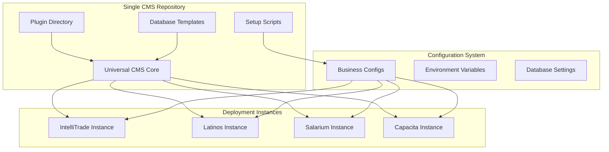

# Single CMS Model Architecture

## 🎯 Revolutionary Architecture: One CMS, Infinite Configurations

This document outlines the complete architecture for our Single CMS Model - a paradigm shift from multiple site folders to one universal CMS with configuration-driven deployments.

## 🌟 Core Concept

Instead of maintaining separate site codebases, we have:
- **One universal CMS codebase** that stays current with Payload updates
- **Configuration-driven deployments** for each business unit
- **Database template system** supporting SQLite, MongoDB, and PostgreSQL
- **Plugin-based customization** with total independence
- **Environment-specific setup** via npm scripts

## 🏗️ Architecture Overview



## 📁 New Directory Structure

```
cms/                              # Single CMS repository
├── src/                          # Universal CMS core
│   ├── payload.config.ts         # Base configuration
│   ├── server.ts                 # Universal server
│   └── app/                      # Next.js app
├── plugins/                      # Plugin development (current structure)
│   ├── core/
│   ├── shared/
│   └── business/
├── templates/                    # Database templates
│   ├── sqlite/
│   ├── mongodb/
│   └── postgresql/
├── configs/                      # Business configurations
│   ├── intellitrade.json
│   ├── latinos.json
│   ├── salarium.json
│   └── capacita.json
├── scripts/                      # Setup and deployment scripts
│   ├── setup-business.js
│   ├── create-instance.js
│   └── migrate-database.js
└── instances/                    # Local deployment instances
    ├── intellitrade/
    │   ├── .env
    │   ├── database/
    │   └── uploads/
    ├── latinos/
    │   ├── .env
    │   ├── database/
    │   └── uploads/
    └── ...
```

## 🗄️ Database Template System

### Template Structure
```
templates/
├── sqlite/
│   ├── payload.config.js         # SQLite-specific config
│   ├── schema.sql               # Initial schema
│   └── migrations/              # SQLite migrations
├── mongodb/
│   ├── payload.config.js         # MongoDB-specific config
│   ├── connection.js            # MongoDB connection
│   └── migrations/              # MongoDB migrations
└── postgresql/
    ├── payload.config.js         # PostgreSQL-specific config
    ├── schema.sql               # Initial schema
    └── migrations/              # PostgreSQL migrations
```

### Database Configuration Examples

**SQLite Template:**
```javascript
// templates/sqlite/payload.config.js
export const sqliteConfig = {
  db: {
    type: 'sqlite',
    url: process.env.DATABASE_URL || `./instances/${process.env.BUSINESS_NAME}/database/payload.db`,
    options: {
      pool: {
        min: 1,
        max: 5,
      },
    },
  },
}
```

**MongoDB Template:**
```javascript
// templates/mongodb/payload.config.js
export const mongodbConfig = {
  db: {
    type: 'mongodb',
    url: process.env.DATABASE_URL || `mongodb://localhost:27017/${process.env.BUSINESS_NAME}`,
    options: {
      useNewUrlParser: true,
      useUnifiedTopology: true,
    },
  },
}
```

**PostgreSQL Template:**
```javascript
// templates/postgresql/payload.config.js
export const postgresqlConfig = {
  db: {
    type: 'postgresql',
    url: process.env.DATABASE_URL || `postgresql://localhost:5432/${process.env.BUSINESS_NAME}`,
    options: {
      pool: {
        min: 2,
        max: 10,
      },
    },
  },
}
```

## ⚙️ Business Configuration System

### Configuration Schema
```json
// configs/intellitrade.json
{
  "businessName": "intellitrade",
  "displayName": "IntelliTrade",
  "domain": "intellitrade.paulovila.org",
  "port": 3004,
  "database": {
    "type": "mongodb",
    "name": "intellitrade_db"
  },
  "plugins": {
    "core": ["auth", "admin", "api"],
    "shared": ["analytics", "notifications"],
    "business": ["kyc", "blockchain", "trading"]
  },
  "theme": {
    "primaryColor": "#1a365d",
    "logo": "/assets/intellitrade-logo.png",
    "favicon": "/assets/intellitrade-favicon.ico"
  },
  "features": {
    "kycVerification": true,
    "blockchainIntegration": true,
    "advancedTrading": true
  },
  "environment": {
    "NODE_ENV": "development",
    "PAYLOAD_SECRET": "auto-generated",
    "JWT_SECRET": "auto-generated"
  }
}
```

## 🚀 NPM Setup Script System

### Main Setup Command
```bash
npm run setup:business -- --name=intellitrade --db=mongodb --port=3004
```

### Setup Script Implementation
```javascript
// scripts/setup-business.js
#!/usr/bin/env node

const fs = require('fs');
const path = require('path');
const { execSync } = require('child_process');

class BusinessSetup {
  constructor(options) {
    this.businessName = options.name;
    this.databaseType = options.db || 'sqlite';
    this.port = options.port || 3000;
    this.instancePath = `./instances/${this.businessName}`;
  }

  async setup() {
    console.log(`🚀 Setting up ${this.businessName} instance...`);
    
    // 1. Create instance directory
    await this.createInstanceDirectory();
    
    // 2. Copy database template
    await this.setupDatabase();
    
    // 3. Generate environment file
    await this.generateEnvironment();
    
    // 4. Install and configure plugins
    await this.setupPlugins();
    
    // 5. Initialize database
    await this.initializeDatabase();
    
    console.log(`✅ ${this.businessName} instance ready!`);
    console.log(`🌐 Run: npm run dev:${this.businessName}`);
  }

  async createInstanceDirectory() {
    const dirs = [
      this.instancePath,
      `${this.instancePath}/database`,
      `${this.instancePath}/uploads`,
      `${this.instancePath}/logs`
    ];
    
    dirs.forEach(dir => {
      if (!fs.existsSync(dir)) {
        fs.mkdirSync(dir, { recursive: true });
      }
    });
  }

  async setupDatabase() {
    const templatePath = `./templates/${this.databaseType}`;
    const configPath = `${templatePath}/payload.config.js`;
    
    if (fs.existsSync(configPath)) {
      fs.copyFileSync(
        configPath,
        `${this.instancePath}/payload.config.js`
      );
    }
  }

  async generateEnvironment() {
    const config = this.loadBusinessConfig();
    const envContent = this.generateEnvContent(config);
    
    fs.writeFileSync(
      `${this.instancePath}/.env`,
      envContent
    );
  }

  generateEnvContent(config) {
    return `
# ${config.displayName} Environment
BUSINESS_NAME=${config.businessName}
PORT=${config.port}
DATABASE_TYPE=${config.database.type}
DATABASE_URL=${this.getDatabaseUrl(config)}

# Payload Configuration
PAYLOAD_SECRET=${this.generateSecret()}
JWT_SECRET=${this.generateSecret()}

# Business Features
${Object.entries(config.features)
  .map(([key, value]) => `FEATURE_${key.toUpperCase()}=${value}`)
  .join('\n')}

# Theme Configuration
THEME_PRIMARY_COLOR=${config.theme.primaryColor}
THEME_LOGO=${config.theme.logo}
`.trim();
  }

  getDatabaseUrl(config) {
    switch (config.database.type) {
      case 'sqlite':
        return `./instances/${config.businessName}/database/payload.db`;
      case 'mongodb':
        return `mongodb://localhost:27017/${config.businessName}`;
      case 'postgresql':
        return `postgresql://localhost:5432/${config.businessName}`;
      default:
        throw new Error(`Unsupported database type: ${config.database.type}`);
    }
  }

  generateSecret() {
    return require('crypto').randomBytes(32).toString('hex');
  }

  loadBusinessConfig() {
    const configPath = `./configs/${this.businessName}.json`;
    if (!fs.existsSync(configPath)) {
      throw new Error(`Business config not found: ${configPath}`);
    }
    return JSON.parse(fs.readFileSync(configPath, 'utf8'));
  }
}

// CLI Interface
const args = process.argv.slice(2);
const options = {};

args.forEach(arg => {
  const [key, value] = arg.replace('--', '').split('=');
  options[key] = value;
});

if (!options.name) {
  console.error('❌ Business name is required: --name=intellitrade');
  process.exit(1);
}

new BusinessSetup(options).setup().catch(console.error);
```

## 🔌 Plugin Selection Mechanism

### Dynamic Plugin Loading
```javascript
// src/payload.config.ts
import { buildConfig } from 'payload/config';
import { loadBusinessConfig } from './utils/config-loader';
import { loadPlugins } from './utils/plugin-loader';

const businessConfig = loadBusinessConfig();
const plugins = loadPlugins(businessConfig.plugins);

export default buildConfig({
  serverURL: `http://localhost:${businessConfig.port}`,
  plugins: plugins,
  collections: [], // Populated by plugins
  globals: [],     // Populated by plugins
  // ... other config
});
```

### Plugin Loader Implementation
```javascript
// src/utils/plugin-loader.js
export const loadPlugins = (pluginConfig) => {
  const plugins = [];
  
  // Load core plugins (always required)
  pluginConfig.core.forEach(pluginName => {
    const plugin = require(`../../plugins/core/${pluginName}`);
    plugins.push(plugin.default({ enabled: true }));
  });
  
  // Load shared plugins (optional)
  pluginConfig.shared.forEach(pluginName => {
    const plugin = require(`../../plugins/shared/${pluginName}`);
    plugins.push(plugin.default({ enabled: true }));
  });
  
  // Load business plugins (business-specific)
  pluginConfig.business.forEach(pluginName => {
    const plugin = require(`../../plugins/business/${pluginName}`);
    plugins.push(plugin.default({ enabled: true }));
  });
  
  return plugins;
};
```

## 🗄️ Local Database Storage Strategy

### Database Location Strategy
```
instances/
├── intellitrade/
│   ├── database/
│   │   ├── payload.db              # SQLite file
│   │   ├── backups/                # Database backups
│   │   └── migrations/             # Applied migrations
│   ├── uploads/                    # File uploads
│   └── logs/                       # Application logs
├── latinos/
│   ├── database/
│   └── uploads/
└── ...
```

### Database Management Scripts
```javascript
// scripts/database-manager.js
class DatabaseManager {
  static async backup(businessName) {
    const instancePath = `./instances/${businessName}`;
    const timestamp = new Date().toISOString().replace(/[:.]/g, '-');
    
    // Create backup based on database type
    const config = loadBusinessConfig(businessName);
    
    switch (config.database.type) {
      case 'sqlite':
        await this.backupSQLite(instancePath, timestamp);
        break;
      case 'mongodb':
        await this.backupMongoDB(businessName, timestamp);
        break;
      case 'postgresql':
        await this.backupPostgreSQL(businessName, timestamp);
        break;
    }
  }
  
  static async migrate(businessName, direction = 'up') {
    // Run migrations for specific business instance
  }
  
  static async seed(businessName) {
    // Seed data for specific business instance
  }
}
```

## 📦 Package.json Scripts

```json
{
  "scripts": {
    "setup:business": "node scripts/setup-business.js",
    "dev:intellitrade": "cross-env BUSINESS_CONFIG=intellitrade npm run dev",
    "dev:latinos": "cross-env BUSINESS_CONFIG=latinos npm run dev",
    "dev:salarium": "cross-env BUSINESS_CONFIG=salarium npm run dev",
    "dev:capacita": "cross-env BUSINESS_CONFIG=capacita npm run dev",
    "build:all": "node scripts/build-all-instances.js",
    "backup:all": "node scripts/backup-all-databases.js",
    "migrate:all": "node scripts/migrate-all-databases.js"
  }
}
```

## 🚀 Deployment Workflow

### 1. Create New Business Instance
```bash
# Setup new business
npm run setup:business -- --name=newbusiness --db=postgresql --port=3008

# Start development
npm run dev:newbusiness
```

### 2. Development Process
```bash
# Develop plugins in the main plugins directory
cd plugins/business/newbusiness-feature
npm run dev

# Test with specific business instance
npm run dev:newbusiness
```

### 3. Production Deployment
```bash
# Build for production
npm run build:newbusiness

# Deploy to server
npm run deploy:newbusiness
```

## 🎯 Benefits of This Architecture

### ✅ **Total Independence**
- Each instance runs completely independently
- Different database types per business
- Isolated configurations and data

### ✅ **Payload Updates**
- Single codebase stays current with Payload
- All instances benefit from updates
- No version fragmentation

### ✅ **Plugin Focus**
- Development centers on plugin directory
- Reusable across all instances
- Clear separation of concerns

### ✅ **Flexible Deployment**
- SQLite for simple deployments
- MongoDB for scalable solutions
- PostgreSQL for enterprise needs

### ✅ **Easy Scaling**
- Add new businesses with single command
- Template-based consistency
- Automated configuration

## 🗺️ Implementation Roadmap

### Phase 1: Foundation (Week 1-2)
1. **Create template system**
   - Database templates for SQLite, MongoDB, PostgreSQL
   - Base configuration templates
   - Environment file templates

2. **Build setup scripts**
   - `setup-business.js` script
   - Configuration loader utilities
   - Plugin loader system

3. **Restructure current codebase**
   - Move sites/intellitrade to instances/intellitrade
   - Create universal src/ directory
   - Migrate existing configurations

### Phase 2: Core Implementation (Week 3-4)
1. **Universal CMS core**
   - Single payload.config.ts with dynamic loading
   - Universal server.ts with business detection
   - Configuration-driven plugin system

2. **Database abstraction layer**
   - Template-based database configurations
   - Migration system for all database types
   - Backup and restore utilities

3. **Business configuration system**
   - JSON-based business configs
   - Environment variable generation
   - Theme and feature toggles

### Phase 3: Migration & Testing (Week 5-6)
1. **Migrate existing businesses**
   - Convert IntelliTrade to new system
   - Test with different database types
   - Validate plugin compatibility

2. **Create additional templates**
   - MongoDB production template
   - PostgreSQL enterprise template
   - Docker deployment templates

3. **Testing & validation**
   - Cross-database compatibility tests
   - Plugin isolation tests
   - Performance benchmarks

### Phase 4: Documentation & Optimization (Week 7-8)
1. **Complete documentation**
   - Setup guides for each database type
   - Plugin development guidelines
   - Deployment procedures

2. **Performance optimization**
   - Lazy loading for plugins
   - Database connection pooling
   - Caching strategies

3. **Developer experience**
   - CLI tools for common tasks
   - Hot reloading for development
   - Debugging utilities

## 🎯 Next Immediate Steps

1. **Start with template creation** - This is the foundation
2. **Build the setup script** - Enables rapid testing
3. **Create one working instance** - Proves the concept
4. **Migrate IntelliTrade** - Real-world validation

## 🚨 Critical Success Factors

1. **Database Template Quality** - Must handle all edge cases
2. **Plugin Compatibility** - Ensure all existing plugins work
3. **Configuration Validation** - Prevent invalid setups
4. **Migration Strategy** - Smooth transition from current system
5. **Documentation** - Clear guides for all scenarios

This Single CMS Model represents a revolutionary approach that eliminates complexity while maximizing flexibility and maintainability. It positions the platform for unlimited growth while keeping development focused on what matters most: the plugins.